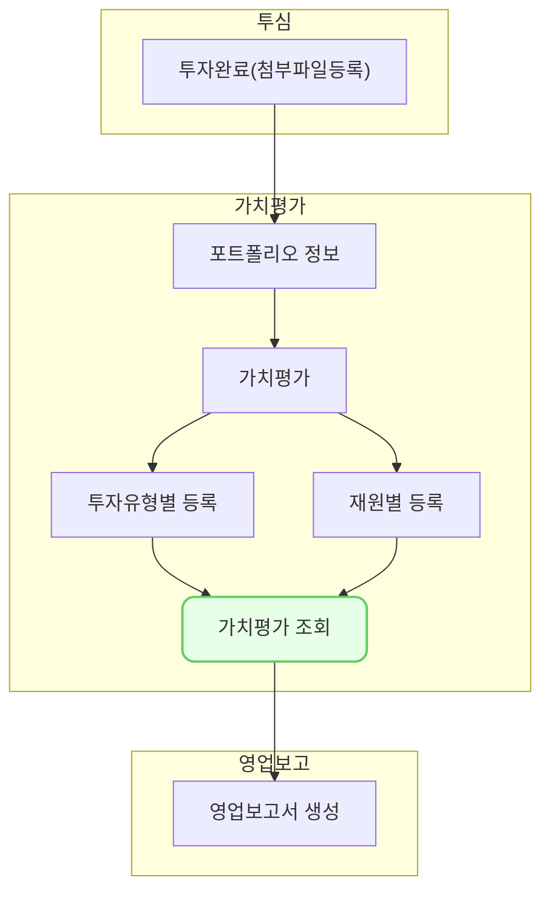

투자 별 평가 상세 화면입니다. 

## 설명
- 투자 별 가치평가를 조회할 수 있습니다.
### 가치평가 상세
- 조회 화면에서 각 투자건을 선택하면 [상세] 내용을 확인할 수 있습니다.
- 가치평가 상세화면에서는 투자건에 대한 상세한 정보와 평가 히스토리를 조회할 수 있습니다.
### 평가 수정
- 등록한 평가는 투자 건 단위로 [수정]할 수 있습니다.
- 가치평가 조회 화면([pm0300]())에서 수정할 투자건을 선택합니다.
- 가치평가 상세 화면([pm0303]())으로 이동합니다. 하단의 평가 중에서 수정할 평가를 선택합니다.
- 우측에 수정 화면이 나타납니다.
- [수정]을 클릭하여 등록한 평가를 수정한 후 [저장]합니다. 
### 평가 삭제
- 등록한 평가는 투자 건 단위로 [삭제]할 수 있습니다.
- 가치평가 조회 화면([pm0300]())에서 [삭제]할 투자건을 선택합니다.
- 가치평가 상세 화면([pm0303]())으로 이동합니다. 하단의 평가 중에서 [삭제]할 평가를 선택합니다.
- 우측에 수정 화면이 나타납니다.
- [삭제]을 클릭하여 등록한 평가를 삭제합니다.
- 삭제된 평가는 복구할 수 없습니다. 

## 자주 묻는 질문

> [평가 기준일]과 [평가 단가]를 변경하고 싶어요. 어떻게 할 수 있나요?
{: .prompt-tip }

- 평가 기준일과 평가 단가는 수정할 수 없습니다. 평가를 삭제하고 신규로 등록해주세요. 

## 선후행 구조도
