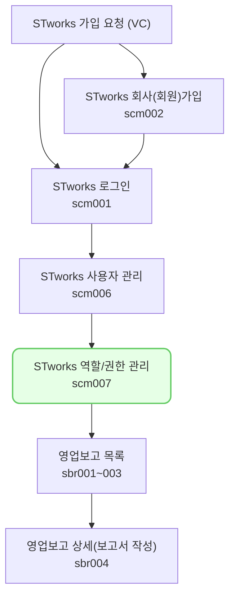

여기에 한줄 요약 내용을 작성합니다. 

## 역할/권한 관리

- `설정 > 역할/권한 관리` 메뉴에서 역할/권한을 설정합니다.
- 관리자 역할을 가진 사용자는 `사용자 관리` 메뉴와 `역할/권한 관리`에서 계정을 추가 생성하고, 권한을 설정할 수 있습니다.

#### 역할 생성 및 권한 설정

역할을 생성하고, 역할별로 권한을 할당하거나 역할을 부여할 사용자 ID를 설정하는 방법은 다음과 같습니다.

###### 역할 생성
1. 역할 설정 섹션에서 [등록] 버튼을 클릭합니다.
  - 역할 등록 드로어가 열립니다. 
2. 역할명과 설명, 사용 여부를 선택해주세요.
3. 우측 상단 [저장] 버튼을 클릭해주세요.

###### 권한 설정
1. 권한 설정 섹션에서 [수정]을 클릭합니다.
2. 권한 설정 섹션 - 기본 정보 탭 - 사용자목록 테이블의 하단에서 [+] 버튼을 클릭해 해당 역할에 배정할 사용자를 추가해주세요.
  - [+] 버튼으로 추가된 행의 `이름` 항목을 더블클릭 하면, 사용자 리스트를 선택할 수 있습니다.
3. 권한 설정 섹션 - 메뉴 권한 탭에서 권한을 가질 메뉴를 선택합니다.
4. 권한 설정 섹션 - 투자자 보고 권한 탭에서 보고 조회 권한을 설정합니다.
  - 공통 외 추가 항목 조회 권한은 기본적으로 제공되는 보고서 항목 외의 모든 탭에 대한 조회 권한을 설정합니다.
  - 모든 탭 및 공통 외 추가 항목 조회 권한이 있는 경우에만 보고 전송 권한을 가질 수 있습니다.

## [역할/권한 관리] 자주 묻는 질문

> 사용하지 않는 역할을 삭제하고 싶어요.
{: .prompt-tip }
-  사용하지 않는 역할의 `사용 여부`를 `부`로 설정하시면, 해당 역할에 할당된 권한이 적용되지 않습니다.
- 역할을 화면 상에서 영구적으로 삭제하는 기능은 현재 제공하고 있지 않습니다.

> 사용하지 않는 역할의 `사용 여부`를 `부`로 수정하려는데, 수정이 되지 않습니다.
{: .prompt-tip }
- 역할의 `사용 여부`가 수정 불가능한 사유는 다음과 같습니다.
	- 해당 역할이 관리자 역할(최초 가입 시 생성된 역할)인 경우
		- 관리자 역할의 `사용 여부`는 수정 불가능하므로, 역할 부여 사용자 목록을 수정해 주세요.
	- `사용 여부`를 `OFF`할 경우, 특정 ID에 설정된 역할이 1개 미만이 되는 경우
		- 사용자 ID에는 `사용 여부`가 `여`인 역할이 최소 1개 이상 부여되어야 합니다.
		- 다른 역할을 부여해준 뒤 해당 역할의 `사용 여부`를 `부`로 설정해 주세요.

> 사용자 목록에서 사용자를 제거할 수 없습니다.
{: .prompt-tip }
- 사용자 ID에는 `사용 여부`가 `여`인 역할이 최소 1개 이상 부여되어야 합니다.
- 선택한 사용자를 제거 시, 해당 ID에 부여된 역할이 1개 미만이 되는 경우 부여된 역할을 제거할 수 없습니다.
- 다른 역할을 부여해준 뒤 해당 역할의 사용자 목록에서 사용자 ID를 제거 주세요.

> 역할을 할당했는데, 권한이 적용되지 않아요.
{: .prompt-tip }
- 역할의 `사용 여부`를 확인해주세요.
- `사용 여부`가 off인 경우 해당 역할에 설정된 권한은 적용되지 않습니다.

## 투자자 보고 업무의 일반 흐름

