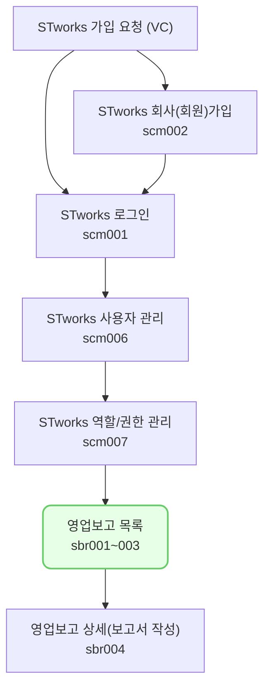

투자사의 보고 요청 내역과 관련된 정보를 조회하고, 보고서를 작성할 수 있는 메뉴입니다.

## 동영상



## 투자자 보고
- 투자자 보고는 투자자가 요청한 정보를 작성 및 전송하는 기능입니다.

### 보고 목록
- 목록에는 투자자가 요청한 보고가 기준일>마감일>요청일 빠른 순으로 상단에 위치합니다.
- 목록에서는 보고별 [요청구분], [보고상태], [투자자], [보고서명], [기준일], [마감일], [작성현황], [전송일시]를 보여줍니다.
	- [보고서명]은 투자자가 입력한 보고서의 이름입니다.
	- [기준일]은 보고서의 기준이 되는 날짜입니다. 기준일에 맞춰 정보를 입력합니다.
	- [작성현황]은 필수 정보를 입력한 정보를 나타냅니다. 클릭하여 탭별 완성도를 확인할 수 있습니다.
	- [전송일시]는 보고를 전송한 날짜와 시간을 나타냅니다. 보고는 전송을 해야 투자자에게 전달됩니다. 
- [요청 구분]은 투자자가 보낸 보고 요청의 상태를 나타냅니다. 
	- [신규 요청]은 새롭게 들어온 요청을 의미합니다.
	- [회수]는 투자가가 회수한 요청입니다. 보고를 전송할 수 없습니다.
	- [마감]은 마감일이 지난 요청입니다. 보고를 전송할 수 없습니다.
	- [연장]은 마감일이 지났지만, 투자자가 보고일을 연장한 요청입니다. 보고를 전송할 수 있습니다.
	- [수정요청]은 보고를 제출했지만, 투자자가 내용 수정을 요청한 보고입니다. 투자자가 수정을 원하는 항목을 확인할 수 있습니다.
	- [검수완료]는 투자자가 검수한 보고입니다. 전송을 취소할 수 없습니다. 
	- [확정]은 투자자가 확정한 보고를 의미합니다. 보고가 확정되었으므로 내용을 전송할 수 없습니다.
- [보고상태]는 ST works 사용자가 작성하는 보고서의 상태를 의미합니다.
	- [미작성]는 아직 작성하지 않은 보고입니다.
	- [저장]은 내용을 저장한 보고입니다. 필수 데이터 저장 정도를 확인할 수 있습니다.
	- [전송완료]는 전송이 완료된 보고입니다. [전송]버튼 클릭 후 전송이 VC works에 성공적으로 전송된 상태입니다. 전송이 완료되면 [전송일시]가 표시됩니다. 
	- [수정대기]는 보고를 제출했으나 투자자로부터 수정 요청을 받은 보고입니다. 어떤 내용을 수정해야 하는 지 알 수 있습니다. [전송]을 하면 [전송완료]상태로 변합니다.
	- [전송취소]는 전송을 취소한 상태입니다. 저장 후 전송을 하였으나 수정 혹은 다른 사유로 제출한 보고를 회수하는 기능입니다. 다만, 투자자가 검수를 완료하여 요청 구분이 [검수완료] 상태로 변한 보고는 취소할 수 없습니다.

### 진행중인 보고
- [진행중인 보고]는 현재 진행 중인 보고를 보여줍니다.
- [요청 구분]의 상태가 [신규 요청], [수정 요청], [확정], [연장]인 보고가 표시됩니다.
	- 마감되었거나 회수된 보고를 제외한 모든 보고가 표시됩니다.

### 종료된 보고
- [종료된 보고]는 일정이 마무리된 보고를 보여줍니다.
- 마감일이 지나 [마감]되었거나, 투자자가 [회수]한 보고가 표시됩니다.
- [마감]되었다 하더라도 투자자가 [연장]처리를 한 경우에는 [종료된 보고]에서 [진행중인 보고]로 이동합니다.

## 투자자 보고 업무의 일반 흐름

