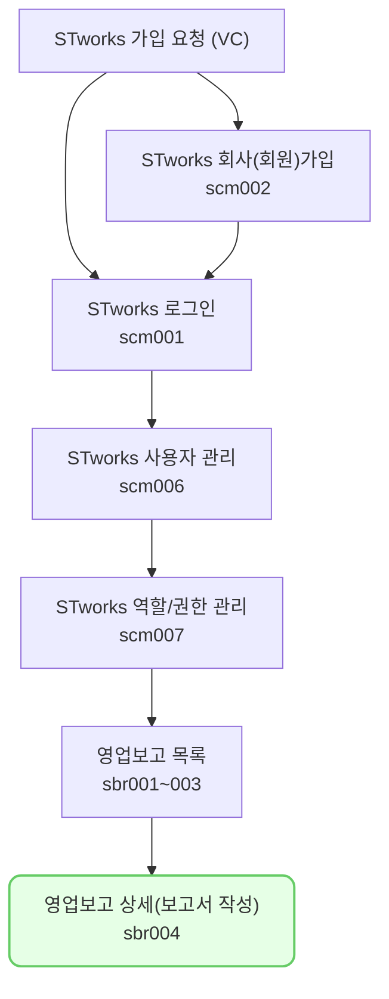

투자자 보고 요청 양식에 맞게 보고서를 작성할 수 있는 메뉴입니다.

## 동영상



### 보고서 작성
- [보고서 작성]은 목록에서 보고를 선택하여 시작합니다.
- 화면에 입력해야 할 항목이 보입니다. 권한이 없는 탭은 보이지 않습니다.
- 우측 상단의 [보고서작성] 버튼을 클릭하면 데이터 입력 모드로 변환됩니다. 
- 우측의 메뉴는 [탭], 입력 영역은 [섹션], 정보는 [항목]입니다. 
- 투자자가 사용자를 위하여 [안내문]을 추가할 수 있습니다
	- [안내문]은 [섹션]의 상단, [항목]의 레이블에 표시됩니다. 
- 붉은 색 별표 표시된 항목은 [필수]입니다. 
	- [필수] 항목을 전부 채워야 보고를 전송할 수 있습니다.
- 표 아래의 [+] 버튼을 클릭하여 행을 추가할 수 있습니다. 
	-  각 행을 체크하고 표 아래의 [상하] 버튼을 이용하여 행의 순서를 변경할 수 있습니다. 휴지통 버튼은 [행 삭제] 기능입니다.
- [첨부파일]은 파일 당 최대 50MB까지 첨부할 수 있습니다. 한 항목에 복수의 파일을 업로드할 수 있습니다. 
- [이전 보고 불러오기] 버튼은 과거에 저장/전송헀던 보고의 내용을 불러오는 기능입니다.
	- 이전 보고의 항목 중 중복되는 항목을 불러옵니다.
	- 권한이 없거나 항목이 다르면 불러올 수 없습니다. 항목명이 같아도 분기 등이 다르다면 불러올 수 없습니다. 
- 우측 상단의 [보고서 저장] 버튼을 클릭하여 보고서를 저장합니다. 
-  저장 후 우측 상단의 [수정] 버튼을 클릭하여 내용을 수정할 수 있습니다. [수정] 버튼 왼쪽의 [작성현황] 기능을 통해 보고서의 완성도를 확인할 수 있습니다. [작성 현황]은 필수 항목의 입력 정도를 표시합니다.

### 보고서 전송 
- [저장]한 보고서는 [전송]해야 투자자에게 전달됩니다. 
- [저장] 상태인 보고서를 클릭하여 화면에 접속합니다.
- 우측 상단의 [전송] 버튼을 클릭하여 보고서를 전송합니다. 전송이 완료되면 [전송 완료] 상태로 변경되고, [전송일시]가 목록 화면에 표시됩니다.
- [전송]은 [전송] 권한이 있는 사용자만 할 수 있습니다. 

## 동영상



### 보고서 수정/재전송/전송취소
- 보고서를 제출하였으나 [수정 요청]을 받을 수 있습니다. [수정 요청]을 받아 [수정 대기] 상태인 보고서를 클릭하면 [수정 대기] 보고 화면으로 이동합니다. 
	- [수정 대기] 상태에서는 투자자가 수정을 요청한 섹션을 확인할 수 있습니다. 
	- 수정 후 [전송]을 하면 [전송 완료]로 바뀝니다.
- 보고서를 전송하고도 내용을 수정할 수 있습니다. 
	- [전송 완료]인 보고를 선택하고, 우측 상단의 [재전송] 버튼을 클릭합니다. 
	- 내용을 수정한 후 [저장 후 전송] 버튼을 클릭하여 저장과 전송합니다.
		- 이미 내용을 제출했으므로 저장과 전송을 따로 할 수 없습니다. 
- 전송한 보고서를 [전송 취소]할 수 있습니다. 
	- [전송 완료]인 보고를 선택하고, 우측 상단의 [전송 취소] 버튼을 클릭합니다. 
	- 전송이 취소됩니다. 다만, 투자자가 검수를 완료하여 요청 구분이 [검수완료] 상태로 변한 보고는 취소할 수 없습니다.
	- 전송을 취소한 보고도 다시 전송할 수 있습니다.
		- 우측 상단의 [전송] 버튼을 클릭하면 다시 전송할 수 있습니다. 

> 권한이 없다고 합니다.
{: .prompt-tip }
- 회사 내의 ST works 관리자에게 문의하세요.

> 마감일이 지났는데 제출할 수 없나요?
{: .prompt-tip }
- 시스템 상 마감일이 지나면 전송할 수 없습니다. 투자자에게 연락하시갈 바랍니다. 

## 투자자 보고 업무의 일반 흐름

