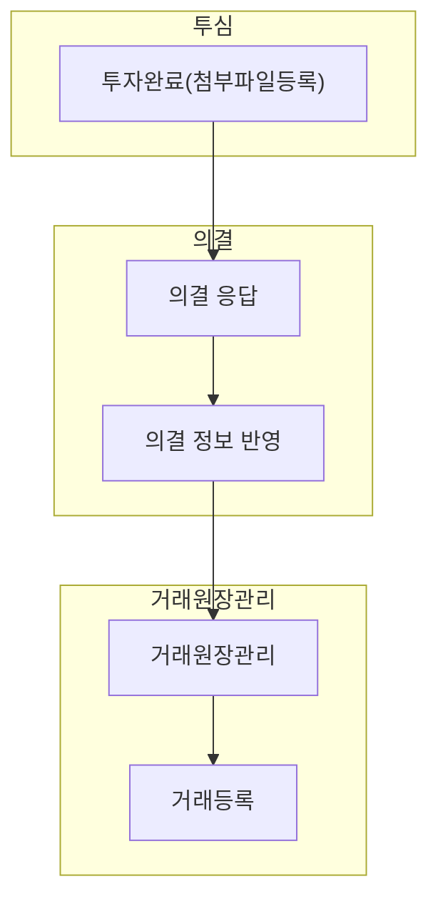

의결(sa0002)에서는 포트폴리오가 요청한 의결 사항에 대해 회신하는 방법을 설명합니다.

## 동영상



## 설명
- `의결 상세`에서는 포트폴리오가 요청한 의결 사항에 대해 회신할 수 있습니다.
	- 포트폴리오가 발의한 의결 사항에 대해 조회하고, 찬성/반대 및 기타 의견을 작성할 수 있습니다.
	- 의결 사항에 대한 결재 품의서를 작성할 수 있습니다.
	- 승인이 완료된 의결 사항에 대해 포트폴리오 측에 회신할 수 있습니다.

#### 의결 세부 내역 조회 및 의견 작성
포트폴리오사가 요청한 의결 세부 내역을 조회하는 방법은 다음과 같습니다.

1. `포트폴리오-의결` 목록 화면에서 새로 요청 온 의결 내역의 ▶ 버튼을 클릭합니다.
2. 의결 내용을 조회할 주주의 행을 클릭합니다.
3. 주주와 연결할 재원을 선택합니다.
	- 연결 재원을 잘못 선택한 경우, 상세 화면에서 `지정` 버튼을 클릭해 수정할 수 있습니다.
4. `선택`을 클릭합니다.
5. 의결과 관련된 내용을 조회합니다.
	- [tip] 주주명이나 주식 수와 관련된 정보가 잘못 기입되어 있는 경우, 요청한 회사에 직접 문의해주세요.
	- [tip] `안내사항 보기` 링크 혹은 버튼을 클릭하면, 의결 요청 시 함께 전송한 안내사항 을 조회하실 수 있습니다.
6. 종합의견 및 안건별 찬성/반대, 기타 의견을 작성합니다.
7. `저장`을 클릭합니다.

##### [tip] 의결 안내 메일 수신 시
1. 포트폴리오에서 요청한 메일을 확인합니다.
2. `의견서 작성` 버튼을 클릭합니다.
3. 코드 인증 화면에 접속합니다.
4. `식별 코드 요청(05:00)`버튼을 클릭합니다.
5. 이메일로 회신한 식별 코드를 입력합니다.
6. `의견서 작성` 버튼을 클릭합니다.
7. VCworks에 로그인 합니다.

#### 의결 품의서 작성
의결 사항에 대해 전자결재를 진행하는 방법은 다음과 같습니다.

1. `의결 목록`에서 품의서를 작성할 내역을 선택한 후, 화면 상단의 `전자결재` 버튼을 클릭합니다.
	- [tip] 동일한 의결 안건에 여러 응답 내역을 상신하는 경우, 하나의 품의서로 합쳐서 작성할 수 있습니다.
	- [tip] `의결 상세` 화면에서도 `전자결재` 버튼을 통해 개별 내역에 대한 품의서를 작성할 수 있습니다.
2. 기안일, 제목, 내용 등 품의서에 작성된 내역을 확인합니다.
	- 작성한 의견의 수정이 필요한 경우, 이전 화면으로 돌아가 의견을 수정합니다.
3. 결재선 `지정` 버튼을 클릭해 결재라인을 등록합니다.
4. `결재 요청` 버튼을 클릭합니다.

#### 결재 승인 후 의견 전송
품의서 결재 승인을 받은 경우, 포트폴리오사에 의견을 전송할 수 있습니다.

1. `의결 목록`에서 의견을 전송할 내역을 선택한 후, 화면 상단의 `응답 전송` 버튼을 클릭합니다.
	- [tip] `의결 상세` 화면에서도 `응답 전송` 버튼을 통해 개별 내역에 대해 회신할 수 있습니다.
2. 컨펌창의 `응답 전송` 버튼을 클릭합니다.
	- [tip] 재응답이 필요한 경우, 동일한 프로세스를 통해 회신해주시면 됩니다.

#### 의결 결과 수신
`결과 회신` 상태의 의결인 경우, 포트폴리오에서 전송한 결과를 조회할 수 있습니다.

1. 결과 조회를 원하는 `의결 상세` 화면에 접속합니다.
2. 안건 옆 통과/기각 태그를 확인합니다.
	- 주주총회인 경우, 포트폴리오에서 전송한 주주총회 의사록을 함께 조회할 수 있습니다.

## [의결] 자주 묻는 질문

> 권한이 없다고 뜹니다.
{: .prompt-tip }
- 관리자 계정으로 접속해 설정-역할/권한 관리 메뉴에서 의결 메뉴의 권한을 설정해주세요.

> 응답 전송이 되지 않습니다.
{: .prompt-tip }
- 품의서 작성 여부를 확인해주세요.
- 품의서를 작성했고, 결재 상태가 `승인`인 경우에만 응답을 전송할 수 있습니다.

> 응답 전송이 버튼이 보이지 않습니다.
{: .prompt-tip }
- 의결 진행 상태를 확인해 주세요.
- 결재중 상태의 의결 응답 내역에 대해서만 전송할 수 있습니다.
- 포트폴리오사의 사정으로 의결이 철회되었거나, 입력 기한이 지나서 의결이 마감된 경우 전송버튼이 제공되지 않습니다.

## 선후행 구조도

