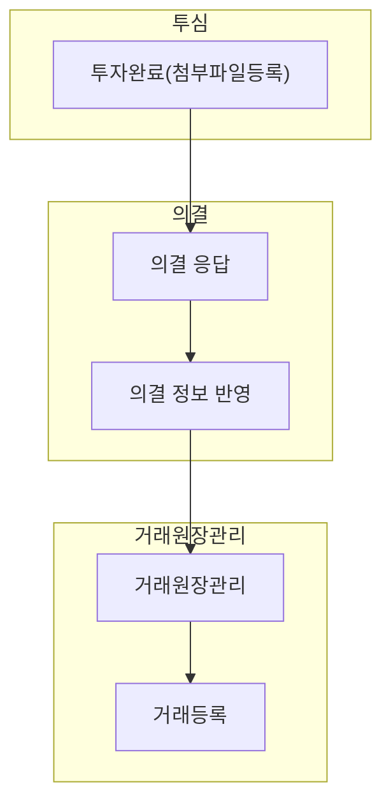

의결 정보 반영(sa0003)에서는 포트폴리오가회신한 정보를 반영하는 방법을 설명합니다.

## 동영상



## 설명
- `의결 정보 반영`에서는 의결에서 회신한 정보를 반영할 수 있습ㄴ니다.
	- 증자, 감자, 소각, 분할, 병합 등으로 인한 발행 주식 수, 액면가, 지분율 등의 변동을 기록할 수 있습니다.

#### 의결 정보 반영
포트폴리오사가 회신한 정보를 반영하는 방법은 다음과 같습니다.

1. `포트폴리오-의결` 목록 화면에서 [회신 결과 반영] 버튼을 클릭합니다.
	- [tip] 결과 반영 상태가 `반영 필요`인 주주총회인 경우에만 결과를 반영할 수 있습니다.
		- 결과 반영 상태가 `해당 없음`인 경우, 정보를 반영할 수 있는 안건이 없는 의결입니다.
		- 결과 반영 상태가 `반영 완료`인 경우, 정보 반영을 완료한 의결입니다.

2. 정보 반영을 진행할 의결(주주총회, 동의사항 및 협의사항)을 선택합니다.
3. `다음` 버튼을 클릭합니다.
4. 정보 반영을 진행할 안건을 선택합니다. (복수 선택 가능)
5. `다음` 버튼을 클릭합니다.
6. 정보 반영 결과를 확인하고, 수정 사항을 작성합니다.
	- [tip] 수정하려는 칸을 더블클릭하면, 자동으로 계산된 값을 수정할 수 있습니다.
7. `저장` 버튼을 클릭합니다.

## [의결 정보 반영] 자주 묻는 질문

> [회신 결과 반영]을 클릭했는데, 빈 테이블이 나옵니다.
{: .prompt-tip }
- 의결 목록 화면에서 결과 반영 상태가 `반영 필요`인 의결이 있는지 확인해주세요.
- 결과 반영 상태가 `반영 필요`인 의결에 대한 결과 반영만 가능합니다.

> 결과 반영으로 인해 생성된 데이터는 어디에서 확인하나요?
{: .prompt-tip }
- 투자/회수 > 거래 원장 관리 메뉴에서 확인하실 수 있습니다.
- 가치평가, 재무제표 등의 정보 반영은 추후 업데이트 예정입니다!

## 선후행 구조도

