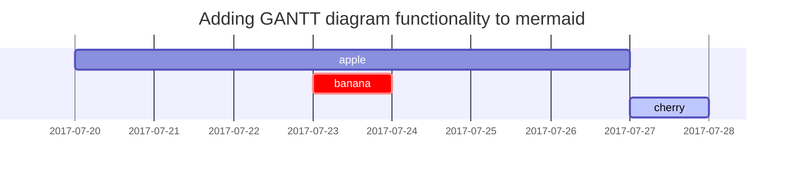

[Chirpy 가이드](https://chirpy.cotes.page/posts/text-and-typography/)를 참고하여 대응하는 markdown 코드를 아래에 추가함 (cheatsheet 처럼 활용하기 위함)

## Headings


# H1 — heading
{: .mt-4 .mb-0 }

```markdown
# H1 — heading
{: .mt-4 .mb-0 }
```

## H2 — heading
{: data-toc-skip='' .mt-4 .mb-0 }

```markdown
## H2 — heading
{: data-toc-skip='' .mt-4 .mb-0 }
```

### H3 — heading
{: data-toc-skip='' .mt-4 .mb-0 }

```markdown
### H3 — heading
{: data-toc-skip='' .mt-4 .mb-0 }
```

#### H4 — heading
{: data-toc-skip='' .mt-4 }

```markdown
#### H4 — heading
{: data-toc-skip='' .mt-4 }
```

## Lists

### Ordered list

1. Firstly
2. Secondly
3. Thirdly

```markdown
1. Firstly
2. Secondly
3. Thirdly
```

### Unordered list

- Chapter
  - Section
    - Paragraph

``` markdown
- Chapter
  - Section
    - Paragraph
```

### Description list

Sun
: the star around which the earth orbits

Moon
: the natural satellite of the earth, visible by reflected light from the sun

```markdown
Sun
: the star around which the earth orbits

Moon
: the natural satellite of the earth, visible by reflected light from the sun
```

## Block Quote

> This line shows the _block quote_.

```markdown
> This line shows the _block quote_.
```


## Prompts

> An example showing the `tip` type prompt.
{: .prompt-tip }

```markdown
> An example showing the `tip` type prompt.
{: .prompt-tip }
```

> An example showing the `info` type prompt.
{: .prompt-info }

```markdown
> An example showing the `info` type prompt.
{: .prompt-info }
```

> An example showing the `warning` type prompt.
{: .prompt-warning }

```markdown
> An example showing the `warning` type prompt.
{: .prompt-warning }
```

> An example showing the `danger` type prompt.
{: .prompt-danger }

```markdown
> An example showing the `danger` type prompt.
{: .prompt-danger }
```

## Tables

| Company                      | Contact          | Country |
| :--------------------------- | :--------------- | ------: |
| Alfreds Futterkiste          | Maria Anders     | Germany |
| Island Trading               | Helen Bennett    |      UK |
| Magazzini Alimentari Riuniti | Giovanni Rovelli |   Italy |


```markdown
| Company                      | Contact          | Country |
| :--------------------------- | :--------------- | ------: |
| Alfreds Futterkiste          | Maria Anders     | Germany |
| Island Trading               | Helen Bennett    |      UK |
| Magazzini Alimentari Riuniti | Giovanni Rovelli |   Italy |
```

## Links

<http://127.0.0.1:4000>

```markdown
<http://127.0.0.1:4000>
```

## Footnote

Click the hook will locate the footnote[^footnote], and here is another footnote[^fn-nth-2].

```markdown
Click the hook will locate the footnote[^footnote], and here is another footnote[^fn-nth-2].
```

## Inline code

This is an example of `Inline Code`.

```markdown
This is an example of `Inline Code`.
```

## Filepath

Here is the `/path/to/the/file.extend`{: .filepath}.

```markdown
Here is the `/path/to/the/file.extend`{: .filepath}.
```

## Code blocks

### Common

```text
This is a common code snippet, without syntax highlight and line number.
```

### Specific Language

```bash
if [ $? -ne 0 ]; then
  echo "The command was not successful.";
  #do the needful / exit
fi;
```

### Specific filename

```sass
@import
  "colors/light-typography",
  "colors/dark-typography";
```
{: file='_sass/jekyll-theme-chirpy.scss'}

## Mathematics

The mathematics powered by [**MathJax**](https://www.mathjax.org/):

$$
\begin{equation}
  \sum_{n=1}^\infty 1/n^2 = \frac{\pi^2}{6}
  \label{eq:series}
\end{equation}
$$

```markdown
$$
\begin{equation}
  \sum_{n=1}^\infty 1/n^2 = \frac{\pi^2}{6}
  \label{eq:series}
\end{equation}
$$
```

We can reference the equation as \eqref{eq:series}.

```markdown
We can reference the equation as \eqref{eq:series}.
```

When $a \ne 0$, there are two solutions to $ax^2 + bx + c = 0$ and they are

```markdown
When $a \ne 0$, there are two solutions to $ax^2 + bx + c = 0$ and they are
```

$$ x = {-b \pm \sqrt{b^2-4ac} \over 2a} $$

```markdown
$$ x = {-b \pm \sqrt{b^2-4ac} \over 2a} $$
```

## Mermaid SVG



> 아래 문구에 대하여 코드 블록을 사용한 다음, 언어를 mermaid로 설정 (markdown → mermaid)
{: .prompt-info }

```markdown
 gantt
  title  Adding GANTT diagram functionality to mermaid
  apple :a, 2017-07-20, 1w
  banana :crit, b, 2017-07-23, 1d
  cherry :active, c, after b a, 1d
```


## Images

### Default (with caption)

{: width="972" height="589" }
_Full screen width and center alignment_

```markdown
{: width="972" height="589" }
_Full screen width and center alignment_
```

### Left aligned

{: width="972" height="589" .w-75 .normal}

```
{: width="972" height="589" .w-75 .normal}
```

### Float to left

{: width="972" height="589" .w-50 .left}
Praesent maximus aliquam sapien. Sed vel neque in dolor pulvinar auctor. Maecenas pharetra, sem sit amet interdum posuere, tellus lacus eleifend magna, ac lobortis felis ipsum id sapien. Proin ornare rutrum metus, ac convallis diam volutpat sit amet. Phasellus volutpat, elit sit amet tincidunt mollis, felis mi scelerisque mauris, ut facilisis leo magna accumsan sapien. In rutrum vehicula nisl eget tempor. Nullam maximus ullamcorper libero non maximus. Integer ultricies velit id convallis varius. Praesent eu nisl eu urna finibus ultrices id nec ex. Mauris ac mattis quam. Fusce aliquam est nec sapien bibendum, vitae malesuada ligula condimentum.

```markdown
{: width="972" height="589" .w-50 .left}
```

### Float to right

{: width="972" height="589" .w-50 .right}
Praesent maximus aliquam sapien. Sed vel neque in dolor pulvinar auctor. Maecenas pharetra, sem sit amet interdum posuere, tellus lacus eleifend magna, ac lobortis felis ipsum id sapien. Proin ornare rutrum metus, ac convallis diam volutpat sit amet. Phasellus volutpat, elit sit amet tincidunt mollis, felis mi scelerisque mauris, ut facilisis leo magna accumsan sapien. In rutrum vehicula nisl eget tempor. Nullam maximus ullamcorper libero non maximus. Integer ultricies velit id convallis varius. Praesent eu nisl eu urna finibus ultrices id nec ex. Mauris ac mattis quam. Fusce aliquam est nec sapien bibendum, vitae malesuada ligula condimentum.

```markdown
{: width="972" height="589" .w-50 .right}
```

### Dark/Light mode & Shadow

아래 이미지는 테마 기본 설정에 따라 어둡게/밝게 모드를 전환됨

그림자가 있음에 유의

{: .light .w-75 .shadow .rounded-10 w='1212' h='668' }
{: .dark .w-75 .shadow .rounded-10 w='1212' h='668' }

```markdown
{: .light .w-75 .shadow .rounded-10 w='1212' h='668' }
{: .dark .w-75 .shadow .rounded-10 w='1212' h='668' }
```

## Video



> 아래 내용은 실제 markdown 표현 형식과 다르기에 주의 필요 (압축 코드로 보임)
{: .prompt-warning }

```markdown

```

## Reverse Footnote

[^footnote]: The footnote source
[^fn-nth-2]: The 2nd footnote source

```markdown
[^footnote]: The footnote source
[^fn-nth-2]: The 2nd footnote source
```
