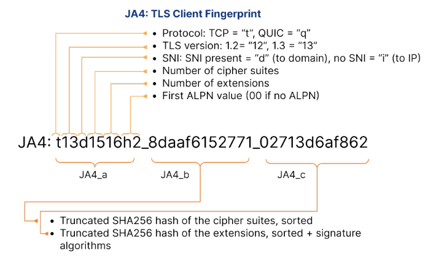

## JA3/JA4 개요

---
JA3와 JA4는 트래픽 분석에서 클라이언트를 식별하고 분류하는 데 사용되는 지문(fingerprint) 생성 알고리즘입니다. 
최근의 봇은 브라우저의 동작을 모방하여 봇 탐지를 회피하는 경우가 많습니다. 
JA4 Fingerprint는 TLS 통신에서 클라이언트의 고유한 특징을 추출하여 이와 같은 봇을 효과적으로 식별할 수 있습니다.

* **JA3:** 초기의 지문 생성 알고리즘으로, TLS 핸드셰이크 메시지에 포함된 정보를 기반으로 지문을 생성합니다.
* **JA4:** JA3를 개선하여 더욱 다양한 정보를 포함하고, 더욱 정확한 식별이 가능하도록 만든 지문 생성 알고리즘입니다. JA4+는 JA4를 기반으로 서버측 정보를 포함하여 더욱 확장된 기능을 제공합니다.

## JA4 작동 방식

---
### JA4 Fingerprint
클라이언트가 TLS 핸드셰이크 과정에서 서버에 전송하는 "Protocol, TLS Version, SNI, 사용 가능한 암호 목록, 확장 기능 목록, ALPN 등"을 조합하여 고유한 문자열(Fingerprint)을 생성합니다.

### JA4: TLS Client Fingerprint 형식

- **프로토콜 식별자(t):** 클라이언트가 사용을 결정한 프로토콜을 표시, QUIC의 'q', TCP의 't'
  
- **TLS 버전(13):** TLS 버전 1.3을 의미하며, ClientHello에서 지원되는 가장 높은 버전을 표시
  
- **SNI 존재(d):**  클라이언트가 IP 주소가 아닌 도메인(d)을 지정한다는 것을 의미합니다. 'i'는 SNI가 없음을 나타냅니다.
  
- **cipher suites 수(15):** ClientHello에 포함된 암호 스위트의 총 수를 나타냅니다.
  
- **extensions 수(16):** 클라이언트가 ClientHello에서 제시한 고유한 확장자의 수를 나타냅니다. 이 측정은 클라이언트가 지원하는 기능 또는 사용자 정의 범위를 식별하는 데 도움이 됩니다.
  
- **ALPN 값(h2):** ALPN(Application-Layer Protocol Negotiation) 프로토콜(HTTP/2)을 나타냅니다.
  
- **Cipher Hash(8daaf6152771):** 16진수 순서로 정렬된 암호화 스위트 목록의 잘린 SHA256 해시입니다. 이 고유한 해시는 클라이언트의 암호화 스위트 선호도에 대한 컴팩트한 식별자 역할을 합니다.
  
- **extensions Hash(02713d6af862):** 정렬된 확장 목록과 서명 알고리즘 목록을 합친 잘린 SHA256 해시입니다. 이 해시는 클라이언트를 지원하는 확장 및 서명 알고리즘에 따라 구별하는 데 도움이 되는 고유 식별자를 제공합니다.

## JA4 Fingerprint 활용

---
특정 악성 소프트웨어나 봇은 고유한 JA4 지문을 가지는 경우가 많아, 이를 이용하여 악성 클라이언트를 식별하고 차단할 수 있습니다.

## 제한사항

---
* **탐지 회피** : 공격자가 의도적으로 네트워크 환경이나 클라이언트 설정 변경에 따라 JA4 지문을 변조하여 탐지를 회피할 수 있습니다.
* **오탐 가능성** : JA4 지문 기반의 탐지는 정상 사용자와 악성 사용자를 명확하게 구분하지 못하고, 정상 사용자 트래픽을 차단할 가능성이 있습니다. 이는 동일한 클라이언트 설정을 사용하는 정당한 사용자가 악성 사용자와 동일한 지문을 가질 수 있기 때문입니다. 

## 결론

---
JA4 Fingerprint는 TLS 통신에서 클라이언트의 고유한 특징을 추출하여 고도화된 봇 탐지와 클라이언트 분류를 가능하게 하는 강력한 도구입니다. 
JA3에 비해 더 많은 정보를 포함해 정확도를 높였으며, 악성 클라이언트의 식별에 유용합니다. 
하지만, 네트워크 환경이나 클라이언트 설정 변경에 따른 지문 변조 가능성과 정상 트래픽의 오탐 위험이 존재합니다. 
JA4를 활용한 보안 시스템은 지속적인 모니터링과 다른 보안 기법들과의 병행 사용이 필요합니다.
