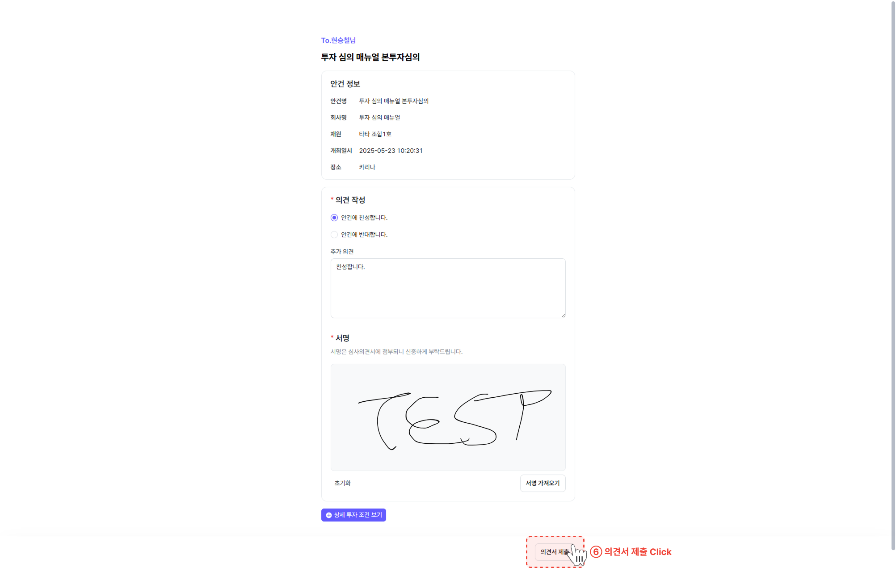

이 포스트는 RISC-V의 Instructions에 대해 설명한다.

## RISC-V instructions
Instruction들은 이진수(binary)로 저장되어 있고 이를 기계어(machine code)라 한다. RISC-V에서는 각 instruction들이 32-bit로 이루어져 있다. Insturction은 **정규성(Regularity)**가 매우 중요하다. 정규성이 정확히 어떤 의미인지는 앞으로 살펴보자.

## R-format Instructions
R-format Instructions들은 두 register 값 사이의 연산을 주로 담당한다.

|funct7|rs2|rs1|funct3|rd|opcode|
|:--:|:--:|:--:|:--:|:--:|:--:|:--:|
|7bits|5bits|5bits|3bits|5bits|7bits|

- rs1, rs2: the first and second source register number
- rd: destination register number
- opcode: operation code, funct3, funct7: additional opcode

ex) add x9, x20, x21  
add는 opcode: 0110011, funct3: 000, funct7: 0000000을 가진다.  
0000000 10101 10100 000 01001 0110011이 이 instruction의 binary 표현이다.

## I-format Instructions
I-format Instructions들은 한 register 값과 상수의 연산, load를 주로 담당한다.

|immediate|rs1|funct3|rd|opcode|
|:--:|:--:|:--:|:--:|:--:|:--:|
|12bits|5bits|3bits|5bits|7bits|

immediate은 2s-complement, sign extended 형태로 상수를 저장한다.

ex) ld x10, 36(x20)  
x20에 있는 주소에 36을 더한 메모리주소에서 값을 읽어서 x10에 값을 저장한다.  
ld는 opcode: 0000011, funct3: 011을 가진다.  
000000100100 10100 011 01010 0000011이 이 instruction의 binary 표현이다.

## S-format Instructions
S-format Instructions들은 store을 주로 담당한다. 

|imm[11:5]|rs2|rs1|funct3|imm[4:0]|opcode|
|:--:|:--:|:--:|:--:|:--:|:--:|
|7bits|5bits|5bits|3bits|5bits|7bits|

imm[11:5]는 총 전체 immeditate 12-bit중(bit11~bit0)에 bit11~bit5까지를 넣어둔 것이고 imm[4:0]은 bit4~bit0을 넣어둔 것이다.  
ex) sd x11, 36(x20)  
x20에 있는 주소에 36을 더한 메모리주소에 x11의 값을 저장한다.  
sd는 opcode: 0100011, funct3: 011을 가진다.  
0000001 01011 10100 011 00100 0100011이 이 instruction의 binary 표현이다.

## Logical Operations
논리 연산자는 bit끼리의 연산을 주로 한다. 대표적인 logical operations는 아래와 같다.

NOT은 xor연산으로 충분히 처리가능하다.  
ex) x = 1011, x xor 1111 = 0100 = ~x

### Shift Operations
그중 shift operations를 주목해야 한다. 
shift operations에 들어가는 slli, srli은 전체적으로는 I-format instructions에 들어간다. 

|funct6|immed|rs1|funct3|rd|opcode|
|:--:|:--:|:--:|:--:|:--:|:--:|:--:|
|6bits|6bits|5bits|3bits|5bits|7bits|

I-format의 12-bit짜리 immediate 중에서 실제로 필요한건 아래 6bits 뿐이다.  
왜? 각 register는 최대 64bit의 크기를 가진다. 따라서 shift를 64번 이상하는 것은 의미가 없다. 따라서 immediate은 0~63까지만 표현하면 되고 $$2^6 = 64$$이므로 6bits만 필요하다.

또한 shift right이 좀 복잡하다. shift left의 경우 slli 하나밖에 없다. 무조건 왼쪽으로 밀고 난 후 빈칸은 0으로 채우면 된다. 그런데 shift right에는 srli과 srai이 있다. srli은 slli 처럼 밀고 0만 채우면 된다. 그게 logical이니까. srai은 arithmetic이라서 만약 MSB가 1이면 1로 채워야 한다. 더 자세히는 추후에 알아보자. 

따라서 slli은 $$2^i$$으로 곱해주는 효과가 나고, srli은 $$2^i$$으로 나눠주는 효과가 난다. srli의 경우에는 unsigned, 또는 non-negative인 경우에만 그러하다. 

### AND Operations

AND operation은 둘다 1이면 1, 아니면 0이 된다. 보통 mask bits로 사용한다.

### OR Operations

OR operation은 하나만 1이여도 1이다. 보통 include느낌으로 많이 쓴다.

### XOR Operations

XOR operation은 같으면 0, 다르면 1이다. 보통 1111... 1111이랑 xor 시켜서 not 만든다.

## Regularity

처음에 언급했던 정규성은 사실 이 포스트의 preview 이미지와 관련되어 있었다. 모든 명령어가 32bit으로 이루어져 있고 각 명령어를 읽기 위해서 parsing해야하는 위치가 다 동일하다. 이러한 성질은 하드웨어 구조의 복잡성을 낮출 수 있도록 도와준다. 또한 각 하드웨어의 낭비가 없도록 할 것이다. 

---
추후 Conditional Operations와 Procedure Call Instructions는 다음 포스트에서 살펴보겠다. 