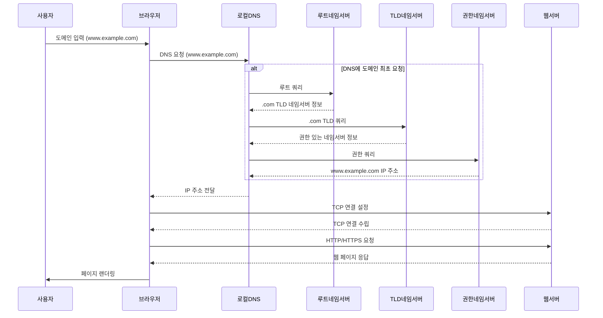

## DNS 재귀 쿼리와 웹 브라우저의 랜딩 과정의 단계

---
1. **도메인 입력**:
   - 사용자가 웹 브라우저에 도메인 이름(예: `www.example.com`)을 입력

2. **DNS 재귀 쿼리**:
   - 웹 브라우저는 로컬 DNS 리졸버에 `www.example.com`에 대한 IP 주소를 요청합니다.
   - 로컬 DNS 리졸버는 캐시에 해당 정보가 없으면 루트 네임서버로 쿼리를 보냅니다.
   - 루트 네임서버는 `.com` TLD 네임서버 주소를 리졸버에 제공합니다.
   - 리졸버는 `.com` TLD 네임서버에 쿼리를 보내고, `example.com`의 권한 있는 네임서버 주소를 받습니다.
   - 리졸버는 권한 있는 네임서버에 `www.example.com` 쿼리를 보내고, IP 주소를 받습니다.
   - 로컬 DNS 리졸버는 이 IP 주소를 브라우저에게 전달합니다.

3. **TCP 연결 수립**:
   - 브라우저는 얻은 IP 주소를 사용하여 해당 웹 서버에 TCP 연결을 수행합니다.

4. **HTTP/HTTPS 요청**:
   - TCP 연결이 설정되면 브라우저는 웹 서버에 HTTP/HTTPS 요청을 보냅니다.

5. **웹 서버 응답**:
   - 웹 서버는 요청을 처리하고, 요청된 웹 페이지(HTML, CSS, JS 등)를 브라우저로 응답합니다.

6. **페이지 랜더링**:
   - 브라우저는 받은 웹 페이지 데이터를 해석하여 페이지를 화면에 표시합니다.

## sequenceDiagram

---

