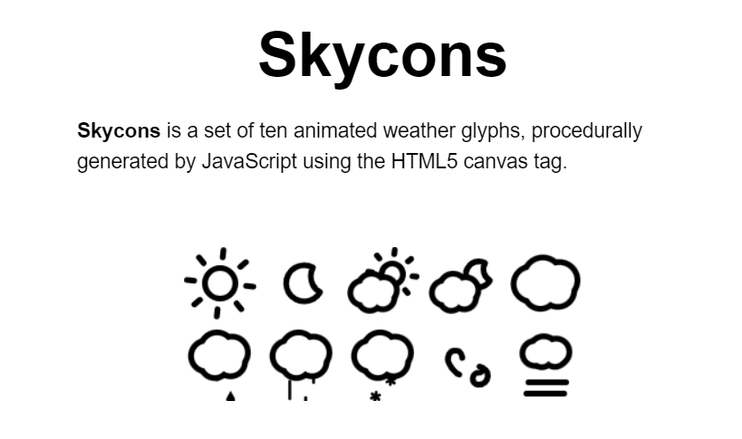
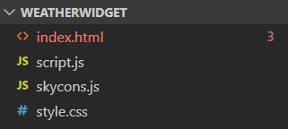
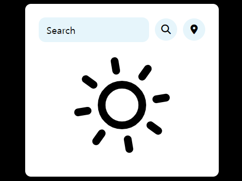
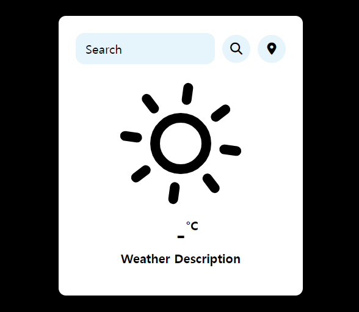
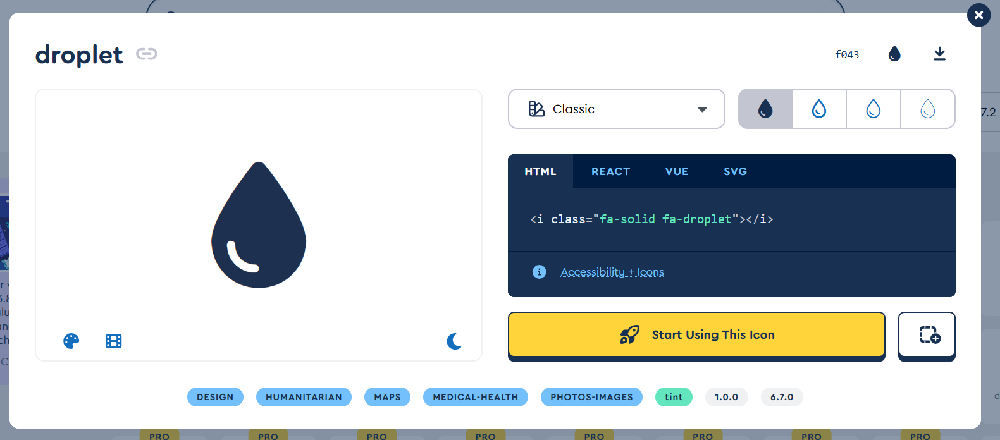
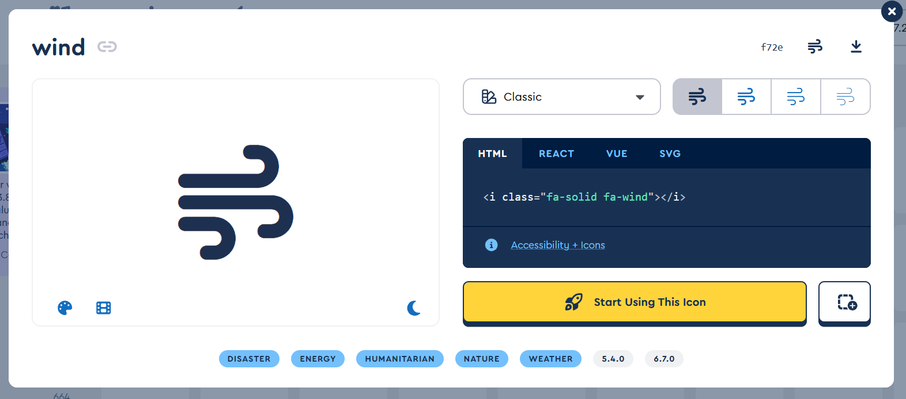
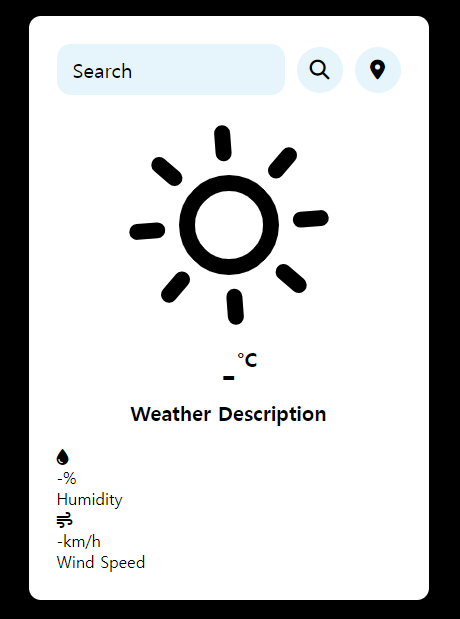
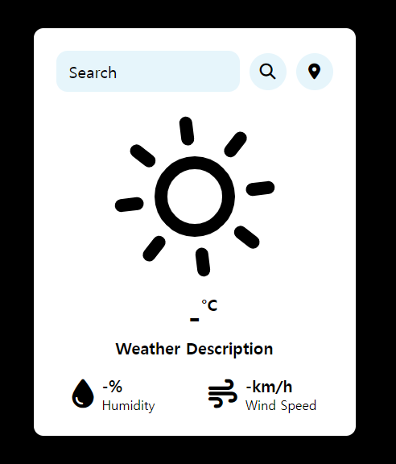

안녕하세요🖐️

오늘은 날씨 위젯을 실행하면 나오는 초기 화면의 레이아웃을 세팅해보도록 하겠습니다!

먼저 이미지를 넣어서 날씨를 표현해보도록 하겠습니다.

이미지를 고르려고 구글링을 하다가 Skycons라는 걸 발견했는데, animated되는 날씨 이미지가 마음에 들어서 이걸 사용했습니다.

{:style="border:1px solid #ababab; border-radius: 10px;"}

***

## 사전에 필요한 파일

Skycons를 사용하려면 **skycons.js** 파일이 필요합니다.

[Skycons 깃허브 링크](https://github.com/darkskyapp/skycons)

다음 링크에서 zip 파일을 다운한 후, **skycons.js** 파일만 복사해서 자신의 프로젝트 파일로 가져옵니다!

{:style="border:1px solid #ababab; border-radius: 10px;"}

이렇게 설정해 주시면 됩니다!

***

## 날씨 초기 화면에 Skycons 아이콘 삽입

### script.js

```js
var icons = new Skycons({ "color": "black" });

icons.add("weather-icon", Skycons.CLEAR_DAY);
icons.play();
```

Skycons 객체를 생성하고, 맑은 날씨 아이콘을 추가한 후, 애니메이션을 재생하는 코드를 하나 작성해 줍니다.

***

### index.html

```html
<body>
    <div class="container">
        <div class="header">
            <div class="search-box">
                <input type="text" placeholder="Search" class="input-box">
                <button class="fa-solid fa-magnifying-glass" id="searchBtn"></button>
                <button class="fa-solid fa-location-dot" id="locationBtn"></button>
            </div>
            <div class="weather-body">
                <canvas id="weather-icon" width="200" height="200" alt="Weather Image" class="weather-img"></canvas>
            </div>
        </div>
    </div>
    <script src="skycons.js"></script>
    <script src='script.js'></script>
    <script src="https://kit.fontawesome.com/당신의 킷 주소.js" crossorigin="anonymous"></script>
</body>
```

다음으로 skycons을 사용하기 위해서 skycons 라이브러리를 html 코드에 포함하고 weather-body 클래스 안에 weather-icon 캔버스를 생성해줘서 날씨 아이콘이 나타나도록 코딩해주었습니다!

***

### style.css

```css
.weather-body {
    display: flex;
    justify-content: center;
    align-items: center;
    flex-direction: column;
    margin-block: 20px;
    padding-top: 10px;
}

.weather-body img {
    width: 60%;
}
```

css 파일을 수정해서 날씨 아이콘을 중앙에 배치했고, 이미지 크기를 조정해 주었습니다.

***

### 구현 결과

{:style="border:1px solid #ababab; border-radius: 10px;"}

아이콘이 잘 움직이네요 ㅎㅎ

***

## °C와 Weather Desciption 구현

날씨 위젯의 핵심 기능을 구현해보겠습니다.

### index.html

```html
<div class="weather-box">
  <p class="temperature">-<sup>°C</sup></p>
  <p class="description">Weather Description</p>
</div>
```

weather-body 클래스 바로 아래에 weather-box클래스를 만들어 주었습니다.

p요소가 temperature, description를 갖도록 했고, 초기 온도를 -°C로, 날씨 설명란에는 Weather Description으로 표기해서 초기 화면 세팅을 했습니다.

***

### style.css

```css
.weather-box {
    margin-block: 20px;
    text-align: center;
}

.weather-box .temperature {
    font-size: 40px;
    font-weight: 800;
    position: relative;
}

.weather-box .temperature sup {
    font-size: 20px;
    position: absolute;
    font-weight: 600;
}

.weather-box .description {
    font-size: 20px;
    font-weight: 700;
    text-transform: capitalize;

}
```

다음으로 style.css 코드입니다.

weather-box 요소의 폰트 크기와 두께, 위치, 텍스트 정렬 및 변환을 설정해 줍니다.

***

### 구현 결과

{:style="border:1px solid #ababab; border-radius: 10px;"}

***

## 습도와 풍속 기능 구현

다음으로 습도와 풍속을 Weather Description 아래에 표현하도록 하겠습니다.

### index.html #1

```html
<div class="wether-details">
                <div class="humidity">
                    
                    <div class="text">
                        <span id="humidity">-%</span>
                        <p>Humidity</p>
                    </div>
                </div>
                <div class="wind">

                    <div class="text">
                        <span id="wind-speed">-km/h</span>
                        <p>Wind Speed</p>
                    </div>
                </div>
            </div>
```

weather-details 클래스를 만들고, humidity, wind-speed를 표현해 준 후,

Font Awesome 사이트에서 물방울 아이콘과 바람 아이콘을 가져와줄께요!

[Font Awesome 바로가기]("https://fontawesome.com")

{:style="border:1px solid #ababab; border-radius: 10px;"}

{:style="border:1px solid #ababab; border-radius: 10px;"}

저는 이 아이콘들로 선택했어요. 오른쪽에 있는 html 코드를 복사해서 붙여 넣습니다. 아래 코드와 같이 작성하시면 됩니다.

***

### index.html #2

```html
<div class="wether-details">
                <div class="humidity">
                    <i class="fa-solid fa-droplet"></i>
                    <div class="text">
                        <span id="humidity">-%</span>
                        <p>Humidity</p>
                    </div>
                </div>
                <div class="wind">
                    <i class="fa-solid fa-wind"></i>
                    <div class="text">
                        <span id="wind-speed">-km/h</span>
                        <p>Wind Speed</p>
                    </div>
                </div>
            </div>
```

***

#### 구현 결과

{:style="border:1px solid #ababab; border-radius: 10px;"}

물방울 아이콘과 바람 아이콘이 잘 구현이 되었고, 초기 화면 세팅도 거의 다 완료된 것 같아요🥳🥳

이제 레이아웃만 적절히 설정해 줍시다!

***

### style.css

```css
.wether-details {
    width: 100%;
    display: flex;
    justify-content: space-between;
    margin-top: 20px;
}

.humidity,
.wind {
    display: flex;
    align-items: center;
}

.humidity {
    margin-left: 20px;
}

.wind {
    margin-right: 20px;
}

.wether-details {
    font-size: 36px;
}

.wether-details .text {
    margin-left: 10px;
    font-size: 16px;
}

.text span {
    font-size: 20px;
    font-weight: 700;

}
```

flexbox 레이아웃을 통해서 humidity와 wind를 수평으로 배치했고, 각 요소의 여백과 폰트 크기를 조정한 코드에요!

***

#### 구현 결과

{:style="border:1px solid #ababab; border-radius: 10px;"}

코드를 작성하시면 이렇게 깔끔한 초기 화면을 만드실 수 있습니다😊

다음 시간에는 날씨 검색 기능과 날씨를 가져와서 화면에 출력하는 기능을 코딩해보겠습니다.

글 읽어주셔서 감사합니다!
