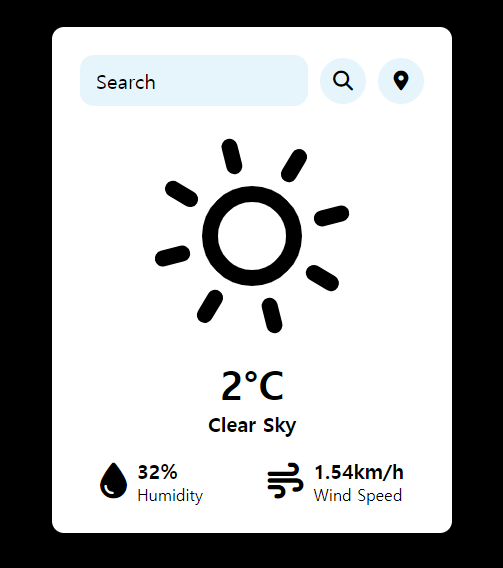
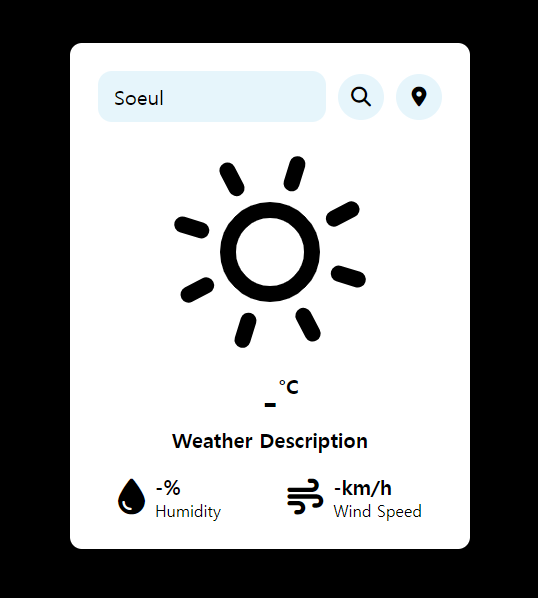

반갑습니다! 오늘은 GeoLocation과 OpenWeatherMap API를 활용해서 위치 기반 날씨 위젯을 만들어 볼 겁니다.

script.js 파일만 수정해주면 될 것 같네요!

***

## 위치 기반 알고리즘

### script.js #1

```js
async function checkWeatherByCoords(lat, lon) {
    const api_key = "당신의 API key";
    const url = `https://api.openweathermap.org/data/2.5/weather?lat=${lat}&lon=${lon}&appid=${api_key}`;
    const weather_data = await fetch(`${url}`).then(response => response.json());

    temperature.innerHTML = `${Math.round(weather_data.main.temp - 273.15)}°C`;
    description.innerHTML = `${weather_data.weather[0].description}`;
    humidity.innerHTML = `${weather_data.main.humidity}%`;
    wind_speed.innerHTML = `${weather_data.wind.speed}km/h`;

    let weatherType = weather_data.weather[0].main.toLowerCase();

    switch (weatherType) {
        case 'clouds':
            icons.set("weather-icon", Skycons.CLOUDY);
            break;
        case 'clear':
            icons.set("weather-icon", Skycons.CLEAR_DAY);
            break;
        case 'rain':
            icons.set("weather-icon", Skycons.RAIN);
            break;
        case 'mist':
            icons.set("weather-icon", Skycons.FOG);
            break;
        case 'snow':
            icons.set("weather-icon", Skycons.SNOW);
            break;
        default:
            icons.set("weather-icon", Skycons.CLEAR_DAY);
    }

    icons.play();
}

function getLocation() {
    if (navigator.geolocation) {
        navigator.geolocation.getCurrentPosition((position) => {
            const lat = position.coords.latitude;
            const lon = position.coords.longitude;
            checkWeatherByCoords(lat, lon);
        });
    } else {
        alert("Geolocation is not supported by this browser.");
    }
}

locationBtn.addEventListener('click', () => {
    getLocation();
});
```

지난 포스팅 3편에 작성했던 checkWeather 함수와 굉장히 유사합니다.

위도와 경도인 lat, lon을 매개 변수로 받은 후 지정된 위도와 경도를 사용하여 날씨 데이터를 가져오기 위한 API URL을 생성합니다.

나머지 부분은 checkWeather 함수와 같으므로, 저번 포스팅을 확인해 주세요!

***

### script.js #2

```js
function getLocation() {
    if (navigator.geolocation) {
        navigator.geolocation.getCurrentPosition((position) => {
            const lat = position.coords.latitude;
            const lon = position.coords.longitude;
            checkWeatherByCoords(lat, lon);
        });
    } else {
        alert("Geolocation is not supported by this browser.");
    }
}

locationBtn.addEventListener('click', () => {
    getLocation();
});
```

다음으로 getLocation 함수를 작성했습니다.

navigator.geolocation 객체를 통해 브라우저가 지리적 위치 정보를 지원하는지 확인한 후, getCurrentPosition 메소드를 호출합니다.

위도와 경도를 가져오고, 해당 정보를 checkWeatherByCoords 함수에 전달하는 코드입니다.

addEventListener를 이용해서 사용자가 위치 버튼을 클릭할 때 getLocation 함수가 실행되도록 했습니다.

***

### 구현 결과

{:style="border:1px solid #ababab; border-radius: 10px;"}

위치 버튼을 클릭했을 때, 다음 사진과 같이 날씨 정보가 출력된 것을 확인할 수 있었습니다👏

***

### 아쉬운 점

위치 아이콘을 클릭했을 때, 날씨는 잘 출력이 되지만 현재 위치가 어디인지 알려주지 않아서 이 부분이 아쉬웠습니다.

또한, 잘못된 위치를 검색했을 때, 에러 코드를 출력하면 더 좋은 프로그램이 될 것 같다고 생각했습니다.

{:style="border:1px solid #ababab; border-radius: 10px;"}

다음 시간에는 위치 표시 및 에러 코드 출력을 해보겠습니다.

오늘 작성한 script.js 전체 코드를 보여드리면서 포스팅 마치도록 하겠습니다. (API key는 꼭 바꿔주세요!)

감사합니다~!

***

### script.js 전체 코드

```js
const inputBox = document.querySelector(".input-box");
const searchBtn = document.getElementById('searchBtn');
const locationBtn = document.getElementById('locationBtn');
const temperature = document.querySelector('.temperature');
const description = document.querySelector('.description');
const humidity = document.getElementById('humidity');
const wind_speed = document.getElementById('wind-speed');

var icons = new Skycons({ "color": "black" });

icons.add("weather-icon", Skycons.CLEAR_DAY);
icons.play();

async function checkWeather(city) {
    const api_key = "당신의 API key";
    const url = `https://api.openweathermap.org/data/2.5/weather?q=${city}&appid=${api_key}`;
    const weather_data = await fetch(`${url}`).then(response => response.json());

    temperature.innerHTML = `${Math.round(weather_data.main.temp - 273.15)}°C`;
    description.innerHTML = `${weather_data.weather[0].description}`;
    humidity.innerHTML = `${weather_data.main.humidity}%`;
    wind_speed.innerHTML = `${weather_data.wind.speed}km/h`;

    let weatherType = weather_data.weather[0].main.toLowerCase();

    switch (weatherType) {
        case 'clouds':
            icons.set("weather-icon", Skycons.CLOUDY);
            break;
        case 'clear':
            icons.set("weather-icon", Skycons.CLEAR_DAY);
            break;
        case 'rain':
            icons.set("weather-icon", Skycons.RAIN);
            break;
        case 'mist':
            icons.set("weather-icon", Skycons.FOG);
            break;
        case 'snow':
            icons.set("weather-icon", Skycons.SNOW);
            break;
        default:
            icons.set("weather-icon", Skycons.CLEAR_DAY);
    }

    icons.play();
}

async function checkWeatherByCoords(lat, lon) {
    const api_key = "당신의 API key";
    const url = `https://api.openweathermap.org/data/2.5/weather?lat=${lat}&lon=${lon}&appid=${api_key}`;
    const weather_data = await fetch(`${url}`).then(response => response.json());

    temperature.innerHTML = `${Math.round(weather_data.main.temp - 273.15)}°C`;
    description.innerHTML = `${weather_data.weather[0].description}`;
    humidity.innerHTML = `${weather_data.main.humidity}%`;
    wind_speed.innerHTML = `${weather_data.wind.speed}km/h`;

    let weatherType = weather_data.weather[0].main.toLowerCase();

    switch (weatherType) {
        case 'clouds':
            icons.set("weather-icon", Skycons.CLOUDY);
            break;
        case 'clear':
            icons.set("weather-icon", Skycons.CLEAR_DAY);
            break;
        case 'rain':
            icons.set("weather-icon", Skycons.RAIN);
            break;
        case 'mist':
            icons.set("weather-icon", Skycons.FOG);
            break;
        case 'snow':
            icons.set("weather-icon", Skycons.SNOW);
            break;
        default:
            icons.set("weather-icon", Skycons.CLEAR_DAY);
    }

    icons.play();
}

function getLocation() {
    if (navigator.geolocation) {
        navigator.geolocation.getCurrentPosition((position) => {
            const lat = position.coords.latitude;
            const lon = position.coords.longitude;
            checkWeatherByCoords(lat, lon);
        });
    } else {
        alert("Geolocation is not supported by this browser.");
    }
}

searchBtn.addEventListener('click', () => {
    checkWeather(inputBox.value);
});

inputBox.addEventListener('keypress', (event) => {
    if (event.key === "Enter") {
        checkWeather(inputBox.value);
    }
});

locationBtn.addEventListener('click', () => {
    getLocation();
});
```

