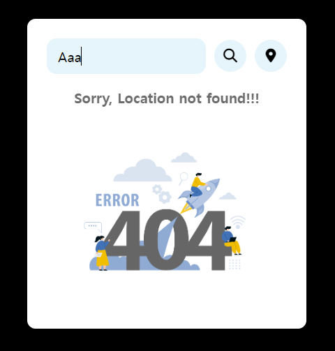
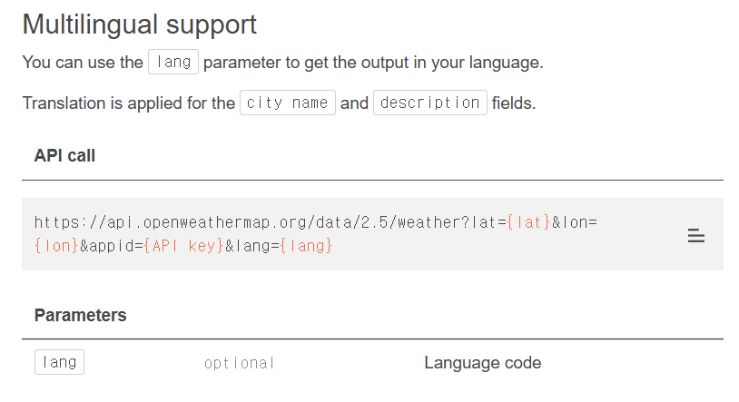
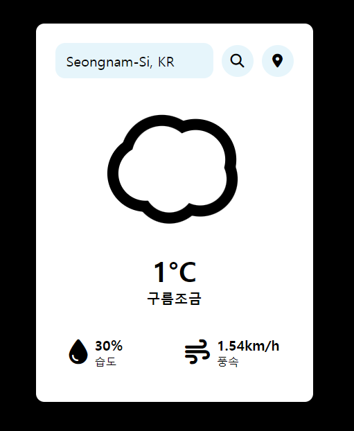

이 글이 날씨 위젯 프로젝트의 마지막이 될 것 같네요😭

제가 만든 프로그램에는 3가지 문제가 있었습니다.

1. 위치 아이콘을 클릭했을 때, 날씨는 출력이 되지만 위치가 출력이 안되는 문제
2. 잘못된 위치를 검색했을 때, 아무런 출력이 없는 문제
3. 한국어가 아닌 영어로 출력되는 문제

오늘은 이 3가지 문제를 해결하는 과정을 포스팅해볼께요!

***

## 404 에러 구현

404 에러를 먼저 구현해주도록 하겠습니다.

적절한 에러 출력 이미지를 찾기 위해 구글링을 해서 다음과 같은 이미지를 구했습니다!

{: width="500" height="500"}}

프로젝트 경로에 "asset"이라는 폴더를 만들어 준 후, 404.png 파일을 옮겼습니다.

***

### script.js

```js
const location_not_found = document.querySelector('.location-not-found');
const weather_body = document.querySelector('.weather-body');
```

```js
if (weather_data.cod == `404`) {
        location_not_found.style.display = "flex";
        weather_body.style.display = "none";
        return;
    }

    location_not_found.style.display = "none";
    weather_body.style.display = "flex";
```

if 문을 checkWeather 함수와 checkWeatherByCoords 함수에 입력해 주었습니다.

location_not_found 변수와 weather_body 변수를 스크립트 파일 최상단에 할당해주고, if 문을 통해서 입력된 위치를 찾을 수 없는 경우를 처리합니다.

none, flex를 통해서 사용자가 위치를 찾을 수 없는 경우에는 경고 메시지를 표시하고, 위치를 찾을 수 있는 경우에는 날씨 정보를 표시해 줍니다.

***

### index.html

```html
<div class="location-not-found">
    <h1>Sorry, Location not found!!!</h1>
    
</div>
```

container 클래스 내부 header 아래에 코드를 입력해 주었습니다.

저장한 404 에러 이미지를 텍스트와 함께 출력해 주는 코드입니다.

***

### style.css

```css
.location-not-found {
    margin-top: 20px;
    display: none;
    align-items: center;
    justify-content: center;
    flex-direction: column;
}

.location-not-found h1 {
    font-size: 20px;
    color: #6b6b6b;
    margin-block-end: 15px;
}

.location-not-found img {
    width: 80%;
}
```

다음으로 css 코드입니다. 

display: none; 속성을 통해서 요소를 화면에서 숨겼습니다.

***

### 구현 결과

{:style="border:1px solid #ababab; border-radius: 10px;"}

구현 성공👏

***

## 현재 위치 출력

현재 위치를 출력하는 것은 생각보다 쉬웠습니다.

위치 아이콘을 클릭한 이후, inputBox의 기존 값인 Search를 현재 위치로 바꿔주면 끝났어요!

### script.js

```js
inputBox.value = `${weather_data.name}, ${weather_data.sys.country}`;
```

이 코드를 checkWeatherByCoords 함수 가장 아랫부분에 입력해 주었습니다.

***

### 구현 결과

{:style="border:1px solid #ababab; border-radius: 10px;"}

***

## 한국어 지원

마지막으로  "Clear Sky" 처럼 영어로 표현되는 날씨의 상세 설명을 한국어로 변경하자는 생각이 들었습니다. 

{:style="border:1px solid #ababab; border-radius: 10px;"}

OpenWeatherMap 사이트를 디깅해서 언어를 변경할 수 있는 코드를 발견했습니다.

**&lang=kr**을 checkWeather 함수와 checkWeatherByCoords 함수의 url 부분에 입력해주었습니다.

바꾸는 김에 초기 화면 레이아웃을 구축할 때 사용했던 Humidity와 같은 부분들도 모두 한국어로 변경했습니다.

***

## 최종 구현 결과

{:style="border:1px solid #ababab; border-radius: 10px;"}

이렇게 날씨 위젯을 완성해보았습니다. 다 만들고 나니 정말 뿌듯하네요 ㅠㅠ

***

## 느낀 점 및 개선할 점

### 느낀 점

이번 미니 프로젝트를 통해 API 사용과 비동기 처리에 대한 이해를 높일 수 있었습니다. 특히 Skycons를 사용해 날씨 아이콘을 추가하는 과정이 재미있었습니다. 해결해야 하는 여러 과제들을 해결하면서 기술적으로 많이 성장했다고 느꼈습니다.

### 개선할 점

1. 사용자가 도시를 검색할 때 자동 완성 기능 추가

2. 더 많은 날씨 정보를 제공하기 위한 추가 API 통합

3. 사용자 인터페이스 개선

프로젝트에 대한 피드백이나 질문이 있다면 언제든지 댓글 남겨주세요!

***

## 전체 코드

### index.html

```html
<!DOCTYPE html>
<html>

<head>
    <meta charset='utf-8'>
    <meta http-equiv='X-UA-Compatible' content='IE=edge'>
    <title>Weather Widget</title>
    <meta name='viewport' content='width=device-width, initial-scale=1'>
    <link rel='stylesheet' type='text/css' media='screen' href='style.css'>
</head>

<body>
    <div class="container">
        <div class="header">
            <div class="search-box">
                <input type="text" placeholder="Search" class="input-box">
                <button class="fa-solid fa-magnifying-glass" id="searchBtn"></button>
                <button class="fa-solid fa-location-dot" id="locationBtn"></button>
            </div>
        </div>
        <div class="location-not-found">
            <h1>잘못된 위치 정보입니다.</h1>
            
        </div>
        <div class="weather-body">
            <canvas id="weather-icon" width="200" height="200" alt="Weather Image" class="weather-img"></canvas>
            <div class="weather-box">
                <p class="temperature">-<sup>°C</sup></p>
                <p class="description">날씨 정보</p>
            </div>
            <div class="wether-details">
                <div class="humidity">
                    <i class="fa-solid fa-droplet"></i>
                    <div class="text">
                        <span id="humidity">-%</span>
                        <p>습도</p>
                    </div>
                </div>
                <div class="wind">
                    <i class="fa-solid fa-wind"></i>
                    <div class="text">
                        <span id="wind-speed">-km/h</span>
                        <p>풍속</p>
                    </div>
                </div>
            </div>
        </div>
    </div>
    <script src="skycons.js"></script>
    <script src='script.js'></script>
    <script src="https://kit.fontawesome.com/당신의 킷 주소.js" crossorigin="anonymous"></script>
</body>

</html>
```

### style.css

```css
* {
    margin: 0;
    box-sizing: border-box;
    border: none;
    outline: none;
    font-family: sans-serif;
}

body {
    min-height: 100vh;
    display: flex;
    justify-content: center;
    align-items: center;
    background-color: #000;

}

.container {
    width: 400px;
    height: min-content;
    background-color: #fff;
    border-radius: 12px;
    padding: 28px;
}

.search-box {
    width: 100%;
    height: min-content;
    display: flex;
    justify-content: space-between;
    align-items: center;
    gap: 12px;
}

.search-box input {
    width: 84%;
    font-size: 20px;
    text-transform: capitalize;
    color: #000;
    background-color: #e6f5fb;
    padding: 12px 16px;
    border-radius: 14px;
}

.search-box input::placeholder {
    color: #000;
}

.search-box button {
    width: 46px;
    height: 46px;
    background-color: #e6f5fb;
    border-radius: 50%;
    flex-shrink: 0;
    cursor: pointer;
    font-size: 20px;
}

.search-box button:hover {
    color: #fff;
    background-color: #ababab;
}

.weather-body {
    display: flex;
    justify-content: center;
    align-items: center;
    flex-direction: column;
    margin-block: 20px;
    padding-top: 10px;
}

.weather-body img {
    width: 60%;
}

.weather-box {
    margin-block: 20px;
    text-align: center;
}

.weather-box .temperature {
    font-size: 40px;
    font-weight: 800;
    position: relative;
}

.weather-box .temperature sup {
    font-size: 20px;
    position: absolute;
    font-weight: 600;
}

.weather-box .description {
    font-size: 20px;
    font-weight: 700;
    text-transform: capitalize;

}

.wether-details {
    width: 100%;
    display: flex;
    justify-content: space-between;
    margin-top: 20px;
}

.humidity,
.wind {
    display: flex;
    align-items: center;
}

.humidity {
    margin-left: 20px;
}

.wind {
    margin-right: 20px;
}

.wether-details {
    font-size: 36px;
}

.wether-details .text {
    margin-left: 10px;
    font-size: 16px;
}

.text span {
    font-size: 20px;
    font-weight: 700;

}

.location-not-found {
    margin-top: 20px;
    display: none;
    align-items: center;
    justify-content: center;
    flex-direction: column;
}

.location-not-found h1 {
    font-size: 20px;
    color: #6b6b6b;
    margin-block-end: 15px;
}

.location-not-found img {
    width: 80%;
}
```

### script.js

```js
const inputBox = document.querySelector(".input-box");
const searchBtn = document.getElementById('searchBtn');
const locationBtn = document.getElementById('locationBtn');
const temperature = document.querySelector('.temperature');
const description = document.querySelector('.description');
const humidity = document.getElementById('humidity');
const wind_speed = document.getElementById('wind-speed');
const location_not_found = document.querySelector('.location-not-found');
const weather_body = document.querySelector('.weather-body');

var icons = new Skycons({ "color": "black" });

icons.add("weather-icon", Skycons.CLEAR_DAY);
icons.play();

async function checkWeather(city) {
    const api_key = "당신의 API key";
    const url = `https://api.openweathermap.org/data/2.5/weather?q=${city}&appid=${api_key}&lang=kr`;
    const weather_data = await fetch(`${url}`).then(response => response.json());

    if (weather_data.cod == `404`) {
        location_not_found.style.display = "flex";
        weather_body.style.display = "none";
        return;
    }

    location_not_found.style.display = "none";
    weather_body.style.display = "flex";

    temperature.innerHTML = `${Math.round(weather_data.main.temp - 273.15)}°C`;
    description.innerHTML = `${weather_data.weather[0].description}`;
    humidity.innerHTML = `${weather_data.main.humidity}%`;
    wind_speed.innerHTML = `${weather_data.wind.speed}km/h`;

    let weatherType = weather_data.weather[0].main.toLowerCase();

    switch (weatherType) {
        case 'clouds':
            icons.set("weather-icon", Skycons.CLOUDY);
            break;
        case 'clear':
            icons.set("weather-icon", Skycons.CLEAR_DAY);
            break;
        case 'rain':
            icons.set("weather-icon", Skycons.RAIN);
            break;
        case 'mist':
            icons.set("weather-icon", Skycons.FOG);
            break;
        case 'snow':
            icons.set("weather-icon", Skycons.SNOW);
            break;
        default:
            icons.set("weather-icon", Skycons.CLEAR_DAY);
    }

    icons.play();
}

async function checkWeatherByCoords(lat, lon) {
    const api_key = "당신의 API key";
    const url = `https://api.openweathermap.org/data/2.5/weather?lat=${lat}&lon=${lon}&appid=${api_key}&lang=kr`;
    const weather_data = await fetch(`${url}`).then(response => response.json());

    if (weather_data.cod == `404`) {
        location_not_found.style.display = "flex";
        weather_body.style.display = "none";
        return;
    }

    location_not_found.style.display = "none";
    weather_body.style.display = "flex";

    temperature.innerHTML = `${Math.round(weather_data.main.temp - 273.15)}°C`;
    description.innerHTML = `${weather_data.weather[0].description}`;
    humidity.innerHTML = `${weather_data.main.humidity}%`;
    wind_speed.innerHTML = `${weather_data.wind.speed}km/h`;

    let weatherType = weather_data.weather[0].main.toLowerCase();

    switch (weatherType) {
        case 'clouds':
            icons.set("weather-icon", Skycons.CLOUDY);
            break;
        case 'clear':
            icons.set("weather-icon", Skycons.CLEAR_DAY);
            break;
        case 'rain':
            icons.set("weather-icon", Skycons.RAIN);
            break;
        case 'mist':
            icons.set("weather-icon", Skycons.FOG);
            break;
        case 'snow':
            icons.set("weather-icon", Skycons.SNOW);
            break;
        default:
            icons.set("weather-icon", Skycons.CLEAR_DAY);
    }

    icons.play();
    
    inputBox.value = `${weather_data.name}, ${weather_data.sys.country}`;
}

function getLocation() {
    if (navigator.geolocation) {
        navigator.geolocation.getCurrentPosition((position) => {
            const lat = position.coords.latitude;
            const lon = position.coords.longitude;
            checkWeatherByCoords(lat, lon);
        });
    } else {
        alert("Geolocation is not supported by this browser.");
    }
}

searchBtn.addEventListener('click', () => {
    checkWeather(inputBox.value);
});

inputBox.addEventListener('keypress', (event) => {
    if (event.key === "Enter") {
        checkWeather(inputBox.value);
    }
});

locationBtn.addEventListener('click', () => {
    getLocation();
});
```
