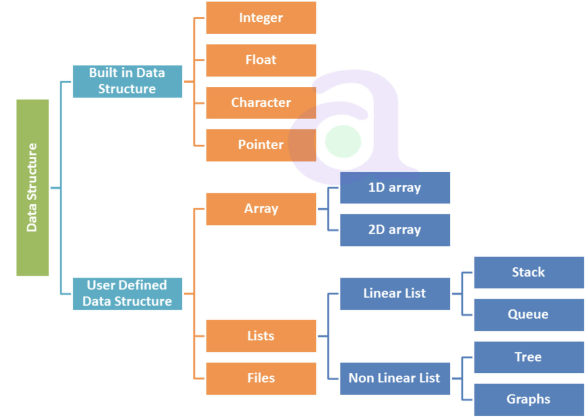
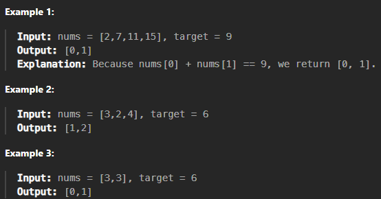

## Data Structure(자료구조)란?
---
>`Data Structure(자료구조)`는 **데이터를 효율적으로 저장하고 관리**하며 조작하기 위해 설계된 구조다.
>

  
예를 들어 도서관을 생각해보면, 책이 10권 밖에 없는 도서관은 딱히 정리를 하지 않아도 원하는 책을 빠르게 고를 수 있다.  

**하지만 10000개의 책이 있다면?**

원하는 책을 고르기까지 시간이 엄청나게 걸릴 것이다.  
그래서 필요한게 책을 정리해놓는것이다. 가나다 순이든, 알파벳순이든, 주제별이든 자신이 찾기 편한 방법으로 정리를 해놓으면 원하는 책을 찾기 훨씬 수월하다.

셀 수도 없이 많은 데이터의 경우도 정리를 잘해놓으면 컴퓨터의 CPU가 빠르고 효율적으로 데이터를 처리할 수 있다.

## 자료구조 분류
---
자료구조는 `선형(Linear)`과 `비선형(Non Linear)`으로 나눌 수 있다.


`선형 자료구조`는 데이터들이 선형으로 되어있어서 한 번에 하나씩 처리하는 구조이다. 예시로는 `배열(Array)`,`스택(Stack)`등이 있다.  
반면에 `비선형 자료구조`는 데이터들을 여러 갈래로 나누어 복잡하게 연결된 구조이다. 예시로는 `트리(Tree)`, `그래프(Graph)`가 있다.

### 배열(Array)
---


배열은 `청크(chunk)` 형태로 메모리가 연속적으로 할당된다.  
배열을 구성하는 각각의 값을 `요소(element)`라고 하며, 배열에서의 위치를 가리키는 숫자를 `인덱스(index)`라고 한다.

**배열 문제 풀이**  
 
  
이 문제는 배열의 두 정수의 합이 target과 일치할 때 원소 2개의 `인덱스`를 반환해야한다.

### 1. Brute Force
---
```c++
class Solution {
public:
    vector<int> twoSum(vector<int>& nums, int target) {
        int n = nums.size();
        for (int i=0; i < n-1; i++){
            for (int j=i+1; j<n; j++){
                if(nums[i]+nums[j] == target){
                    return {i, j};
                } 
            }
        }
        return {};
    } 
};
```
브루트 포스로 작성한 코드는 시간복잡도가 *O(n^2)* 이 된다.
### 2. Hash Table
---
```c++
class Solution {
public:
    vector<int> twoSum(vector<int>& nums, int target) {
        unordered_map<int, int> mp;
        int n = nums.size();

        for (int i = 0; i < n; i++) {
            int com = target - nums[i];
            if (mp.count(com)) {
                return {mp[com], i};
            }
            mp[nums[i]] = i;
        }

        return {};
    }
};
```
해시 테이블을 이용하여 풀면 브루트 포스에 비해 공간복잡도는 커지지만 시간복잡도는 *O(n)* 으로 작아진다.
