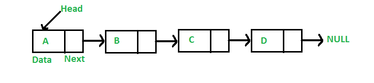
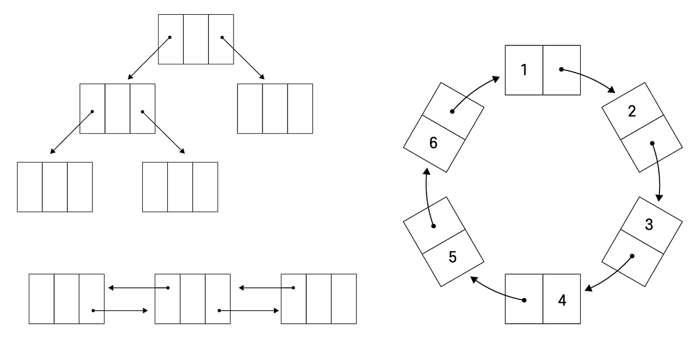
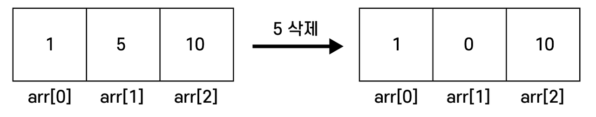
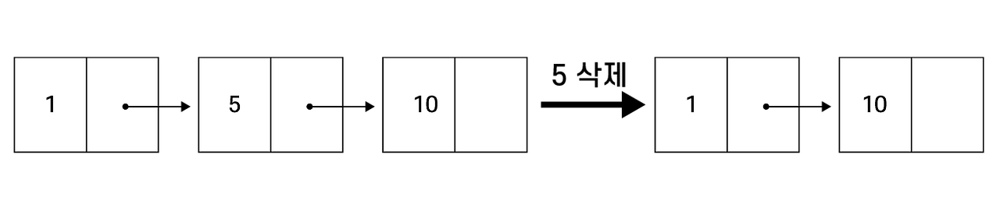
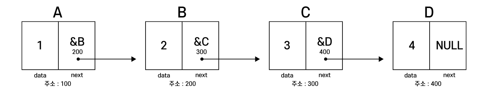

## Linked List(연결 리스트)란?
---
연속적인 메모리에 저장되는 배열과 달리 <u>**동적으로 사슬처럼 연결되어 있는 선형 데이터 구조**</u> 이다.


연결리스트에서 각 칸은 **노드(Node)**라고 부른다.

각 node는 동적으로 할당되며, **data와 주소를 동시에 저장** 할 수 있어야 하기 때문에 구조체로 만들 수 있다.

## 왜 Linked List를 사용하는가?
---
연결 리스트에 비해 배열은 만들기 쉽지만 몇 가지 제한사항이 있다.

1. 배열은 크기가 고정되어 있어 미리 요소의 수에 대해 할당을 받아야 한다.
   
    
    배열과 달리 연결 리스트는 원형 연결 리스트, 트리형 연결 리스트 등,   
    <u><span style="color: #008000">원하는 형태로 리스트를 구현</span></u> 할 수 있다.

2. 새로운 요소를 삽입 혹은 삭제하는 것이 힘들다. *(공간을 창출 -> 기존 요소 전부 이동)*
   
   
   배열은 크기가 고정되어 있으므로 node 자체를 삭제할 수는 없다.  
   따라서 해당 데이터가 삭제되었다는 **표시**를 남긴다.

   위의 예시에서 5 대신 0을 삽입하여 삭제했다는 표시를 남긴다.
   데이터를 다시 정렬하고 싶다면 뒤의 모든 데이터를 앞으로 한칸씩 당기는 작업이 필요하다.

   
   반면 연결 리스트는 node가 동적으로 구현되고, 포인터를 통해 다음 노드의 주소를 저장하기 때문에 각 노드를 원하는 대로 삭제가 가능하다.

장단점을 정리하자면 아래와 같다.
### 장점
1. 동적 구현
2. 삽입/삭제 용이
3. 메모리 효율성

### 단점
1. 임의로 액세스 허용 불가: 첫 번째 노드부터 순차적으로 요소에 액세스 해야해서 **접근속도가 느림**
2. 추가적인 메모리 사용

## Node 구현
---
노드는 아래와 같이 <U>구조체</u> 를 통해 구현한다.
```c
struct Node{
    int data; // 데이터가 저장되는 공간. 저장할 데이터에 따라 자료형이 다름
    struct node*next // 다음 노드의 주소를 저장할 포인터
};
```
### 정적 연결리스트 구현
```C
#include<stdio.h>
struct Node
{
	int data;
	struct node *next;
};

int main()
{
	Node a, b, c, d;
	
	a.data = 1;
	a.next = &b;
	
	b.data = 2;
	b.next = &c;
	
	c.data = 3;
	c.next = &d;
	
	d.data = 4;
	d.next = NULL;
	
	return 0;
}
```

위 코드는 **정적으로 구현된 연결리스트** 이다.
a ~ d는 Node의 자료형으로, 각각 data와 next를 노드로 가진다.

### 동적 연결리스트 구현
---
```c
#include<stdio.h>
#include<stdlib.h>

typedef struct node_{
	int data;
	struct node_ *next;
} Node;

Node *head = NULL;
Node *tail = NULL;

int main() {
	while(1) {
		int input;
		printf("Enter the data you want to input. ");
		scanf("%d",&input);
		
    if(input <=0 ) break;  //  입력 데이터가 0또는 음수면 종료
      
    Node *newnode = (Node*)malloc(sizeof(Node));  //  노드 동적 생성
      
    newnode->data = input;  //  노드의 데이터 삽입 
    newnode->next = NULL;  //  새로 생성된 노드는 항상 마지막 노드이므로 next는 없음
      
    if(head == NULL) head = newnode;  // head가 NULL이면 현재 연결리스트에 노드가 없다는 뜻
      
    else tail->next = newnode;  // 마지막에 생성했던 노드의 다음 노드를 방금 생성한 노드와 연결
      
    tail = newnode;  // 방금 생성한 노드가 마지막 노드이므로 tail 변경
  }
	
	printf("Current status : "); 
	Node *cur = head;  // 첫 번째 노드(head)부터 연결리스트 탐색 
  while(cur != NULL) {  // 더 이상 탐색할 노드가 없을 때 까지 반복
	  printf("%d ",cur->data);
	  cur = cur->next;  // 연결된 다음 노드로 이동
  }
  puts("");
	
	while(1) {
		int k;
		printf("Enter the data you want to delete. ");
		scanf("%d",&k);
		
		if(k <= 0) break;
		
		int search = 0; // 검색 여부 검사(1이면 있다, 0이면 없다)
		Node *cur_prev = NULL; // cur을 뒤 따라 다니는 포인터
		cur = head; // 첫 번째 노드(head)부터 연결리스트 탐색 
		while(cur != NULL) { // 더 이상 탐색할 노드가 없을 때 까지 반복
      if(cur->data == k){  // 입력한 데이터를 연결리스트에서 찾았음
        search = 1;  // 찾았으므로 search 변수를 1로 변경
        break;  // 찾았으므로 탐색 종료
      }
      cur_prev = cur;   // cur의 뒤를 따라 다님
      cur = cur->next;  // 연결된 다음 노드로 이동
		}
		
		if(search == 1) { // 삭제할 노드를 찾았을 때
			printf("Delete %d.\n",k);
			
			if(cur == head) head = cur->next; // 삭제할 노드가 head면 head를 이동
			else cur_prev->next = cur->next;  // 삭제할 노드의 이전 노드와 다음 노드를 연결
			
			free(cur); // cur 삭제
		}
		else { // 삭제할 노드를 찾지 못했을 때
			printf("%d not found.\n",k);
		}
	}
	
	printf("Current status(after deletion) : "); 
	cur = head;
	while(cur != NULL) {
		printf("%d ",cur->data);
		cur = cur->next;
	}
	puts(""); 
}
```
