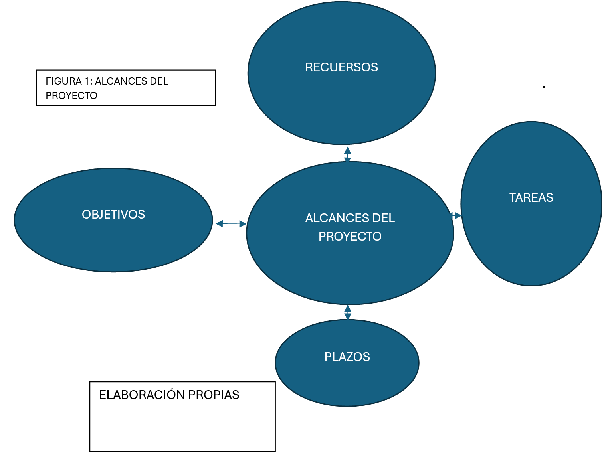

Un proyecto es un plan de trabajo diseñado para alcanzar un objetivo específico, que responde a necesidades o problemas previamente identificados. Los proyectos pueden tener diferentes naturalezas: económica, social, artística, científica, entre otras.
También se puede considerar un proyecto la elaboración de un plan de vida, ya sea personal o profesional.
En el ámbito profesional, un proyecto consiste en desarrollar un plan estructurado que refleje los conocimientos, habilidades y competencias que debe aplicar un profesional, por ejemplo, un ingeniero en sistemas computacionales.
En el campo de la inteligencia artificial, la detección de una necesidad implica la existencia de un problema que debe resolverse. Este problema puede convertirse en una oportunidad de innovación, al buscar soluciones que satisfagan los requisitos técnicos y humanos.

En la fase inicial de un proyecto informático se concibe la idea del proyecto y se formulan sus lineamientos básicos. 
> Esto implica identificar una necesidad, problema u oportunidad que el proyecto buscará resolver, y proponer una solución a alto nivel. (Schwalbe, 2019, p. 52).

El proyecto puede desarrollarse de forma individual o colectiva, y debe seguir una serie de pasos estratégicos que aseguren una ejecución eficaz y un aporte real de valor al entorno.

Los proyectos con fines de lucro deben mostrarse su viabilidad económica, financiera y  técnica que permitan determinar el costo-beneficio esperado. La formulación de proyectos se requiere levantar requerimientos técnicos, económicos-financieros; que sirvan para determinar los beneficios esperados. 

En la fase inicial de un proyecto informático se concibe la idea del proyecto y se formulan sus lineamientos básicos. Esto implica identificar una necesidad, problema u oportunidad que el proyecto buscará resolver, y proponer una solución a alto nivel. 

> Es fundamental alinear la concepción del proyecto con la estrategia organizacional para garantizar que aporte valor y cuente con apoyo de la dirección (Schwalbe, 2019, p. 52). 

### ¿Cuál es objetivo en planear un proyecto?
Desarrollar la planeación de un proyecto conlleva a minimizar los riegos para alcanzar los resultados deseados. Con el fin, de a partir de la planeación disminuir los riesgos.
El objetivo es facilitar el entendiemiento que ayude a indetificar el proposito del proyecto, plasmando las bases para una planificación efectiva. 
La planeación de un proyecto permite tener una luz del camino que hay que andar.

En esta etapa se definen de manera preliminar los objetivos del proyecto (qué se pretende lograr) y su alcance general, estableciendo los criterios de éxito. 
> Una clara definición inicial de los objetivos y beneficios facilita un entendimiento común del propósito del proyecto y sienta las bases para una planificación eficaz (Lock, 2020, p. 20).

En el siglo XXI las necesidades empresariales son bastas, el hecho de llevar a cabo una planeación de un proyecto permite observar cuales podría ser nuestros alcances y limitaciones a partir de las condiciones de los recursos económicos-financieros, técnicos y legislativos.
### Estrategia organizacional: 
Para alcanzar el éxito organizacional es primordial la definición de objetivos e implementar las acciones mediante una estrategia organizacional, todo proyecto debe ir en concordancia con los objetivos generales de una empresa, es decir, con la misión, objetivos sin olvidar los valores de ese ente económico.

> Es fundamental alinear la concepción del proyecto con la estrategia organizacional para garantizar que aporte valor y cuente con apoyo de la dirección (Schwalbe, 2019, p. 52). 

### Actividad 1. Cuestionario
- **Objetivo:** _Evaluar de forma lúdica y participativa la comprensión sobre la concepción y planteamiento inicial de proyectos, reforzando conceptos clave como necesidad, planificación, alineación estratégica y propósito._
- **Instrucciones:** _Contestar las siguientes preguntas_

<iframe src="https://learningapps.org/watch?v=pw26q32pk25" style="border:0px;width:100%;height:500px" allowfullscreen="true" webkitallowfullscreen="true" mozallowfullscreen="true"></iframe>

### Alcance de un proyecto: 
Para determinar el alcance un proyecto en primer momento hay determinar con precisión los objetivos, las tareas, los recursos, plazos y los límites. Todos estos elementos en su conjunto juegan un papel primordial para determinar adecuadamente el alcance del proyecto. VER FIGURA 1.

> Por ello, suele elaborarse un caso de negocio o estudio de viabilidad que analice los beneficios esperados y la factibilidad técnico-financiera, sirviendo de base para su aprobación inicial (Kerzner, 2017, p. 89). 

En esta etapa se definen de manera preliminar los objetivos del proyecto (qué se pretende lograr) y su alcance general, estableciendo los criterios de éxito. 

> Una clara definición inicial de los objetivos y beneficios facilita un entendimiento común del propósito del proyecto y sienta las bases para una planificación eficaz (Lock, 2020, p. 20).

### Herramienta de recopilación de requisitos:
Toda organización debe garantizar el cumplimiento de los requisitos necesarios para evaluar la viabilidad de un proyecto. Para ello, es imprescindible emplear herramientas que permitan recopilar información clara y precisa desde las etapas iniciales. Estas herramientas facilitan la identificación de las necesidades de los distintos actores implicados y permiten documentarlas de forma estructurada.

La responsabilidad de aplicar estas herramientas recae, por lo general, en el responsable del proyecto, quien además gestiona la documentación y coordina la asignación eficiente de los recursos humanos, materiales y temporales, con el fin de asegurar el desarrollo óptimo del proyecto desde su fase inicial.

Entre las herramientas más comunes se encuentran las **entrevistas, cuestionarios, encuestas, talleres participativos, revisión de documentación existente y técnicas de observación directa**. Asimismo, documentos clave como el acta constitutiva resultan fundamentales, ya que, una vez debidamente elaborados y registrados, permiten dotar a la entidad de personalidad jurídica.

La obtención de personalidad jurídica es esencial, dado que otorga a la organización la capacidad legal para operar conforme al marco normativo vigente, permitiéndole ejercer derechos, contraer obligaciones y realizar actividades empresariales de manera formal.
Un resultado clave de la concepción del proyecto es el acta de constitución del proyecto (project charter). 
La Guía PMBOK la define como 
> “un documento que autoriza formalmente la existencia de un proyecto y confiere al director de proyecto la autoridad para asignar los recursos de la organización a las actividades del proyecto” (PMI, 2017, p. 75). 

El acta de constitución resume la justificación del proyecto, los objetivos principales, el alcance preliminar, las entregables iniciales esperados, los requisitos de alto nivel, los principales riesgos y restricciones, así como los nombres del patrocinador y del gerente del proyecto asignado (PMI, 2017, p. 81). Este documento inicial funciona como un acuerdo entre el patrocinador y el equipo de proyecto, proporcionando una visión compartida y autorizando formalmente el inicio del trabajo.

Los objetivos principales, el alcance preliminar, las entregables iniciales esperados, los requisitos de alto nivel, los principales riesgos y restricciones, así como los nombres del patrocinador, del gerente del proyecto asignado, nombre de empresa, razón social, domicilio, fecha, personalidad jurídica, aportación de capital.

Es fundamental que una organización defina con claridad el grado de autoridad y responsabilidad asignado a cada uno de sus departamentos dentro de la estructura organizativa.
Cuando una empresa establece de forma explícita las funciones y atribuciones de cada departamento, se evita la duplicidad de mandos y se reducen los riesgos asociados a la administración y gestión de sus respectivas actividades
