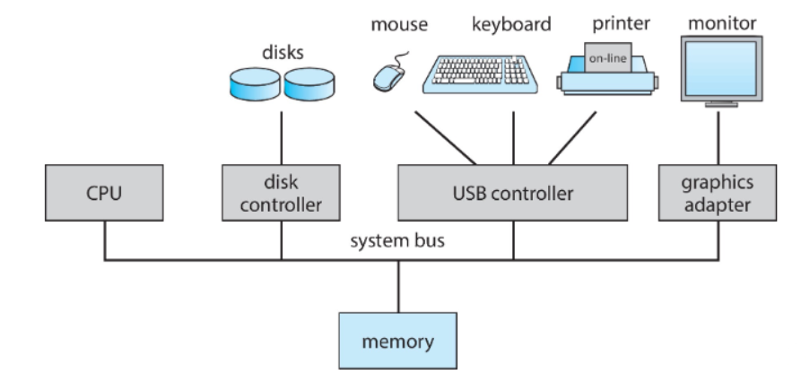

# 운영체제란?
<u>여러 서비스들을 유저들과 응용프로그램을 하드웨어가 사용할 수 있도록 도와주는 역할</u>

## 운영체제 개념
---
* 보는 관점에 따라 다를 수 있음 (사용자 <-> 개발자)
* 운영체제가 있는 이유: 하나 컴퓨터마다 하나의 프로그램만 작동하지 않음.  
  - 여러 프로그램을 하드웨어 같은 인프라를 가지고 효율적으로 돌리기위해 운영체제가 필요. 
  - 작은 메모리(RAM)만 가지고도 여러 프로그램을 돌릴 수 있음.
* Mobile devices like smartphones and tablets are resource poor,  optimized for usability and battery life
  : 모바일은 성능이 더 작으니 resource poor 하고, 배터리를 잘 관리하기 위해 운영체제가 여기에 맞춰 개발됨.
* 심지어 가전제품 등에도 CPU가 있고 OS도 있음. OS의 시발점은 군사용이었음.
 
## 운영체제 정의
---
1. No universally accepted definition
2. “The one program **running at all times** on the computer”is the <u>kernel</u>, part of the operating system
3. 그외 나머지는 system program(ships with the os, but not part of the kernel) 또는 
   application program(all programs not associated with os)이다.
4. middle ware: 개발자들을 위해 API를 제공해주는 계층, 사용자들이 보는 것보다 추상화되어 있음. 예시: 쿼리 등

↑ picture of Computer System

bus로 각자 연결되어 있음. 
동시에 움직이는 과정에서 메모리 접근의 속도는 느릴 수 밖에 없음.
**Local Buffer** 는 일종의 메모리이다. 화면에 출력되는 것은 local buffer 안의 값을 변경한 결과이다.
Each device controller type has an operating system device driverto manage it
CPU moves data from/to main memory to/from local buffers. 모든 계산들은 CPU를 통해서 이루어 진다. 메모리의 이동조차.
Device controller informs CPU that it has finished its operation by causing an **interrupt**.

interrupt를 해야 CPU가 여러 일을 한번에 할 수 있다.

### interrupt란?(중요)
---
CPU를 갑자기 중단을 시킴. 어떤 사건이 발생한 것을 알려주기 위해. 
평소 CPU는 무슨 일을 하다가도 마우스를 움직이면 마우스I/O에서 CPU에 interrupt를 검.
그럼 CPU가 멈추고 변경된 것을 반영. 이 과정이 **service routines** 이다. 

interrupt의 종류가 있는데, 각 interrupt를 구별하기 위해 **interrupt vector** 가 있다.
interrupt vector는 interrupt의 index와 같다.
Interrupt transfers control to the interrupt service routine generally, 
through the interrupt vector, which contains the addresses of all the service routines

A trap or exceptionis a software-generated interrupt caused either by an error or a user request

OS는 **interrupt driven**이다.

CPU가 interrupt가 걸린지 어떻게 아는가?
The CPU hardware has a wire called the interrupt-request line 
that the CPU senses after executing every instruction.

interrupt는 대략 1초에 2천번 정도 이루어 진다.

#### interrupt handling
---
CPU가 interrupt가 걸리면 실행하던 코드를 멈추고 다른 코드를 실행함.
그리고 원래의 상태로 돌아가기 위해 **registers**에 스레드를 저장함.

interrupt 방식.
1. polled
2. vectored

interrupt request line
1. nonmaskable
2. maskable
Interrupt chaining: each element in the interrupt vector points to the head of a list of interrupt handlers.
vector의 크기를 줄이기 위해 계층 구조를 가지고 있다.
interrupt의 우선순위가 있는데 interrupt priority level이라 하고 우선순위대로 실행됨.

instruction중에 sensing을 통해 interrput 여부 확인

interrupt는 OS의 multitasking등을 이해하기 위한 기초

### Storage Structure
---
* main memory: only large storage media that the CPU can access directly
* Secondary storage: extension of main memory that provides large **nonvolatile(비휘발성)** storage capacity
  1. nvm = ssd =/ hdd
  2. HDD(Hard Disk Drives)
  3. NVM(Non-volatile memory) = SSD
octec = 8 bit = 1 byte
A less common term is word,which is a given computer architecture’s native unit of data. 
A word is madeup of one or more bytes. 
For example, a computer that has 64-bit registers and64-bit memory addressing typically has 64-bit (8-byte) words.

#### Stroage Hierarchy
1. speed: program
2. cost
3. volatility

register, cache는 CPU안에 내장되어있고 가장 빠르고 용량이 적으면 비쌈.
밑으로 갈수록 용량이 높고 느리며 가격이 쌈.

DMA란 direct memory access
큰 데이터에 한해서 CPU가 처리하려면 오래걸리기 때문에 CPU가 관여하지 않고 시작과 끝만 관여함

뒤에는 알아서 학습. 담주는 Ch.2 시작함