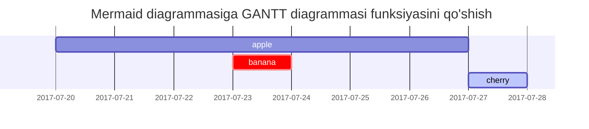

## Sarlavhalar

<!-- markdownlint-capture -->
<!-- markdownlint-disable -->
# H1 — sarlavha
{: .mt-4 .mb-0 }

## H2 — sarlavha
{: data-toc-skip='' .mt-4 .mb-0 }

### H3 — sarlavha
{: data-toc-skip='' .mt-4 .mb-0 }

#### H4 — sarlavha
{: data-toc-skip='' .mt-4 }
<!-- markdownlint-restore -->

## Paragraf

Quisque egestas convallis ipsum, ut sollicitudin risus tincidunt a. Maecenas interdum malesuada egestas. Duis consectetur porta risus, sit amet vulputate urna facilisis ac. Phasellus semper dui non purus ultrices sodales. Aliquam ante lorem, ornare a feugiat ac, finibus nec mauris. Vivamus ut tristique nisi. Sed vel leo vulputate, efficitur risus non, posuere mi. Nullam tincidunt bibendum rutrum. Proin commodo ornare sapien. Vivamus interdum diam sed sapien blandit, sit amet aliquam risus mattis. Nullam arcu turpis, mollis quis laoreet at, placerat id nibh. Suspendisse venenatis eros eros.

## Ro'yxatlar

### Tartiblangan ro'yxat

1. Birinchi
2. Ikkinchi
3. Uchinchi

### Tartiblanmagan ro'yxat

- Bob
  - Bo'lim
    - Paragraf

### ToDo ro'yxati

- [ ] Ish
  - [x] 1-qadam
  - [x] 2-qadam
  - [ ] 3-qadam

### Ta'rif ro'yxati

Quyosh
: Yer atrofida aylanadigan yulduz

Oy
: Quyoshdan aks etgan yorug'lik bilan ko'rinadigan Yerning tabiiy yo'ldoshi

## Blok Iqtibos

> Bu chiziq _blok iqtibos_ni ko'rsatadi.

## Ko'rsatmalar

<!-- markdownlint-capture -->
<!-- markdownlint-disable -->
> `Maslahat` turidagi ko'rsatma misoli.
{: .prompt-tip }

> `Ma'lumot` turidagi ko'rsatma misoli.
{: .prompt-info }

> `Ogohlantirish` turidagi ko'rsatma misoli.
{: .prompt-warning }

> `Xavf` turidagi ko'rsatma misoli.
{: .prompt-danger }
<!-- markdownlint-restore -->

## Jadvalar

| Kompaniya                    | Aloqa            | Mamlakat |
| :--------------------------- | :--------------- | -------: |
| Alfreds Futterkiste          | Maria Anders     | Germaniya |
| Island Trading               | Helen Bennett    |      UK |
| Magazzini Alimentari Riuniti | Giovanni Rovelli |   Italiya |

## Havolalar

<http://127.0.0.1:4000>

## Izoh

Kanca bosilganda izohga o'tadi[^footnote], va bu yerda yana bir izoh[^fn-nth-2].

## Inline kod

Bu `Inline Kod` misoli.

## Fayl yo'li

Bu yerda `/path/to/the/file.extend`{: .filepath}.

## Kod bloklari

### Umumiy

```text
Bu umumiy kod parchasidir, sintaksis yoritish va qator raqamlari yo'q.
```

### Maxsus Til

```bash
if [ $? -ne 0 ]; then
  echo "Buyruq muvaffaqiyatli bajarilmadi.";
  # kerakli ishlarni bajaring / chiqish
fi;
```

### Maxsus fayl nomi

```sass
@import
  "colors/light-typography",
  "colors/dark-typography";
```
{: file='_sass/jekyll-theme-chirpy.scss'}

## Matematika

Matematika [**MathJax**](https://www.mathjax.org/) tomonidan quvvatlanadi:

$$
\begin{equation}
  \sum_{n=1}^\infty 1/n^2 = \frac{\pi^2}{6}
  \label{eq:series}
\end{equation}
$$

Biz tenglamani \eqref{eq:series} deb atashimiz mumkin.

$a \ne 0$ bo'lganda, $ax^2 + bx + c = 0$ tenglamasining ikkita yechimi bor va ular

$$ x = {-b \pm \sqrt{b^2-4ac} \over 2a} $$

## Mermaid SVG



## Rasmlar

### Standart (sarlavha bilan)

{: width="972" height="589" }
_To'liq ekran kengligi va markaziy hizalama_

### Chapga hizalangan

{: width="972" height="589" .w-75 .normal}

### Chapga suzuvchi

{: width="972" height="589" .w-50 .left}
Praesent maximus aliquam sapien. Sed vel neque in dolor pulvinar auctor. Maecenas pharetra, sem sit amet interdum posuere, tellus lacus eleifend magna, ac lobortis felis ipsum id sapien. Proin ornare rutrum metus, ac convallis diam volutpat sit amet. Phasellus volutpat, elit sit amet tincidunt mollis, felis mi scelerisque mauris, ut facilisis leo magna accumsan sapien. In rutrum vehicula nisl eget tempor. Nullam maximus ullamcorper libero non maximus. Integer ultricies velit id convallis varius. Praesent eu nisl eu urna finibus ultrices id nec ex. Mauris ac mattis quam. Fusce aliquam est nec sapien bibendum, vitae malesuada ligula condimentum.

### O'ngga suzuvchi

{: width="972" height="589" .w-50 .right}
Praesent maximus aliquam sapien. Sed vel neque in dolor pulvinar auctor. Maecenas pharetra, sem sit amet interdum posuere, tellus lacus eleifend magna, ac lobortis felis ipsum id sapien. Proin ornare rutrum metus, ac convallis diam volutpat sit amet. Phasellus volutpat, elit sit amet tincidunt mollis, felis mi scelerisque mauris, ut facilisis leo magna accumsan sapien. In rutrum vehicula nisl eget tempor. Nullam maximus ullamcorper libero non maximus. Integer ultricies velit id convallis varius. Praesent eu nisl eu urna finibus ultrices id nec ex. Mauris ac mattis quam. Fusce aliquam est nec sapien bibendum, vitae malesuada ligula condimentum.

### Qorong'i/Yorug' rejim va Soyalar

Quyidagi rasm mavzu afzalligiga qarab qorong'i/yorug' rejimni almashtiradi, e'tibor bering, u soyalar bilan.

{: .light .w-75 .shadow .rounded-10 w='1212' h='668' }
{: .dark .w-75 .shadow .rounded-10 w='1212' h='668' }

## Video



## Teskari Izoh

[^footnote]: Izoh manbasi
[^fn-nth-2]: 2-izoh manbasi
