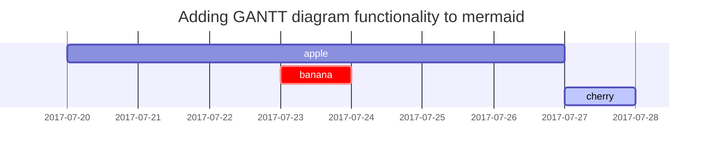

## 제목

<!-- markdownlint-capture -->
<!-- markdownlint-disable -->
# H1 — 제목1
{: .mt-4 .mb-0 }

## H2 — 제목2
{: data-toc-skip='' .mt-4 .mb-0 }

### H3 — 제목3
{: data-toc-skip='' .mt-4 .mb-0 }

#### H4 — 제목4
{: data-toc-skip='' .mt-4 }
<!-- markdownlint-restore -->

## 절

 여섯 살 시절 나는 『모험기』라는 제목의 원시림 이야기책에서 멋진 그림 하나를 본 적이 있다. 맹수를 삼키는 보아 뱀 그림이었다. 위의 그림은 그걸 옮겨 그려 본 것이다.
그 책에는 이렇게 쓰여 있었다. “보아 뱀은 먹이를 씹지도 않고 통째로 삼킨다. 그러고는 꼼짝달싹 못 한 채 먹이가 소화될 때까지 여섯 달 동안 잠만 잔다.”
 그래서 정글 속 모험에 대해 곰곰이 생각해 보았다. 그러고는 혼자서 색연필로 내 생애 첫 번째 그림을 그려 내는 쾌거를 이루었다. 내 그림 1호는 이러했다.
 이 걸작을 어른들에게 보여 주고 그림이 무섭지 않은지 물었다. 어른들은 “모자가 뭐가 무서운데?”라고 답했다.
 내 그림은 모자를 그린 게 아니었다. 코끼리를 소화하는 보아 뱀 그림이었다. 그래서 나는 어른들이 알아볼 수 있도록 보아 뱀 속을 그렸다. 어른들에게는 언제나 설명이 필요한 법이다. 나의 그림 2호는 이러했다.
 어른들은 속이 보이거나 보이지 않거나 보아 뱀 그림 따위는 집어치우고 차라리 지리와 역사와 산수와 문법에 관심을 가지라고 충고했다. 이런 연유로 그만 나는 나이 여섯에 화가라는 멋진 직업을 포기해 버렸다. 내 그림 1호와 그림 2호의 실패로 그만 기가 꺾인 탓이다. 어른들 스스로는 아무것도 이해할 수 없다. 그럴 때마다 설명을 해 주어야 하니 어린 아이들로서는 피곤한 일이다.

## 목록

### 순서가 있는 항목

1. 첫번째
2. 두번째
3. 세번째

### 순서가 없는 항목

- 첫번째
  - 두번째
    - 세번째
`-` 사용

### 체크리스트

- [ ] 작업
  - [x] 1단계
  - [x] 2단계
  - [ ] 3단계

### 설명문

해
: 지구가 공전하는 별

달
: 지구의 자연 위성

## 블록 인용

> 이 줄은 블록 인용문을 보여줍니다_.
` > 인용문_`

## 프롬프트

<!-- markdownlint-capture -->
<!-- markdownlint-disable -->
> An example showing the `tip` type prompt.
{: .prompt-tip }

> An example showing the `info` type prompt.
{: .prompt-info }

> An example showing the `warning` type prompt.
{: .prompt-warning }

> An example showing the `danger` type prompt.
{: .prompt-danger }
<!-- markdownlint-restore -->

## 표
`<table>` 태그로 변환되는 '표(Table)'를 표현합니다.
테이블 헤더를 구분하기 위해, 3개 이상의 `-`(hyphen/dash) 기호를 사용합니다.
테이블 헤더를 구분하며 `:`(Colons) 기호를 추가해 셀(열/칸) 안에 내용을 정렬할 수 있습니다.

 - `---`, `:---:` 좌측 정렬
 - `:---::` 가운데 정렬
 - `---::` 우측 정렬

| Company                      | Contact          | Country |
| :--------------------------- | :--------------- | ------: |
| Alfreds Futterkiste          | Maria Anders     | Germany |
| Island Trading               | Helen Bennett    |      UK |
| Magazzini Alimentari Riuniti | Giovanni Rovelli |   Italy |

```
| 값 | 의미 | 기본값 |
|:---|:---|---:|
| `static` | 유형(기준) 없음 / 배치 불가능 | `static` |
| `relative` | 요소 자신을 기준으로 배치 |  |
| `absolute` | 위치 상 부모(조상)요소를 기준으로 배치 |  |
| `fixed` | 브라우저 창을 기준으로 배치 |  |
| `sticky` | 스크롤 영역 기준으로 배치 |  |
```

## 링크

<http://127.0.0.1:4000>
` <주소> `

## 각주

후크를 클릭하면 각주[^footnote]를 찾을 수 있고, 여기에 또 다른 각주[^fn-nth-2]가 있습니다.
` 각주[^footnote] `

## 인라인 코드

코드를 보여줄 수 있습니다 ` \`Inline Code\`. `

## 파일 경로

`/path/to/the/file.extend`{: .filepath}.
```
/path/to/the/file.extend`{: .filepath}. 
```

## 코드 블록
\`를 3번 이상 입력하고 언어(코드) 이름을 명시해, 코드 '블록(Block)'를 표현합니다.
코드 블록의 시작 \` 개수와 종료 \` 개수는 같아야 합니다.

### 일반적

```text
This is a common code snippet, without syntax highlight and line number.
```

### 특정 언어

```bash
if [ $? -ne 0 ]; then
  echo "The command was not successful.";
  #do the needful / exit
fi;
```

### 특정 파일 이름

```sass
@import
  "colors/light-typography",
  "colors/dark-typography";
```
{: file='_sass/jekyll-theme-chirpy.scss'}

## 공식

The mathematics powered by [**MathJax**](https://www.mathjax.org/):

$$
\begin{equation}
  \sum_{n=1}^\infty 1/n^2 = \frac{\pi^2}{6}
  \label{eq:series}
\end{equation}
$$

We can reference the equation as \eqref{eq:series}.

When $a \ne 0$, there are two solutions to $ax^2 + bx + c = 0$ and they are

$$ x = {-b \pm \sqrt{b^2-4ac} \over 2a} $$

## Mermaid SVG



## 이미지
외부 url을 입력해도 되지만, 나의 블로그에 이미지를 업로드 하여 설정하는 것도 가능하다. 이미지가 들어 있는 경로는 `/assets/img/`이다.

### 기본값 (캡션 포함)

{: width="972" height="589" }
_전체 화면 너비 및 중앙 정렬_

```
{: width="972" height="589" }
_전체 화면 너비 및 중앙 정렬_
```

### 왼쪽 정렬

{: width="972" height="589" .w-75 .normal}
```
{: width="972" height="589" .w-75 .normal}
```

### 왼쪽 플롯

{: width="972" height="589" .w-50 .left}
 여섯 살 시절 나는 『모험기』라는 제목의 원시림 이야기책에서 멋진 그림 하나를 본 적이 있다. 맹수를 삼키는 보아 뱀 그림이었다. 위의 그림은 그걸 옮겨 그려 본 것이다.
그 책에는 이렇게 쓰여 있었다. “보아 뱀은 먹이를 씹지도 않고 통째로 삼킨다. 그러고는 꼼짝달싹 못 한 채 먹이가 소화될 때까지 여섯 달 동안 잠만 잔다.”
 그래서 정글 속 모험에 대해 곰곰이 생각해 보았다. 그러고는 혼자서 색연필로 내 생애 첫 번째 그림을 그려 내는 쾌거를 이루었다. 내 그림 1호는 이러했다.
 이 걸작을 어른들에게 보여 주고 그림이 무섭지 않은지 물었다. 어른들은 “모자가 뭐가 무서운데?”라고 답했다.
```
{: width="972" height="589" .w-50 .left}
```

### 오른쪽 플롯

{: width="972" height="589" .w-50 .right}
 내 그림은 모자를 그린 게 아니었다. 코끼리를 소화하는 보아 뱀 그림이었다. 그래서 나는 어른들이 알아볼 수 있도록 보아 뱀 속을 그렸다. 어른들에게는 언제나 설명이 필요한 법이다. 나의 그림 2호는 이러했다.
 어른들은 속이 보이거나 보이지 않거나 보아 뱀 그림 따위는 집어치우고 차라리 지리와 역사와 산수와 문법에 관심을 가지라고 충고했다. 이런 연유로 그만 나는 나이 여섯에 화가라는 멋진 직업을 포기해 버렸다. 내 그림 1호와 그림 2호의 실패로 그만 기가 꺾인 탓이다. 어른들 스스로는 아무것도 이해할 수 없다. 그럴 때마다 설명을 해 주어야 하니 어린 아이들로서는 피곤한 일이다.

```
{: width="972" height="589" .w-50 .right}
```

### 다크 모드/화이트 모드 와 그림자

아래 이미지는 테마 기본 설정에 따라 어둡게/밝게 모드를 전환합니다. 그림자가 있는 점에 유의하세요.

{: .light .w-75 .shadow .rounded-10 w='1212' h='668' }
{: .dark .w-75 .shadow .rounded-10 w='1212' h='668' }

## 동영상


```

```

## 역 각주

[^footnote]: 첫번째 각주 출처
[^fn-nth-2]: 두번째 각주 출처
```
[^footnote]: 첫번째 각주 출처
[^fn-nth-2]: 두번째 각주 출처
```