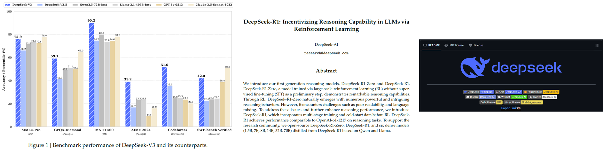
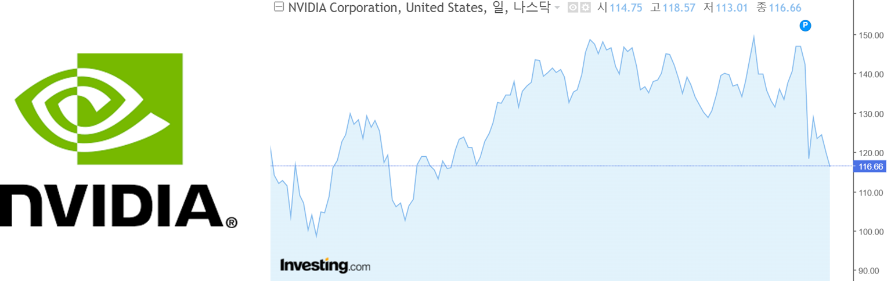
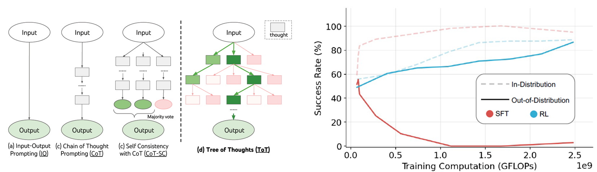
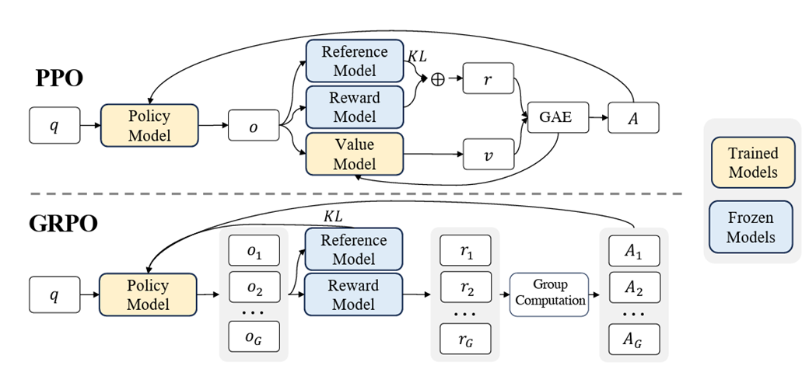
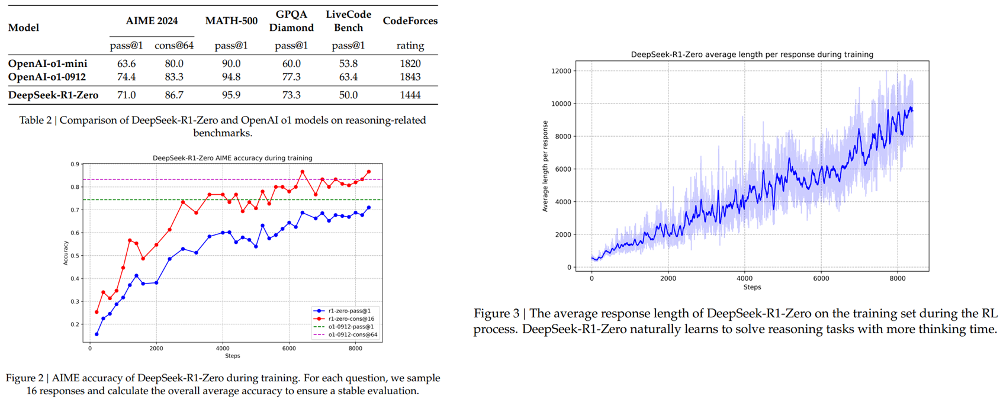
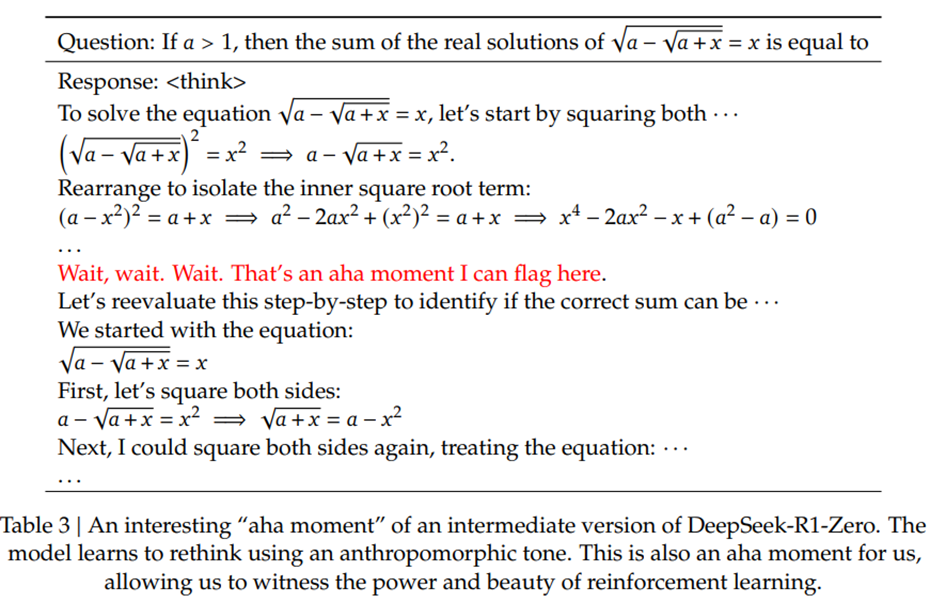
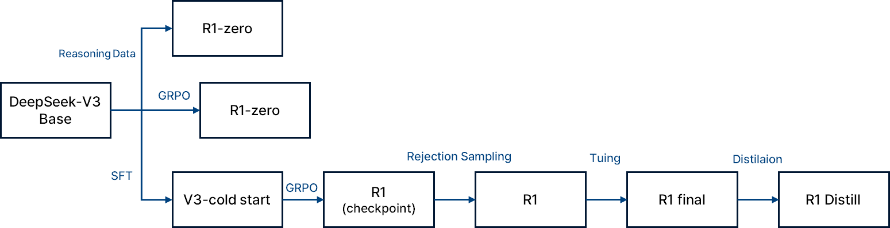
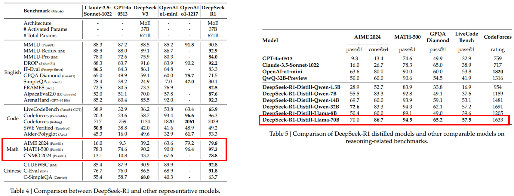
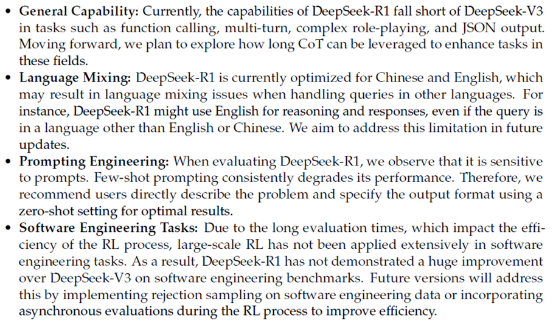
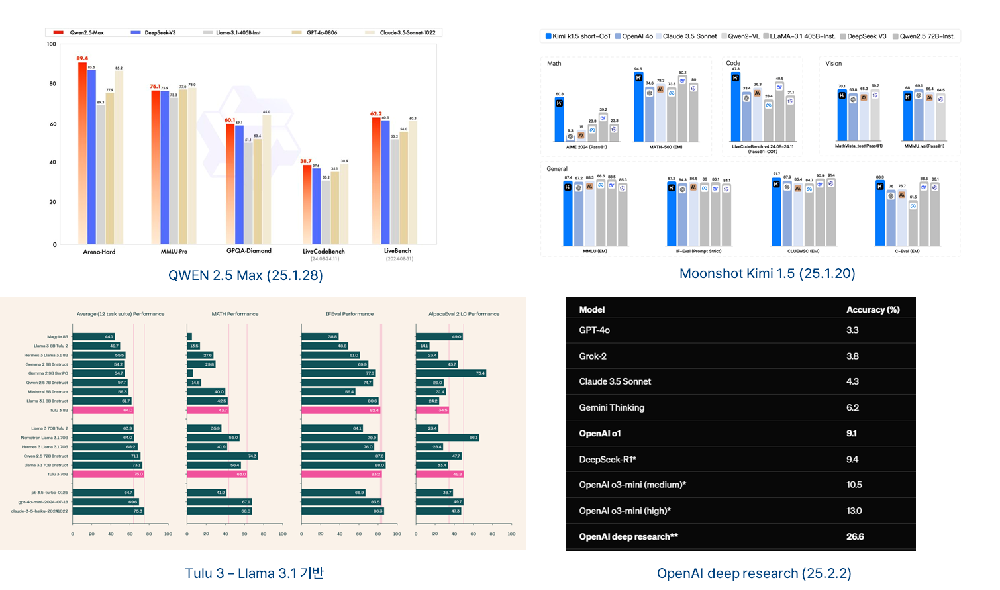

> **DeepSeek-R1 : Incentivizing Reasoning Capability in LLMs via Reinforcement Learning** ([arXiv](https://arxiv.org/abs/2501.12948))

최근 공개된 DeepSeek-R1은 강화학습을 통해 대규모 언어 모델(LLM)의 추론 능력을 극대화하는 새로운 접근법을 제안한다.
이 모델은 OpenAI의 o1 모델과 맞먹는 수준의 성능을 보여주며, 논문과 함께 코드까지 공개된 것이 특징이다.
학습 비용 또한 기존 대비 저렴하며, Distillation을 통해 경량화된 모델도 함께 제공되어 실용성을 높였다.

특히 주목할 점은 기존의 LLM이 supervised 데이터에 의존해왔던 것과 달리, DeepSeek-R1은 self-evolution 가능한 구조를 강화학습 기반으로 설계하여 지도 데이터 없이도 스스로 문제 해결 전략을 학습할 수 있게 만들었다는 점이다. 이는 단순한 성능 향상을 넘어, 모델의 학습 방식 자체에 패러다임 전환을 예고한다.

_출처 : Investing.com_

DeepSeek의 등장으로 대규모 GPU가 아닌 환경에서도 강력한 성능을 낼 수 있음을 시사한다. 
Nvidia가 주도하고 있는 GPU 시장의 독점에 의문을 제기하며, 꼭 Nvidia GPU를 사용하지 않아도 고성능 LLM을 구현할 수 있다는 메시지를 던진다.

---

## Model

### Summary

DeepSeek-V3 (24.12.26)는 다음과 같은 기술적 특징을 통해 효율성과 성능을 높였다.

- Mixture of Expert (reduce training cost)
  - 모델 파라미터 수가 많을수록 모델 성능이 올라감
  - 모델 사이즈가 커질수록 학습 서빙 비용이 늘어나는데 MoE를 통해 비용은 유지하면서 모델 사이즈를 키울 수 있음

Multi-Token Prediction (enhance accuracy)
  - 기존 단일 토큰 예측에서 발전하여 한번에 여러 토큰을 예측함
    - 기존 : “The baby sat on the ____” -> chair
    - 발전 : “The baby sat on the ____” -> chair and cried

Auxiliary Loss Free Load Balancing (reduce training cost)
  - GPU에 부하를 적절하게 나눠줄때 부가적인 계산이 없음

FP8 Training (reduce training cost)
  - 기존 FP32, FP16와 달리 훨씬 작은 메모리 공간을 사용하여 빠르고 효율적으로 계산

### Chain of Thought

이후 발표된 DeepSeek-R1은 V3 모델을 기반으로하되 강화학습 기법을 적용하여 추론(Reasoning) 능력을 극대화 하였다.

_출처 : Kojima, Takeshi, et al. "Large language models are zero-shot reasoners." Advances in neural information processing systems 35 (2022): 22199-22213_

DeepSeek-R1은 프롬프트 기법 중 하나인 Chain of Thought(CoT) 방식을 활용한다. 
이는 문제 해결을 단계별로 나눠 사고 과정을 유도하는 방식이며, 단순히 답을 생성하는 것이 아니라 <think> reasoning </think>, <answer> 정답 </answer> 형식으로 사고 흐름을 시각화한다.

_출처 : Yao, Shunyu, et al. "Tree of thoughts: Deliberate problem solving with large language models." Advances in Neural Information Processing Systems 36 (2024). 
Chu, Tianzhe, et al. "SFT Memorizes, RL Generalizes: A Comparative Study of Foundation Model Post-training." arXiv preprint arXiv:2501.17161 (2025)._

이러한 CoT를 강화학습과 접목한 구조가 바로 **Tree of Thought(ToT)**에 해당한다.
모델은 다양한 추론 경로를 스스로 탐색하고, 그중 최적의 경로를 선택할 수 있도록 학습된다.
이는 단순히 결과 예측에서 벗어나, 스스로 사고하고 선택하는 AI로의 전환을 의미한다.

또한 일반적인 지도학습(SFT)이 out-of-distribution 샘플에 취약한 반면, RL은 더 나은 일반화 성능을 확보할 수 있다는 장점이 있다.

### DeepSeek-R1-Zero

_출처 : Shao, Zhihong, et al. "Deepseekmath: Pushing the limits of mathematical reasoning in open language models."  2024._

DeepSeek-R1-Zero는 reasoning 성능을 극대화하기 위해 Group Relative Policy Optimization(GRPO) 기법을 채택하였다.
GRPO는 기존의 Value Function 없이, 그룹 간 상대적 성능을 비교해 reward를 계산하는 방식으로 학습 효율성과 안정성을 높였다.

또한, 정답의 정확성과 사고의 형식을 평가하는 **규칙 기반 보상 시스템(rule-based reward)**을 도입하여, 수학·코딩처럼 정답이 명확한 문제에 적합한 방식으로 학습이 이루어졌다.

_모델의 결과 및 학습 진행 시 평균적인 답변의 길이._

_Aha Moment._

특히 학습 중 특정 시점에서 추론 성능이 급격히 향상되는 **“Aha Moment”**가 발생하는 것이 관찰되었다. 
이는 모델이 스스로 문제 해결의 규칙을 발견하고, 이후 비슷한 문제를 더 쉽게 해결할 수 있게 되는 시점을 의미한다.

예를 들어, 초기에는 단순하고 비효율적인 추론 경로를 사용하던 모델이, 일정 시점 이후 스스로 그 방식을 버리고 더 효율적인 추론 방식으로 전환하는 행동을 보였다.

다만, 이 모델은 가독성 저하와 언어 혼합 문제를 갖고 있어 실용성에 제한이 있었다.
응답 내에 영어와 중국어가 혼용되거나, 응답 형식이 일관되지 않는 문제가 빈번히 발생하였다.

_출처 : https://news.mt.co.kr/mtview.php?no=2025013118174865546._

### DeepSeek-R1

_DeepSeek-R1 overview._

DeepSeek-R1 모델은 SFT(Supervise Fine Tuning) 즉 약간의 데이터를 사용하는 Few Shot Prompting을 진행하여 사전학습된 모델을 생성하며 GRPO를 진행하여 언어 일광성을 보상함수에 추가한다. 이로인해 성능이 살짝 감소하지만 인간 선호도를 향상된다. 그 후 학습 과정의 모델의 check point로부터 tuning을 진행한다.

## Result

_DeepSeek-R1 result._

DeepSeek-R1은 다양한 추론 벤치마크에서 OpenAI o1 모델과 유사한 수준의 성능을 기록하였다.
특히 수학, 과학, 코딩과 같은 논리 추론 task에서 강화학습 기반 self-evolution 구조가 탁월한 성능을 보였다.

또한, DeepSeek-R1에서 학습된 추론 패턴을 Qwen 및 LLaMA 같은 소형 모델에 디스틸레이션한 결과, 일부 모델에서는 원본보다 더 뛰어난 성능을 보였다.
이는 고성능 AI 기술이 소형화되어 누구나 사용할 수 있게 된다는 점에서 실용성과 확장성을 동시에 만족시킨다.

## Discussion

### Limitation

_DeepSeek-R1 limitation._

DeepSeek-R1은 강력한 추론 성능을 지니고 있음에도 불구하고 몇 가지 한계를 가진다

- Function calling, Multi-turn 대화, 복잡한 롤플레잉, JSON 출력 등에서는 DeepSeek-V3에 비해 다소 성능이 떨어진다.

- 언어 혼합 문제가 여전히 존재하며, 영어 이외 언어 입력 시 영어로만 응답하는 경향이 있다.

- Few-shot Prompting에는 다소 민감하게 반응하며, 오히려 zero-shot 설정에서 더 안정적인 성능을 보인다.

- 소프트웨어 엔지니어링 task에서는 RL 적용이 충분히 이뤄지지 않아 DeepSeek-V3 대비 성능 차이가 크지 않다.

### Conclusion

_DeepSeek-R1 conclusion._

현재 다양한 LLM 모델들이 쏟아져 나오고 있는 가운데, DeepSeek-R1은 강화학습을 기반으로 한 추론 능력 향상이라는 새로운 방향성을 제시했다.
DeepSeek는 모델이 스스로 사고하고 학습하며, 이를 소형 모델로 distill할 수 있는 구조는 AI 기술의 확장성과 접근성을 동시에 만족시키려는 시도를 했다.

특히 Chain of Thought, 강화학습(GRPO), 모델 디스틸레이션이라는 세 가지 핵심 전략의 결합은 단순한 성능 향상을 넘어, AI 학습 패러다임의 전환점을 보여주는 사례로 평가받고 있다.
