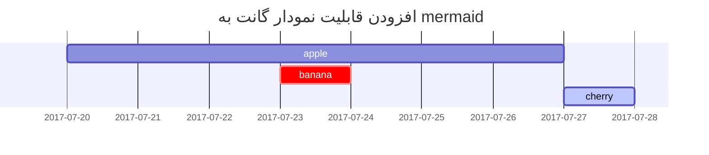

## سرتیترها

<!-- markdownlint-capture -->
<!-- markdownlint-disable -->
# H1 — سرتیتر
{: .mt-4 .mb-0 }

## H2 — سرتیتر
{: data-toc-skip='' .mt-4 .mb-0 }

### H3 — سرتیتر
{: data-toc-skip='' .mt-4 .mb-0 }

#### H4 — سرتیتر
{: data-toc-skip='' .mt-4 }
<!-- markdownlint-restore -->

## پاراگراف

لورم ایپسوم متن ساختگی با تولید سادگی نامفهوم از صنعت چاپ، و با استفاده از طراحان گرافیک است، چاپگرها و متون بلکه روزنامه و مجله در ستون و سطرآنچنان که لازم است، و برای شرایط فعلی تکنولوژی مورد نیاز، و کاربردهای متنوع با هدف بهبود ابزارهای کاربردی می باشد، کتابهای زیادی در شصت و سه درصد گذشته حال و آینده، شناخت فراوان جامعه و متخصصان را می طلبد، تا با نرم افزارها شناخت بیشتری را برای طراحان رایانه ای علی الخصوص طراحان خلاقی، و فرهنگ پیشرو در زبان فارسی ایجاد کرد.

## لیست‌ها

### لیست مرتب شده

1. اول
2. دوم
3. سوم

### لیست مرتب نشده

- فصل
  - بخش
    - پاراگراف

### لیست کارها

- [ ] کار
  - [x] مرحله ۱
  - [x] مرحله ۲
  - [ ] مرحله ۳

### لیست توضیحی

خورشید
: ستاره‌ای که زمین به دور آن می‌چرخد

ماه
: قمر طبیعی زمین که با نور منعکس شده از خورشید قابل مشاهده است

## نقل قول

> این خط نقل قول را نشان می‌دهد.

## هشدارها

<!-- markdownlint-capture -->
<!-- markdownlint-disable -->
> یک مثال که نوع هشدار `tip` را نشان می‌دهد.
{: .prompt-tip }

> یک مثال که نوع هشدار `info` را نشان می‌دهد.
{: .prompt-info }

> یک مثال که نوع هشدار `warning` را نشان می‌دهد.
{: .prompt-warning }

> یک مثال که نوع هشدار `danger` را نشان می‌دهد.
{: .prompt-danger }
<!-- markdownlint-restore -->

## جدول‌ها

| شرکت | تماس | کشور |
| ---: | ---: | ---: |
| آلفردز فاترکیسته | ماریا آندرز | آلمان |
| تجارت جزیره | هلن بنت | انگلستان |
| مگازینی آلیمنتاری ریونیتی | جیووانی روولی | ایتالیا |

## لینک‌ها

<http://127.0.0.1:4000>

## پاورقی

روی این قلاب کلیک کنید تا به پاورقی برسید[^footnote]، و اینجا یک پاورقی دیگر است[^fn-nth-2].

## کد درون‌خطی

این یک مثال از `کد درون‌خطی` است.

## مسیر فایل

اینجا مسیر `/path/to/the/file.extend`{: .filepath} است.

## بلوک‌های کد

### عمومی

```text
این یک بلوک کد معمولی است، بدون هایلایت سینتکس و شماره خط.
```

### زبان خاص

```bash
if [ $? -ne 0 ]; then
  echo "فرمان موفقیت‌آمیز نبود.";
  #انجام کار لازم / خروج
fi;
```

### نام فایل خاص

```sass
@import
  "colors/light-typography",
  "colors/dark-typography";
```
{: file='_sass/jekyll-theme-chirpy.scss'}

## ریاضیات

ریاضیات با استفاده از [**MathJax**](https://www.mathjax.org/):

$$
\begin{equation}
  \sum_{n=1}^\infty 1/n^2 = \frac{\pi^2}{6}
  \label{eq:series}
\end{equation}
$$

می‌توانیم به معادله به صورت \eqref{eq:series} ارجاع دهیم.

وقتی $a \ne 0$ باشد، دو جواب برای $ax^2 + bx + c = 0$ وجود دارد و آنها عبارتند از

$$ x = {-b \pm \sqrt{b^2-4ac} \over 2a} $$

## نمودار SVG با Mermaid



## تصاویر

### پیش‌فرض (با عنوان)

{: width="972" height="589" }
_عرض کامل صفحه و تراز وسط_

### تراز چپ

{: width="972" height="589" .w-75 .normal}

### شناور به سمت چپ

{: width="972" height="589" .w-50 .left}

لورم ایپسوم متن ساختگی با تولید سادگی نامفهوم از صنعت چاپ، و با استفاده از طراحان گرافیک است، چاپگرها و متون بلکه روزنامه و مجله در ستون و سطرآنچنان که لازم است، و برای شرایط فعلی تکنولوژی مورد نیاز، و کاربردهای متنوع با هدف بهبود ابزارهای کاربردی می باشد.

### شناور به سمت راست

{: width="972" height="589" .w-50 .right}

لورم ایپسوم متن ساختگی با تولید سادگی نامفهوم از صنعت چاپ، و با استفاده از طراحان گرافیک است، چاپگرها و متون بلکه روزنامه و مجله در ستون و سطرآنچنان که لازم است، و برای شرایط فعلی تکنولوژی مورد نیاز، و کاربردهای متنوع با هدف بهبود ابزارهای کاربردی می باشد.

### حالت روشن/تاریک و سایه

تصویر زیر بر اساس تم روشن/تاریک تغییر می‌کند، توجه کنید که دارای سایه است.

{: .normal .light .w-75 .shadow .rounded-10 w='1212' h='668' }
{: .normal .dark .w-75 .shadow .rounded-10 w='1212' h='668' }

## ویدیو



## پاورقی برگشتی

[^footnote]: منبع پاورقی
[^fn-nth-2]: منبع پاورقی دوم
