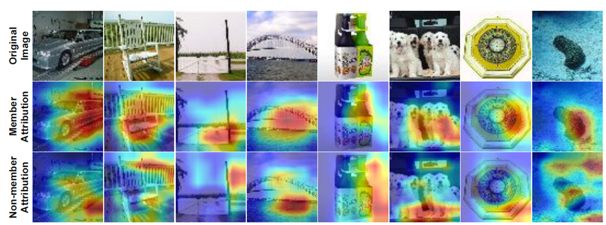
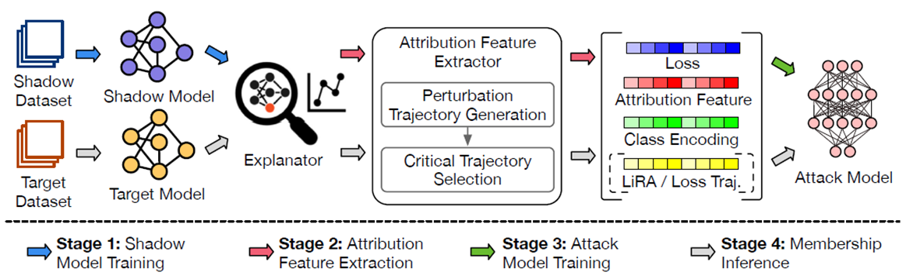
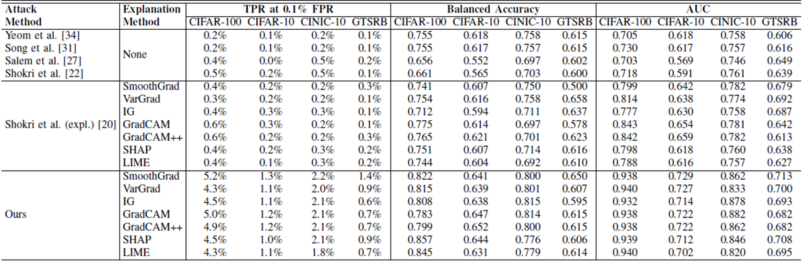
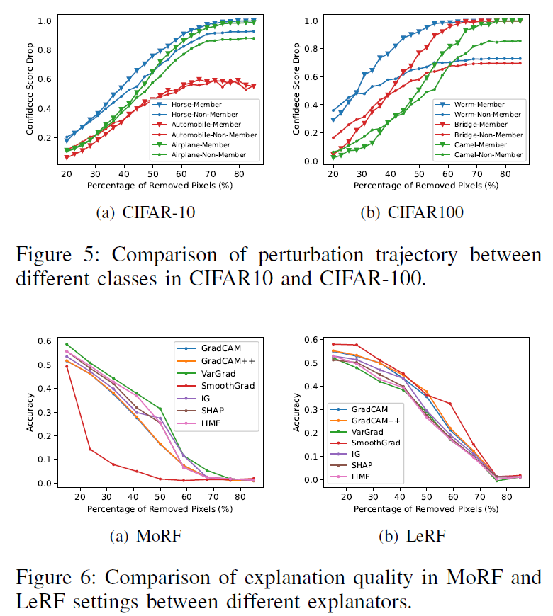
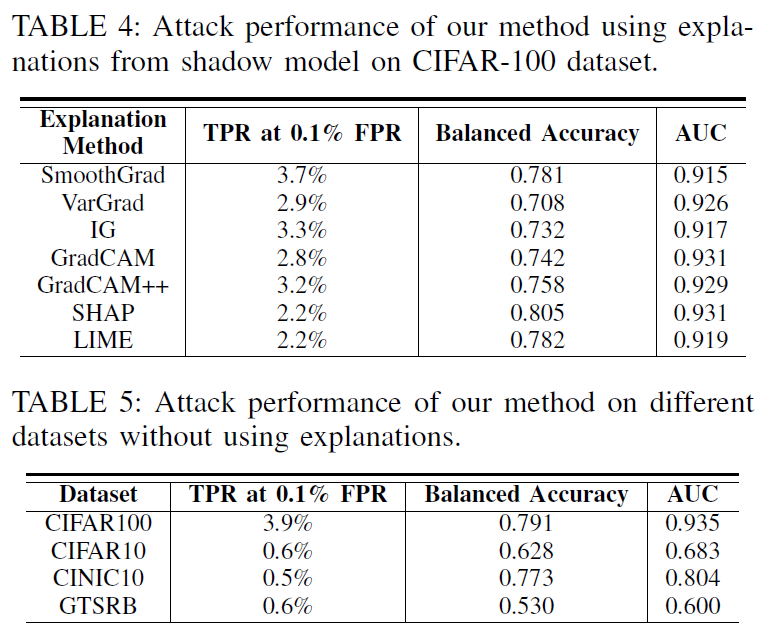

> **Please Tell Me More: Privacy Impact of Explainability through the Lens of Membership Inference Attack** ([IEEE](https://ieeexplore.ieee.org/document/10646875))
> Year : 2024
> Authors : Han Liu et al.
> Conference : IEEE Symposium on Security and Privacy

## Motivation

Explainable Machine Learning(XML)은 인공지능 모델이 어떤 방식으로 판단을 내렸는지를 사용자에게 설명할 수 있도록 해주는 기술이다. 
그러나 이러한 설명 기능은 예상치 못한 프라이버시 위험을 야기할 수 있다. 
이 논문은 다음 세 가지 질문에 대한 분석을 통해 XML의 프라이버시 위험성을 설명한다.

1. 설명 가능성이 실제로 개인정보 유출을 유의미하게 증가시키는가? 그렇다면, 어떤 공격 벡터가 작동하는가?
2. 모델의 과적합 수준이나 설명 방식의 선택이 유출 위험도에 어떤 영향을 주는가?
3. 공격자의 지식 수준(데이터 분포, 모델 구조 등)에 따라 유출 가능성은 어떻게 달라지는가? 특히 블랙박스 환경에서도 유출이 가능한가?

## Proposed Method

_Motivation._

이 연구는 새로운 형태의 Membership Inference Attack(MIA)을 제안하며, 주요 아이디어는 설명 기법으로 생성된 **Attribution Map**을 기반으로 중요 픽셀을 선택하고, 이를 점진적으로 변형하며 **confidence drop trajectory**를 추적하는 것이다.

일반적으로, 모델은 학습 데이터(member)에 대해 중요 특징을 더 잘 학습하고 있어 해당 특징이 제거되었을 때 confidence가 더 급격히 하락하는 경향이 있다. 
반면, non-member 데이터는 이러한 특징 학습이 덜 되어 있어 perturbation에 덜 민감하다. 
이 차이를 활용해 공격 모델을 학습시킬 수 있다.

_Overview._

전체 공격 파이프라인은 아래와 같이 네 단계로 구성된다.

Shadow Model Training:
- 공격자가 대상 모델과 유사한 Shadow Model을 학습시켜 MIA에 필요한 정보를 확보한다.

Attribution Feature Extraction:
- 대상 샘플을 설명 가능성 모델(Grad-CAM, SHAP, LIME 등)에 입력하여 Attribution Map을 생성한다.
- 속성 맵을 바탕으로 중요한 픽셀부터 변형(MoRF, LeRF 기법 사용)하여 모델의 신뢰도 변화를 추적한다.

Attack Model Training:
- 위에서 추출한 신뢰도 변화(Confidence Score Drop) + 기존 MIA의 손실 값을 활용하여 새로운 공격 모델 학습한다.

Membership Inference:
- 공격 모델을 사용해 입력된 샘플이 원본 모델의 학습 데이터였는지 추론한다.

### Attribution Feature Extraction

Attribution Feature Extraction 단계에서는 XAI(Explainable AI) 기법을 활용하여 샘플의 주요 특징을 식별하고, 이를 기반으로 신뢰도(confidence)의 변화 양상을 분석하여 멤버십 정보를 추론한다.

생성된 Attribution Map에서 어떤 순서로 픽셀을 제거할 것인지가 핵심이다. 이때 두 가지 방법을 사용한다:
- **MoRF (Most Relevant First)**: 가장 중요한 픽셀부터 제거
  - member 샘플의 경우 이 전략에 더 민감하게 반응하여 confidence가 급격히 감소함.
- **LeRF (Least Relevant First)**: 덜 중요한 픽셀부터 제거
  - confidence는 천천히 감소하며, 변화 추세 비교를 통해 멤버십을 판별할 수 있음.

단순히 픽셀 값을 0으로 설정하거나 제거하는 방식은 원본 이미지의 데이터 분포를 크게 왜곡할 수 있으며, 이로 인해 모델의 신뢰도(confidence)가 감소한 원인이 실제로 중요한 특징의 제거 때문인지 아니면 비자연적인 입력 변화 때문인지 구분하기 어려워진다. 
이러한 distribution shift 및 adversarial artifact 문제를 해결하기 위해, 본 연구에서는 두 가지 보완 기술을 사용한다:
- **Noisy Linear Imputation (ROAD 기법)**
  - 제거된 픽셀을 주변 픽셀의 가중 평균으로 보정하여, 자연스러운 perturbation을 생성함.
  - 데이터 분포의 변형을 최소화하고, 의미 있는 특징 제거 여부에만 의존하도록 유도함.
- **Total Variation (TV) Regularization**:
  - perturbation의 연속성과 부드러움을 유지하기 위한 정규화 기법.
  - 픽셀 간 변화량을 최소화하여 adversarial noise의 생성을 억제하고, 설명이 자연스럽게 보이도록 유도함.

TV 정규화 항은 다음과 같이 정의된다:

$$
TV(m_{ij}) = \sum_{m=-1}^{1} \sum_{n=-1}^{1} |m_{i+m,j+n} - m_{ij}|
$$

픽셀 선택의 우선순위는 Attribution 값과 TV 정규화 항의 조합으로 결정된다:

$$
I_{ij} = g_{ij} - \alpha \cdot TV(m_{ij})
$$

여기서 $g_{ij}$는 해당 위치의 attribution 값이며, $\alpha$는 TV 항의 가중치이다. 이 수식을 통해 정보성이 높고 부드러운 perturbation이 이루어진다.

또한 perturbation 후 얻은 confidence score drop trajectory 중에서 정보성이 높은 특징만을 선택하기 위해 통계적 가설검정이 적용된다. Welch의 t-test를 통해 member와 non-member 간 confidence drop의 유의미한 차이를 검정한다:

$$
t = \frac{\bar{m} - \bar{n}}{\sqrt{\frac{s_m^2}{k_m} + \frac{s_n^2}{k_n}}}
$$

여기서 $\bar{m}, \bar{n}$은 member, non-member 각각의 평균 confidence drop,$s^2$는 분산, $k$는 샘플 수이다.

### Attack Model Design

최종 공격 모델의 입력은 다음 네 가지 특징을 결합한 벡터다:

- Confidence Score Drop
    - Member : confidence가 크게 감소 / Non-member : confidence가 적게 감소
- Original Confidence Score
- Loss Value
    - Member : loss가 낮음 / Non-member : loss가 큼
- Confidence change trajectory
    - 여러 단계에서의 confidence 변화 패턴

이를 수식으로 정리하면 다음과 같다:

$$
\hat{a} = \mathcal{T}_{\text{MoRF}}(g) \oplus \mathcal{T}_{\text{LeRF}}(g) \oplus \mathcal{L}(x) \oplus \mathcal{O}(c)
$$

$\mathcal{T}_{\text{MoRF}}(g), \mathcal{T}_{\text{LeRF}}(g)$
: 각각 attribution 기반 perturbation에 따른 confidence drop trajectory  

$\mathcal{L}(x)$
: 입력 샘플 \( x \)의 loss 값  

$\mathcal{O}(c)$
: 클래스 정보의 one-hot 인코딩

이러한 feature를 입력으로 받는 MLP(다층 퍼셉트론)를 학습시켜 membership을 예측한다.

## Experiment

### Setup

실험은 다양한 데이터셋, 모델, 설명 기법에 대해 진행되었다.

- **Datasets**: CIFAR-10, CIFAR-100, CINIC-10, GTSRB  
- **Models**: ResNet-18, ResNet-56, VGG-16, DenseNet-161  
- **Explainers**: Grad-CAM, SHAP, SmoothGrad, VarGrad, IG, LIME 등

성능 평가는 다음 세 가지 메트릭으로 측정되었다.

- **TPR @ 0.1% FPR**: 오탐률을 0.1%로 고정했을 때, member를 정확히 잡아낼 수 있는 비율  
- **Balanced Accuracy**: 클래스 불균형을 고려한 정확도 지표  
- **AUC**: ROC 곡선 아래 면적

### Results

논문에서는 여러 baseline 방법과의 비교 결과를 정량적으로 제시하고 있다. 
예를 들어, Grad-CAM을 사용했을 때 기존 MIA 방법들은 CIFAR-100 기준 TPR @ 0.1%가 0.5~0.6%에 그친 반면, 제안한 방법은 5.0%까지 달성한다. 
더 나아가 loss trajectory까지 포함한 경우 성능은 15.8%로 10배 이상 향상된다.

Figure 6은은 perturbation을 통해 confidence가 어떻게 변화하는지를 시각적으로 보여준다.
CIFAR-10과 CIFAR-100 데이터셋을 대상으로, 각각의 샘플이 member일 때와 non-member일 때의 confidence score 및 confidence drop의 평균 경로를 시각화하였다.

그래프를 보면, 중요한 픽셀을 점차 제거하는 MoRF(Most Relevant First) 방식에서 member 샘플은 perturbation이 진행될수록 confidence가 빠르게 떨어지는 반면, non-member 샘플은 상대적으로 완만한 감소를 보인다. 
즉, member는 설명기법에서 강조된 핵심 feature에 더 의존적이라는 특성이 명확히 드러난다. 
이 차이는 특히 두 샘플이 모델에서 유사한 loss 값을 가진 경우에도 뚜렷하게 나타나는데, 이는 기존의 loss-based MIA 기법이 실패하는 상황에서도 explainability 기반 perturbation은 유효한 attack signal을 제공할 수 있음을 의미한다.

이러한 결과는 attribution 기반 perturbation이 기존 방법과 보완적인 공격 정보를 제공하며, 단순한 모델 confidence나 loss 기반 공격보다 더 정교한 멤버십 판별이 가능하다는 점을 보여준다.

Table 4는 CIFAR-10과 CIFAR-100 데이터셋의 각 클래스별로 member와 non-member 간의 confidence 변화 패턴을 분석한 결과이다. 
각 클래스에 대해 Grad-CAM 기반 MoRF perturbation을 적용하고, confidence score drop의 평균 trajectory를 시각화하여 클래스 별 멤버십 유출 민감도를 비교한다.

모든 클래스가 동일한 수준의 privacy leakage를 보이지 않으며, 몇몇 클래스는 perturbation에 훨씬 더 민감한 반응을 보인다. 
이는 해당 클래스가 모델에 의해 보다 집중적으로 학습된 discriminative features를 가지고 있으며, 이로 인해 perturbation의 영향이 더 크기 때문으로 해석된다.

이 실험은 privacy leakage가 데이터 클래스에 따라 비균등하게 발생할 수 있다는 사실을 제공한다. 
실제 시스템에서는 특정 클래스에 속한 데이터가 더 높은 위험에 노출될 수 있으므로, class-specific defense 전략이 필요할 수 있다.

Table 5는 서로 다른 모델 구조(architecture) 및 설명 기법(explainer) 조합이 membership inference 공격에 얼마나 영향을 미치는지를 정량적으로 비교한 결과를 제시한다.

결과적으로, 모델의 아키텍처가 달라지면 동일한 설명 기법을 사용해도 privacy leakage 정도에 차이가 발생하는 것으로 나타났다.

또한 Grad-CAM과 같이 시각적으로 강한 집중을 보여주는 explainer는 SHAP이나 LIME에 비해 멤버/비멤버 간 confidence drop의 차이가 더 극명하게 드러나는 경우가 많다. 이는 설명 기법의 특성 자체가 프라이버시 유출에 기여하는 요소임을 시사한다.

## Conclusion

이 연구는 Explainable ML이 의도치 않게 심각한 개인정보 유출 경로가 될 수 있음을 체계적으로 분석한다. 
특히, Attribution Map 기반으로 중요한 픽셀을 제거하며 모델의 반응을 관찰함으로써 member와 non-member 간의 robustness 차이를 추출할 수 있다.

- 설명 기법의 품질이 높을수록 오히려 프라이버시 유출 위험이 증가할 수 있다.
- 기존 loss 기반 MIA가 실패하는 샘플(낮은 loss를 가진 경우)에서도 perturbation 기반 trajectory는 명확한 차이를 보인다.

따라서, 향후 Explainable AI(XAI) 기술을 설계할 때는 프라이버시 보호를 동시에 고려하는 것이 필수적이다.
