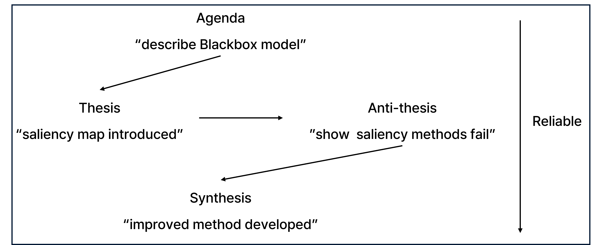
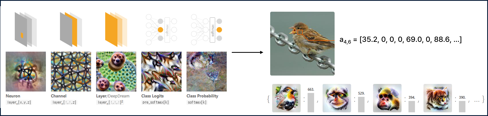
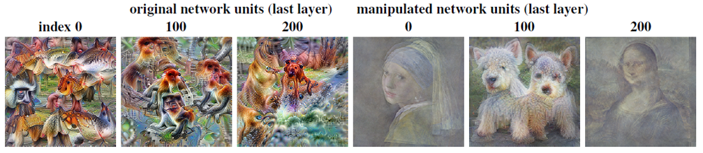
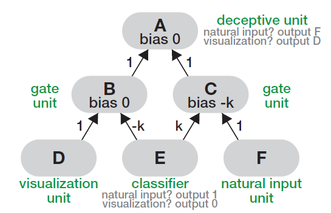
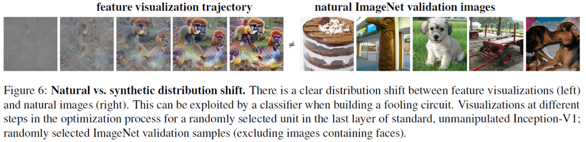
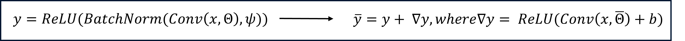
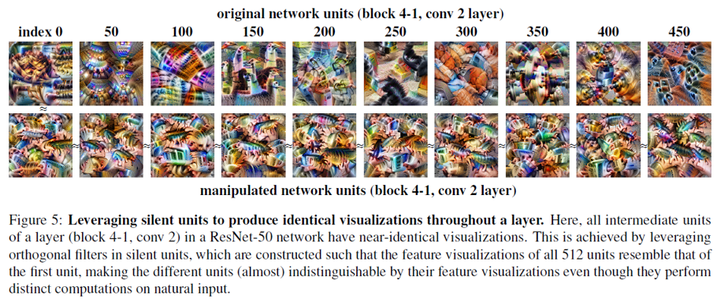
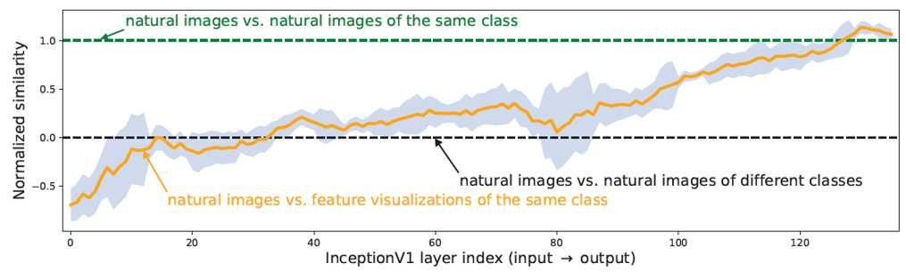
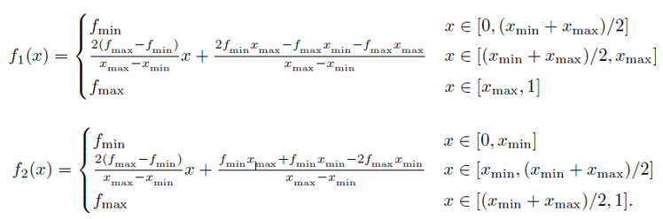

> **Don't trust your eyes: on the (un)reliability of feature visualizations** ([arXiv](https://arxiv.org/abs/2306.04719))
> Year : 2023
> Authors : Robert Geirhos et al.
> Conference : ICML

## Introduction

_Hegenlian dialectic._

"Interpretability", "Reliability"
- Hegelian dialectic

딥러닝 해석가능성 해법들은 헤겔의 변증법(Hegelian Dialectic)처럼 발전해 왔다.
어떤 방법이 등장(thesis)하고, 그 한계가 지적되며(antithesis), 새로운 개선된 방법(synthesis)으로 이어지는 순환을 보인다. 
본 논문은 그 중에서도 **Activation Maximization 기반 Feature Visualization**이 정말 신뢰할 수 있는지에 대한 의문을 던진다.

### Feature Visualization

_출처 : https://distill.pub/2017/feature-visualization/, https://distill.pub/2018/building-blocks/._

Feature Visualization은 뉴런 또는 채널을 극대화하는 이미지를 생성하여 신경망이 무엇을 "보고" 있는지를 직관적으로 보여주는 방법이다.

_Activation Maximization Overview._

**Activation Maximization**은 신경망 내부의 특정 뉴런(혹은 채널, 레이어 출력 등)을 **가장 크게 활성화시키는 입력 이미지**를 찾는 최적화 기반의 해석 방법이다다.  
이 과정을 통해 해당 뉴런이 어떤 입력에 반응하는지를 시각적으로 이해할 수 있다.

$$
x^* = \arg\max_x f(x)
$$

주요 아이디어로는 모델에 존재하는 어떤 뉴런이 가장 반응하는 입력을 역으로 생성하는 방식이다. 
- $f(x)$: 특정 뉴런이나 채널의 출력 (activation)
- $x^*$: 해당 뉴런을 가장 크게 활성화시키는 입력 이미지

전체 과정을 보면, 무작위 노이즈 이미지를 초기 입력 $x_0$로 설정하여 초기화를 진행하고 그 다음 해당 뉴런의 출력값 $f(x)$를 최대화하도록 Forward Process를 진행한다.
그 후 입력 이미지 $x$에 대해 gradient ascent를 수행하여 Backward Process를 진행한다.
마지막으로 현실적인 이미지 형태를 유지하기 위해 regularization을 추가한다.

$$
\hat{x} = \arg\max_x \left( f(x) - \lambda \cdot R(x) \right)
$$

- $R(x)$: 이미지에 대한 규제 항 (e.g. smoothness, 자연스러움)
- $\lambda$: 규제 강도

최종 결과는 직관적으로 결과 이미지 $\hat{x}$는 모델이 해당 뉴런이 어떤 특징을 보고 있는지를 시각적으로 보여준다.
- 예: 특정 채널이 곱슬머리, 푸들, 강아지 눈을 감지한다면, $\hat{x}$는 그러한 패턴을 담게 된다.

---

## Motivation

### How reliable are feature visualizations?

Feature visualization은 일반적으로 무작위 노이즈 이미지를 시작점으로 하여, 특정 뉴런 A가 가장 강하게 활성화되도록 입력 이미지를 반복적으로 최적화하는 방식으로 이루어진다. 
본 논문에서는 이러한 시각화 기법이 얼마나 쉽게 조작될 수 있는지를 보여주며, feature visualization 자체의 신뢰성에 대해 경각심을 불러일으킨다. 
논문에서는 네트워크 구조를 조작함으로써 시각화 결과를 속이는 것이 가능하다는 것을 증명하고, 이를 통해 feature visualization을 대상으로 한 최초의 interpretability circumvention attack을 제안한다. 
이 공격 시나리오는 모델 백도어 삽입, 가중치 조작, 학습 데이터 중독 등 일반적인 머신러닝 공격과 유사한 맥락에서 설명될 수 있다.

---

## Proposed Method

### Manipulating feature visualization through a fooling circuit

_Figure 1: 서브 네트워크 삽입 결과._

본 논문에서는 시각화의 신뢰성에 대한 경각심을 불러일으키기 위해 서브 네트워크를 삽입하여 Natural input에 대해서는 원래대로 동작하며 Feature visualization에서는 다른 반응을 하게 만드는 구조인 **fooling circuit**을 제안한다.  
Figure 1은 서브 네트워크인 fooling circuit을 추가했을 때 feature visualization을 통해 생성되는 이미지를 완전히 조작할 수 있음을 보여준다.  
실제로, 특정 뉴런이 '모나리자'나 '강아지'와 같은 전혀 무관한 패턴을 출력하도록 설계할 수 있으며, 이는 원래 모델의 성능(예: ImageNet top-1 정확도)에는 거의 영향을 주지 않는다.

_Figure 3: fooling circuit._

- fooling circuit의 구조
  - A : 속이려는 대상 (feature visualization 대상)
  - F : natural input에 대해 A가 따라야할 원래 동작
  - E : input이 natura인지 visualization 대상인지 구별하는 분류기
  - D : visualization 대상에 대해 A가 따라야 할 속임 동작
  - B,C : ReLU 기반 경로 선택 동작 

$$
\text{natural input} \Rightarrow A = F, \quad \text{visualization input} \Rightarrow A = D
$$

- fooling circuit의의 동작
  1. natural
     - E에 의해 natural 이다 라고 판단
     - B 활성화
     - C 차단
     - A는 F 처럼 동작

  2. visualization
     - E에 의해 visualization 이다 라고 판단
     - C 활성화
     - B 차단
     - A는 D처럼 동작

이처럼 fooling circuit은 단일 분류기를 통해 입력 분포를 구분하고, 이를 기반으로 경로를 선택해 특정 뉴런의 시각화 결과를 **임의로 조작할 수 있는 공격 방식**을 제공한다. 
특히 자연 입력에 대한 모델의 성능을 유지한 채, 해석 결과만 속일 수 있다는 점에서 **interpetability circumvention attack**의 대표적 사례라 할 수 있다.

### Manipulating visualizations through silent units

_Figure 6._

두 번째로 본 논문에서는 feature visualization으로 생성된 이미지가 고주파 성분, 이상한 패턴, 비자연스러운 텍스처 등을 포함하는 경향이 있다는 점을 활용한다. 
이로 인해 자연 이미지와의 분포 차이가 명확하게 존재하며, 이를 이용해 **silent unit**을 활용한 조작 기법을 제안한다.

_Formula 1,2._

- Silent unit : 전체 학습 데이터에 대해 활성화 되지 않는 유닛
  - ∇𝑦 : silent unit에서의 추가 출력 (natural 이미지에서는 거의 0, feature visualization 과정에서는 활성화 됨)
  - Θ  : orthogonal 필터
    - 분포의 차이를 이용하여 unnatural한 이미지에 필터가 활성화 되며 활성화 시 시각화 이미지는 필터가 표현하는 이미지로 출력됨

$$
\bar{y} = y + \Delta y, \quad \Delta y = \text{ReLU}(\text{Conv}(x, \bar{Θ}) + b)
$$

  - 여기서 $\bar{Θ} = αΘ + βΔΘ^{\perp}$는 기존 필터와 직교하는 새로운 필터 조합
  - bias $b$는 자연 이미지에서 활성화되지 않도록 충분히 큰 음수로 설정:

$$
b = -\frac{α}{β} \bar{y}_{\text{max, nat}}
$$

  - 결과적으로 자연 이미지에서는 $\Delta y \approx 0$이 되어 기존 출력과 동일하고, feature visualization에서는 $\Delta y \neq 0$으로 인해 조작된 시각화 결과를 생성하게 된다.

이러한 방식은 fooling circuit처럼 복잡한 구조 없이도 **기존 뉴런을 변경하지 않고**, 전체 layer의 시각화를 완전히 조작할 수 있다는 장점을 가진다. 
실제로 ResNet-50에서 전체 512개의 뉴런이 동일한 패턴을 시각화하도록 유도한 결과는 Figure 5에서 확인할 수 있다. 
이는 시각화 기반 해석이 뉴런의 실제 계산 역할과 무관하게 보여질 수 있음을 강하게 시사한다.

---

## Experiment

visualization

_Figure 5._

Do feature visualizations reliably reflect how standard, unmanipulated networks respond to natural input?
Natural vs Synthetic path similarity analysis

_Figure 4._

- Natural Image와 Visualized 된 이미지의 네트워크 activation 경로 비교
  - 네트워크의 앞쪽과 중간 layer는 무작위 클래스 간 비교하는 수준으로 나타남

## Theory : impossible results for feature visualization

본 논문에서는 "**Feature visualization만 가지고 유닛의 동작을 이해할 수 있나?**"라는 질문에 대해 명확히 "**불가능하다**"라고 결론짓는다.  
이를 뒷받침하기 위해 여러 이론적 정리를 제시하며, **왜 feature visualization이 black-box 모델을 설명하는 데 부적절한가**를 보여준다.

$$
Φ_{\text{min,max}}(f) = \left( \arg\min_x f(x), \arg\max_x f(x), \min_x f(x), \max_x f(x) \right)
$$

Feature visualization은 위의 식과 같은 정보를 제공한다.
하지만 Feature visualization은 단순히 입력 공간 $x$에 대해 가장 작은 값과 가장 큰 값을 찾아낸 결과일 뿐, 함수 $f(x)$의 전체 구조나 동작을 파악하기에는 정보가 너무 부족하다.

---

### Theorem 1

$$
\|f' - D(Φ_{\text{min,max}}(f'))\|_{\infty} \geq \frac{f'_{\text{max}} - f'_{\text{min}}}{2}
$$

함수의 복원 가능성을 확인해 보자면, 서로 다른 함수가 같은 시각화를 가질 수 있기 때문에 복원할 수 없어 시각화 결과로 유닛의 동작을 재구성 할 수 없음을 보인다. 

- 어떤 디코더 $D$가 주어져도, 동일한 feature visualization 결과 $\Phi_{\text{min,max}}$를 갖는 **두 개의 전혀 다른 함수** $f_1$, $f_2$가 항상 존재한다.
- 이 말은 곧, **feature visualization만으로는 원래의 함수 $f(x)$를 재구성하는 것이 불가능**하다는 것을 의미한다.

_B.5.3. Proof of theorem 1._

- $f_1$, $f_2$는 동일한 $\arg\min$, $\arg\max$, $\min$, $\max$를 가지지만,
- 전체 함수 모양은 완전히 다름

- 직관적으로, 두 함수 모두 같은 이미지를 시각화할 수 있지만, 실제로는 서로 다른 동작을 할 수 있다.

즉, 시각화는 단지 하나의 "극단값"을 보여줄 뿐이며, 함수의 전체적인 구조나 해석 가능성은 제공하지 않는다.

### Theorem 2

$$
\left\| \mathbb{1}_{f' > m_{f'}} - \mathbb{1}_{D(Φ_{\text{min,max}}(f')) > m_{f'}} \right\|_{\infty} \geq 1
$$

"시각화 결과로 해당 입력이 positive 한지 negative한지 알 수 있나?" 라고 했을 때 동일한 시각화 결과를 보여주는 함수가 정반대의 출력을 낼 수 있기 때문에 "알 수 없다"라고 답한다.
  - Positive? : 입력에 대한 유닛의 출력값의 중간값 보다 높을 때를 의미 

- 여기서 $m_{f'} = \frac{f'_{\text{max}} + f'_{\text{min}}}{2}$ 는 중간값 (median-like threshold)을 의미한다.
- 즉, feature visualization 결과를 기반으로 한 디코더 $D$는 어떤 입력 $x$에 대해 $f(x)$가 중간값 이상인지 아닌지를 **정확하게 판단할 수 없다.**
- 심지어 **같은 시각화 결과를 갖는 함수** $f_1$, $f_2$가 존재하면서:
  - $f_1(x) > m$,  
  - $f_2(x) < m$ 이 성립될 수 있다.

이는 **Positive/Negative를 구분하는 가장 단순한 형태의 예측조차 시각화 정보만으로는 신뢰할 수 없다는 이론적 근거**를 제공한다.

---

## Conclusion

Feature visualization은 모델 내부를 이해하는 데 유용한 **탐색적 도구**일 수 있으나, 몇 가지 한계를 가진다.

- **Feature visualization은 시각적으로 인상적인 결과를 제공할 수는 있지만**, 실제로 모델 내부의 동작이나 유닛의 의미를 "정확히" 이해할 수 있게 해주지는 않는다.
   - 특히 black-box 신경망처럼 함수 형태에 제약이 없는 경우, **동일한 시각화 결과가 매우 다양한 동작을 가진 함수에서 유도될 수 있음**이 수학적으로 보장된다.

따라서 feature visualization은 **탐색적 분석 도구**로는 쓸 수 있지만, **확정적인 설명 수단**으로 사용하기에는 적합하지 않다.
