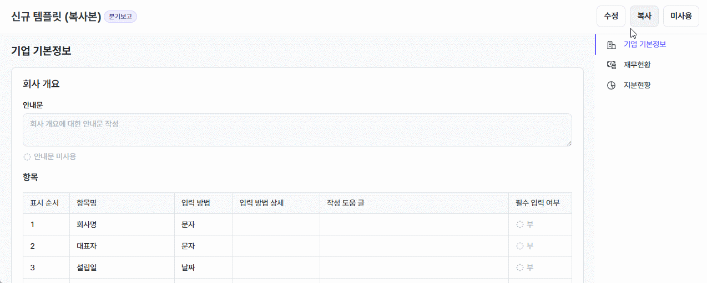

### 공통 사항
- 입력 또는 저장 시 오류 안내가 더 명확해졌습니다.
- 개인 거래처(개인 조합원 포함)중복 여부 검증 로직이 이름, 생년월일 및 성별의 일치 여부로 변경되었습니다.
	- 병합하지 않고 저장: 새 거래처로 저장합니다.
	- 기존 거래처에 병합: 사용자가 선택한 기존 거래처로 병합 처리됩니다.
	
-  사용자 코드 설정이 추가되었습니다. 아래 7가지 분류 항목을 사용자화할 수 있습니다.
	- 가치평가 주체
	- 가치평가 기준
	- 직위
	- 직책
	- 비즈니스 분야
	- 기술 분류
	- 테마 분류
	
- 기타 버그를 수정하고 시스템의 안정성을 개선하였습니다.

### 포트폴리오 관리 개선 사항
- 포트폴리오 상세 정보에 아래의 항목이 추가 또는 개선되었습니다.
	- [회사정보] 탭 내 회사정보 영역에 비즈니스 분야, 테마 분류, 기술 분류 정보가 추가되었습니다.
	
	- [회사정보] 탭 내 주요 연락처 영역에 STworks 가입 요청 시간 조회 및 담당자 수신 여부 확인 기능이 추가되었습니다.
	
	- [투자 현황] 탭 내 '투자 조건' 영역에 투자 라운드 정보가 추가되었습니다.
	- [문서/파일] 탭에 문서 행 우 클릭 시 '새 창으로 열기' 기능이 추가되었습니다.
	
	- [문서/파일] 탭에 '법인 등기부등본' 문서가 연동되어 해당 포트폴리오의 법인 등기부등본 발행 내역을 조회할 수 있습니다.
	
### 영업보고 개선 사항
- 영업보고 검수 화면에서 메모 편집 기능이 추가되었습니다.
	
- 영업보고 템플릿 관리 메뉴에서 템플릿 복사 및 템플릿명 수정 기능이 추가되었습니다.
	
	
- 영업보고 검수 상세에 문서 이동 기능이 추가되어 영업보고 검수 시 문서 이동이 더욱 편리해졌습니다.
	
### BI 개선 사항
- 숫자 서식에 '한국 적응형'(백만원 단위)이 추가되었습니다.
- 보유 주식 수, 보통주 총발행주식수, 우선주 총발행주식수를 조회할 수 있습니다.
- 운용사 및 포트폴리오의 수익률, 가치평가 데이터를 조회할 수 있습니다.
- 심사역 성과 관리를 위해 기여율이 반영된 투자/회수 금액을 조회할 수 있습니다.

### 투자 심의 개선 사항
- 해외 투자 건에 대한 투자 심의 프로세스가 실제 실무 흐름을 더 잘 반영하도록 개선되었습니다.
	- 납입 단계에서 투자 조건의 환율 정보를 수정할 수 있습니다.
	
	- 해외 투자(외화 투자)의 경우 최대 2개의 운용지시서를 등록할 수 있습니다.
	
	- 투자 운용지시서에 적용 환율 및 환율 적용 합계가 표시됩니다.
	
- 투자 업체 등록 시 주간 보고 등에서 입력한 회사 정보(주요 제품, 비즈니스 분야, 보유 기술 분류, 테마 분류)가 있으면 자동으로 입력됩니다.
- 동반투자조건의 지분율 자동 계산 기능이 추가되었습니다.

### 주간 보고 개선 사항
- 주간보고 등록 또는 수정 시 마우스 드래그로 보고 카드 순서 변경을 할 수 있습니다.
	
- 주간보고 등록 또는 수정 시 같은 일자의 보고를 동시에 수정 시 가장 나중에 저장한 사람의 내용으로 덮어쓰는 일을 방지하도록 안정성을 강화하였습니다. 
	
### 전자결재 개선 사항
- 최종 승인되지 않은 품의는 열람자가 품의를 열람한 후에도 품의 회수가 가능하도록 수정되었습니다.