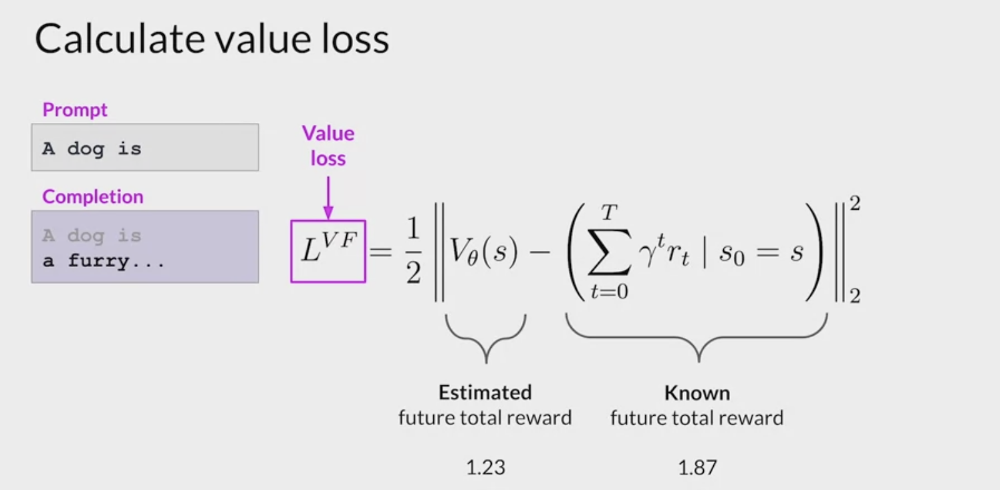
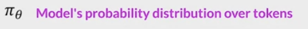

# PPO

- [PPO](#ppo)
- [LLM - Data Tuning - RLHF - PPO - Proximal Policy Optimization (微调)](#llm---data-tuning---rlhf---ppo---proximal-policy-optimization-微调)
  - [核心思想](#核心思想)
  - [特点](#特点)
  - [算法框架](#算法框架)
  - [PPO（近端策略优化）的应用](#ppo近端策略优化的应用)
  - [目标函数](#目标函数)
  - [微调过程 - PPO 2 phaseS](#微调过程---ppo-2-phases)
  - [RL(PPO) 算法](#rlppo-算法)
  - [实现 PPO 算法](#实现-ppo-算法)

---


# LLM - Data Tuning - RLHF - PPO - Proximal Policy Optimization (微调)


---

## 核心思想

- 旨在通过`限制策略更新的幅度`来提高学习的稳定性。

- 目标是在更新策略时，尽量保持当前策略和新策略之间的相似性。

- PPO optimizes a policy (LLM) to be more aligned with human preferences

---

## 特点

优点

- 策略优化：
  - 通过优化策略（即智能体的决策规则）来最大化预期的累积奖励。

- 稳定性
  - 使用一种截断的目标函数，`限制每次更新的幅度`。
  - 这种限制使得更新过程更加稳定，避免过大更新带来的不稳定性。
  - makes small updates to the LLM within a `bounded region` for stability, resulting in an updated LLM that is close to the previous version
  - 更新策略参数时，通过小批量（mini-batch）方式进行多次迭代，增强样本效率。
  - The goal is to maximize the reward by updating the policy.

- 重要性采样：
  - 采用重要性采样的方法，使得策略更新时能利用过去的数据，提高样本的利用效率。
  - 采用重要性采样来利用过去的数据，计算当前策略与旧策略之间的比值。
  - 高效性：可以利用经验回放（reuse past experiences），提高样本利用率。

- 灵活性：
  - 可以在不同的环境中使用，包括离散和连续动作空间，使其在多种应用场景中表现良好。

- 易于实现：
  - 与 TRPO 等算法相比，PPO 的实现相对简单，因此在实际应用中被广泛采用。

- 灵活性：适用于多种类型的环境（离散和连续动作空间）。

缺点
- **超参数敏感**：PPO 的性能可能对超参数（如 $\epsilon$) 的选择敏感。
- **收敛速度**：在某些情况下，PPO 的收敛速度可能不如其他算法快。


## 算法框架
PPO 的算法框架可以分为以下几个步骤：

1. **收集数据**：
   - 智能体与环境交互，收集状态、动作、奖励和下一状态的信息。

2. **计算优势函数**：
   - 使用广义优势估计（GAE）来计算优势函数 $\hat{A}_t$

3. **更新策略**：
   - 通过优化目标函数更新策略参数，确保更新幅度在可控范围内。

---

## PPO（近端策略优化）的应用

PPO 是一种强大的优化算法，能够在多种应用领域中有效地训练智能体。无论是在游戏、机器人控制、自动驾驶，还是在资源管理和金融交易等领域，PPO 都展示了其良好的性能和灵活性。其通过限制策略更新幅度的方法，能够有效提高学习的稳定性，适应各种复杂的决策环境。

1. 游戏领域: 广泛应用，特别是在需要智能体通过试错学习的环境中。例如：

   - 例子：Atari 游戏
   - 在 Atari 游戏中，智能体通过观察游戏画面作为状态，选择动作（如向左、向右、跳跃等），并获得奖励（如得分）。使用 PPO，智能体能够在游戏中进行策略学习。

     - **状态**：游戏画面
     - **动作**：智能体在游戏中可以选择的操作（如移动、攻击）
     - **奖励**：基于游戏规则的得分

   - PPO 通过持续地优化策略，使智能体在反复的游戏中逐步提高得分，最终达到人类玩家的水平。


2. 机器人控制: 训练机器人控制任务，尤其是在复杂环境中。机器人需要通过学习来平衡、行走或执行特定的任务。
   - 例子：四足机器人走路,设想一个四足机器人学习走路的场景：

     - **状态**：机器人当前的姿势、位置、速度等信息。
     - **动作**：每条腿的移动、抬起或放下等。
     - **奖励**：机器人在地面上行走的距离、保持平衡的时间等。

   - 通过使用 PPO，机器人可以在各种地形上学习走路的策略，逐渐提高其稳定性和灵活性。


3. 自动驾驶: 自动驾驶系统的开发，帮助车辆在复杂的交通环境中做出决策。

   - 例子：城市交通驾驶: 在自动驾驶汽车的应用中，智能体需要根据周围环境的信息做出行驶决策。

     - **状态**：汽车的当前位置、速度、交通信号、周围车辆等信息。
     - **动作**：加速、刹车、转向等驾驶行为。
     - **奖励**：根据安全驾驶（避免碰撞）、遵守交通规则（如红灯停）、有效到达目的地等指标计算奖励。

   - PPO 通过优化决策策略，使得自动驾驶汽车能够在各种复杂情况下做出安全、有效的驾驶决策。


4. 资源管理: 资源管理问题，例如能源分配或网络流量管理。

   - 例子：智能电网, 用于优化电力的分配和使用。

     - **状态**：电网的实时负载、电价、发电情况等信息。
     - **动作**：调整各个发电站的输出功率、控制电池充放电等。
     - **奖励**：基于系统的经济效益、用户的电力需求满足程度等指标进行奖励。

   - 通过使用 PPO，电力公司可以更有效地管理和优化电力资源，降低成本，提高服务质量。


5. 金融交易: 用于算法交易策略的优化。

   - 例子：股票交易策略, 在股票市场进行交易的场景：

     - **状态**：市场价格、交易量、技术指标等信息。
     - **动作**：买入、卖出或持有股票。
     - **奖励**：基于交易的收益或损失来计算奖励。

   - 通过 PPO，智能体可以学习在不同市场条件下的最佳交易策略，以实现长期的收益最大化。


---

## 目标函数

PPO 的目标函数通常如下：

$$
L(\theta) = \mathbb{E}_t\left[\frac{\pi_\theta(a_t|s_t)}{\pi_{\theta_{old}}(a_t|s_t)} \hat{A}_t\right]
$$

这里：
- $\pi_\theta$ 是当前策略，$\pi_{\theta_{old}}$ 是旧策略。
- $\hat{A}_t$ 是优势函数，表示当前动作相对于基准的好坏。
- 目标函数的目的是最大化这个期望值。

限制更新
为了避免策略更新过大，PPO 引入了一个超参数 $\epsilon$，限制更新的幅度。目标函数变为：

$$
L(\theta) = \mathbb{E}_t\left[\min\left(\frac{\pi_\theta(a_t|s_t)}{\pi_{\theta_{old}}(a_t|s_t)} \hat{A}_t, \text{clip}\left(\frac{\pi_\theta(a_t|s_t)}{\pi_{\theta_{old}}(a_t|s_t)}, 1-\epsilon, 1+\epsilon\right) \hat{A}_t\right)\right]
$$

这里的 `clip` 函数确保更新后的策略不会比旧策略偏离太远。


1. 从数据中随机采样 prompt。

2. Policy( $LLM^{RL}$ 即： $LLM^{SFT}$ )，根据 prompt 生成 response。

3. Reward 模型根据 $(prompt, response)$，计算分数 score。

4. 根据 score 更新 Policy 模型 (Policy 是在 $LLM^{SFT}$ 基础上微调得到的)。

- 在这个过程中，policy( $LLM^{RL}$ )会不断更新，为了不让它偏离 SFT 阶段的模型太远，OpenAI 在训练过程中增加了 KL 离散度约束，保证模型在得到更好的结果同时不会跑偏，这是因为 Comparison Data 不是一个很大的数据集，不会包含全部的回答，对于任何给定的提示，都有许多可能的回答，其中绝大多数是 RM 以前从未见过的。

- 对于许多未知 (提示 响应)对，RM 可能会错误地给出极高或极低的分数。如果没有这个约束，模型可能会偏向那些得分极高的回答，它们可能不是好的回答。

---

## 微调过程 - PPO 2 phaseS


- start PPO with the initial instruct LLM

- at a high level, each cycle of PPO goes over two phases.


Phase I

- the LLM, is used to carry out a number of experiments, completing the given prompts.
- These experiments allow you to update the LLM against the **reward model** in Phase II.


- **reward model**
  - the reward model captures the human preferences.
  - For example, the reward can define how helpful, harmless, and honest the responses are.
  - The `expected reward` of a completion is an important quantity used in the PPO objective.
  - estimate this quantity through a separate head of the LLM called the `value function`.



Assume a number of prompts are given.
- First, generate the LLM responses to the prompts, then calculate the reward for the prompt completions using the **reward model**.
- You have a set of prompt completions and their corresponding rewards.
  - The **value function** estimates the expected total reward for a given State S.
  - as the LLM generates each token of a completion, estimate the total future reward based on the current sequence of tokens.
  - this is the baseline to evaluate the quality of completions against the alignment criteria.

- For example:
  - the first prompt completion shown here might receive a reward of 1.87.
  - The next one might receive a reward of -1.24, and so on.
  - Let's say that at this step of completion, the `estimated future total reward` is 0.34.
  - With the next generated token, the `estimated future total reward` increases to 1.23.
  - The goal is to minimize the `value loss`, the difference between the actual future total reward, 1.87, and its approximation to the value function, 1.23.


- The `value loss` makes estimates for future rewards more accurate.

- The `value function` in Phase 1 is then used in Advantage Estimation in Phase 2.
  - the losses and rewards determined in Phase 1 are used in Phase 2 to update the weights resulting in an updated LLM.
  - similar to start writing a passage, and have a rough idea of its final form even before write it.

Phase 2


- In Phase 2, you make a small updates to the model and evaluate the impact of those updates on the alignment goal for the model.
  - The model weights updates are guided by the `prompt completion, losses, and rewards`.
  - PPO also ensures to keep the model updates within a certain small region called the **trust region**.
    - This is where the `proximal` aspect of PPO comes into play.
    - Ideally, this series of small updates will move the model towards higher rewards.

- The **PPO policy objective** is the main ingredient of this method.
  - the objective is to `find a policy whose expected reward is high`.
  - trying to make updates to the LLM weights that result in completions more aligned with human preferences and so receive a higher reward.

- The **policy loss** is the main objective that the PPO algorithm tries to optimize during training.
  - 

  - The action $a_t$: the next token
  - the state $S_t$ is the completed prompt up to the token t.

  - The denominator: the probability of the next token with the initial version of the LLM.

  - The numerator: the probabilities of the next token, through the updated LLM, which change for the better reward.

  - $A_t$:
    - the estimated advantage term of a given choice of action.
    - The advantage term estimates how much better or worse `the current action` is compared to `all possible actions` at data state.

  - We look at the expected future rewards of a completion following the new token, and estimate how advantageous this completion is compared to the rest.

  - There is a recursive formula to estimate this quantity based on the value function
    - visual representation:
    - prompt S have different paths to complete it, illustrated by different paths on the figure.
    - The advantage term tells how better or worse the current token $A_t$ is with respect to all the possible tokens.
    - the top path which goes higher is better completion, receiving a higher reward.
    - The bottom path goes down which is a worst completion.
    - 

Maximizing advantage term lead to higher rewards:
- if the advantage is positive for the suggested token.
  - A positive advantage means that the suggested token is better than the average.
  - Therefore, increasing the probability of the current token seems like a good strategy that leads to higher rewards.
  - This translates to maximizing the expression have here.
- If the suggested token is worse than average, the advantage will be negative.
  - maximizing the expression will demote the token, which is the correct strategy.
- overall conclusion: maximizing this expression results in a better aligned LLM.


Directly maximizing the expression would lead into problems because calculations are reliable under the assumption that advantage estimations are valid.
- The advantage estimates are valid only when the old and new policies are close to each other.
- This is where the rest of the terms come into play.
- equation: pick the smaller of the two terms.
  - The one just discussed and this second modified version of it.
  - this second expression defines a region, where two policies are near each other.
  - These extra terms are guardrails, and simply define a region in proximity to the LLM, where estimates have small errors.
  - This is called the trust region.
  - These extra terms ensure that are unlikely to leave the trust region.
- In summary, optimizing the PPO policy objective results in a better LLM without overshooting to unreliable regions.


Entropy loss.
- While the policy loss moves the model towards alignment goal, entropy allows the model to maintain creativity.
- kept entropy low -> end up always completing the prompt in the same way
- Higher entropy -> guides the LLM towards more creativity.
- similar to the temperature
  - **temperature** influences model creativity at the inference time
  - **entropy** influences the model creativity during training.


the overall PPO objective.
- 
- Putting all terms together as a weighted sum, get PPO objective, which updates the model towards human preference in a stable manner.
- The C1 and C2 are hyperparameters.
- The PPO objective updates the model weights through back propagation over several steps.


Once the model weights are updated, PPO starts a new cycle.
- For the next iteration, the LLM is replaced with the updated LLM, and a new PPO cycle starts.
- 
- After many iterations, arrive at the human-aligned LLM.
- 


other reinforcement learning techniques that are used for RLHF? Yes.
- Q-learning is an alternate technique for fine-tuning LLMs through RL,
- PPO is currently the most popular method.
  - PPO is popular because it has the right balance of complexity and performance.
- fine-tuning the LLMs through human or AI feedback is an active area of research.
  - researchers at Stanford published a paper describing a technique called **direct preference optimization**, which is a simpler alternate to RLHF.

---

## RL(PPO) 算法

- ML task : RL(PPO)

  - Action Space : the vocabulary of tokens the LLM uses. Taking action means choosing a token to generate.

  - Observation Space : the distribution over all possible prompts.

  - Policy: the probability distribution over all actions to take (aka all tokens to generate) given an observation (aka a prompt). An LLM constitutes a policy because it dictates how likely a token is to be generated next.

  - Reward function: the **reward model**.

- Training data: randomly selected prompts

- Data scale: 10,000 - 100,000 prompts

  - [InstructGPT](https://openai.com/research/instruction-following#sample1): 40,000 prompts

- $R_{\phi}$​ : the **reward model**.

- $LLM^{SFT}$ : the supervised finetuned model(instruction finetuning).

- $LLM^{RL}_{\phi}$​ : the model being trained with PPO, parameterized by $\phi$ .

  - $x$: prompt.
  - $D_{RL}$​ : the distribution of prompts used explicitly for the RL model.
  - $D_{pretrain}$​ : the distribution of the training data for the pretrain model.

  - For each training step, sample a batch of $x_{RL}$​ from $D_{RL}$​ and a batch of $x_{pretrain}$​ from $D_{pretrain}$​.

    1. For each $x_{RL}$​ , use $LLM_{\phi}^{RL}$​ to generate a response : $y \sim LLM_{\phi}^{RL}(x_{RL})$

       $$
       \text{objective}_1(x_{RL}, y; \phi) = R_{\theta}(x_{RL}, y) - \beta \log (\frac{LLM^{RL}_\phi(y \vert x)}{LLM^{SFT}(y \vert x)})
       $$

    2. For each x p r e t r a i n x\_{pretrain} xpretrain​, the objective is computed as follows. Intuitively, this objective is to make sure that the RL model doesn’t perform worse on text completion - the task the pretrained model was optimized for.

       $$
       \text{objective}_2(x_{pretrain}; \phi) = \gamma \log (LLM^{RL}_\phi(x_{pretrain})
       $$

    3. The final objective is the sum of the expectation of two objectives above.

       $$
       \text{objective}(\phi) = E_{x \sim D_{RL}}E_{y \sim LLM^{RL}_\phi(x)}
       $$

       \

       [R_{\theta}(x, y) - \beta \log \frac{LLM^{RL}_\phi(y \vert x)}{LLM^{SFT}(y \vert x)}] +

       $$
       \gamma E_{x \sim D_{pretrain}}\log LLM^{RL}_\phi(x)
       $$

- Goal: Maximize $objective(\phi)$

---

## 实现 PPO 算法

1. 环境准备

1.1 安装必要的库

```bash
pip install gym stable-baselines
```

1.2 创建训练环境

选择一个简单的环境，例如 CartPole 或 MountainCar。

- CartPole：目的是保持一根竖直的杆子平衡在小车上。
- MountainCar：目标是控制一辆小车，使其在山谷中爬上山顶。

2. 实现 PPO 算法

```py
# 2.1 导入必要的库
import gym
from stable_baselines3 import PPO

# 2.2 创建环境
# 创建 CartPole 环境
env = gym.make('CartPole-v1')

# 2.3 创建 PPO 模型
# 使用 Stable Baselines3 中的 PPO 实现：
# 创建 PPO 模型
model = PPO("MlpPolicy", env, verbose=1)

# 2.4 训练模型
# 训练模型并观察训练过程：
# 训练模型
model.learn(total_timesteps=10000)
```

3. 评估模型

3.1 测试训练好的模型

```py
# 训练完成后，可以测试模型在环境中的表现：
obs = env.reset()
for _ in range(1000):
    action, _ = model.predict(obs)
    obs, rewards, done, info = env.step(action)
    env.render()  # 渲染环境以可视化
    if done:
        break
```

4. 超参数调整

4.1 了解超参数

PPO 有几个重要的超参数，包括：

- 学习率（learning_rate）：影响模型学习速度的参数。
- 批量大小（batch_size）：用于更新策略的样本数量。
- 回合数（n_epochs）：每个更新步骤的训练轮数。
- 截断参数（clip_range）：控制策略更新幅度的参数。

4.2 调整超参数

在创建 PPO 模型时，可以调整超参数：

```py
model = PPO(
  "MlpPolicy", env,
  learning_rate=0.001, n_steps=2048,
  batch_size=64, n_epochs=10, clip_range=0.2, verbose=1)
```

4.3 观察效果
每次调整超参数后，重新训练模型并观察训练效果和收敛情况。

5. 记录和分析结果

5.1 记录训练数据

在训练过程中，可以记录每次训练的奖励和损失值，以便后续分析：

```py
# 记录奖励
rewards = []
obs = env.reset()
for _ in range(10000):
    action, _ = model.predict(obs)
    obs, reward, done, info = env.step(action)
    rewards.append(reward)
    if done:
        obs = env.reset()
```

5.2 可视化结果
使用 matplotlib 库可视化训练过程中的奖励变化：

```py
import matplotlib.pyplot as plt

plt.plot(rewards)
plt.title("Training Rewards")
plt.xlabel("Episodes")
plt.ylabel("Reward")
plt.show()
```
