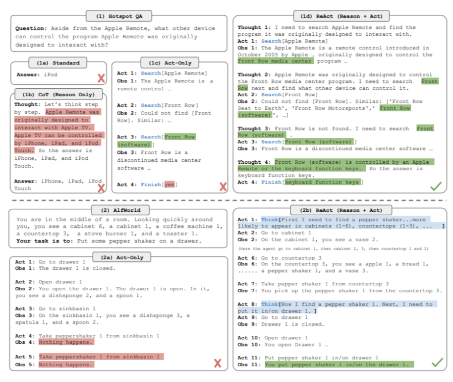

# AI Security

**Table of contents:**

- [AI Security](#ai-security)
  - [Overview](#overview)
  - [AI tools](#ai-tools)
  - [AI Security](#ai-security-1)
    - [AI pipeline risk](#ai-pipeline-risk)
    - [AI Observability 可观察性](#ai-observability-可观察性)
    - [Secure AI Framework](#secure-ai-framework)
      - [Google Secure AI Framework](#google-secure-ai-framework)
        - [6 core elements:](#6-core-elements)
        - [5 steps to support and advance a framework](#5-steps-to-support-and-advance-a-framework)
- [Drawback of LLMs](#drawback-of-llms)
  - [Outdated knowledge](#outdated-knowledge)
  - [struggle with complex math.](#struggle-with-complex-math)
  - [Hallucination](#hallucination)
    - [Hallucinations in Large Language Models](#hallucinations-in-large-language-models)
      - [Using Hallucinations](#using-hallucinations)
    - [Mitigating Hallucinations](#mitigating-hallucinations)
  - [Bias](#bias)
  - [Glitch tokens](#glitch-tokens)
  - [LLM Generation Inefficient](#llm-generation-inefficient)
    - [Speculative 推测的 Decoding](#speculative-推测的-decoding)
- [Techniques to overcome LLM issues](#techniques-to-overcome-llm-issues)
  - [RAG / Retrieval Augmented Generation](#rag--retrieval-augmented-generation)
    - [Implementation](#implementation)
      - [Retriever](#retriever)
  - [Helping LLMs reason and plan with chain-of-thought](#helping-llms-reason-and-plan-with-chain-of-thought)
  - [Program-aided language models (PAL)](#program-aided-language-models-pal)
    - [Augmenting LLMs](#augmenting-llms)
  - [ReAct: Combining reasoning and action](#react-combining-reasoning-and-action)
    - [ReAct structured examples](#react-structured-examples)
  - [LangChain](#langchain)
  - [LLMs Security](#llms-security)
    - [Protection solution](#protection-solution)
      - [Large Language Model (LLM) Monitoring](#large-language-model-llm-monitoring)
      - [OpenSSF Scorecard](#openssf-scorecard)
  - [Vendor - Data Security and AI Language Models](#vendor---data-security-and-ai-language-models)
    - [controls](#controls)
    - [Security Practices Review](#security-practices-review)
    - [Contractual Protections 合同的](#contractual-protections-合同的)
      - [Data Processing Addendum (DPA)](#data-processing-addendum-dpa)
      - [Business Associate Agreement (BAA)](#business-associate-agreement-baa)
    - [Customer Data Rights](#customer-data-rights)
      - [Data Retention Policy](#data-retention-policy)
    - [Transparency](#transparency)
    - [Regulatory Compliance](#regulatory-compliance)
    - [Ethics](#ethics)

---

## Overview

---

## AI tools

**AI Model**
- LLaMA,
- ChatGPT
- MPT
- Falcon
- Hugging Face model

LLM Engine
- https://github.com/scaleapi/llm-engine

LLM Security
- https://github.com/greshake/llm-security

**AI Platform**: Build, compare, deploy LLM Apps
- [ScaleAI](https://scale.com/spellbook)

**AI Observability**
- [whylabs](https://docs.whylabs.ai/docs/integrations-llm-whylogs-container)

---

## AI Security

- Artificial Intelligence is very good at finding vulnerabilities, and with the help of humans, it can exploit them even better.

- In computing, debuggers use AI software to look for bugs in source code, autocompletion, autocorrection, and handwriting software. AI can also find vulnerabilities in systems of finance, law, and even politics. AI is used to look for loopholes in contracts, datasets about people, and improve literature gaps.

This brings about two problems:

- AI can be **created to hack** a system.

  - it can be good or bad depending on how people use it.
  - A cybercriminal may create an advanced chatbot to obtain information from a wide range of people across vast platforms and perhaps even languages.
  - companies can use AI to look for the vulnerabilities they have and patch them up so an attacker cannot exploit them.

- AI might **unintentionally hack** the system.

  - Computers have a very different logic from humans. This means that almost all the time, they accept data, process it, and produce output in a completely different manner in contrast to humans.
  - Take an example of the classic game of chess:
  - Chess is an abstract strategy game that is played on a board with 64 squares arranged in an 8-by-8 grid. At the start, each player controls sixteen pieces. The aim is to checkmate the opponent's king with the condition that the king is in check and there is no escape.
  - A human and a classic chess engine look at this game in two very different ways. A human may play the value game (measuring winning by the value and number of pieces on the board), whereas a computer looks at a finite number of possibilities that can occur with each move the opponent makes via a search algorithm.
  - By having this limited ability to see into the future, the computer has the advantage almost every time to win the game. This is a very preliminary example and quite basic to the other systems that can be ‘hacked’ by Artificial intelligence.

- humans are programmed by implicit and explicit knowledge. Computers are programmed by a set of instructions and logic that never change unless told to. Therefore, computers and humans will have different approaches, solutions, and hacks for the same problem.

- But systems are built around humans and not computers. So, when the chips are down, computers can do a lot more vulnerability finding and exploitation to many more systems, both virtual and physical.

---

### AI pipeline risk

- AI's potential is limitless, but data security is paramount.
- as AI evolves, developers and researchers who rely on data sharing must prioritize securing sensitive information.

Breakdown of security risks in the AI pipeline:

---

### AI Observability 可观察性

observability platform
- to control the behavior of ML & data applications.

- `Monitor and observe model performance` for predictive ML models, supporting delayed ground truth and custom performance metrics

- `Monitor and observe data quality` in ML model inputs, Feature Stores, batch and streaming pipelines

- Detect and root cause common ML issues such as drift, data quality, model performance degradation, and model bias

- Explain the cause of model performance degradation using tracing and feature importance

- Detect and root cause common LLM issues such as `toxicity, PII leakage, malicious activity, and indications of hallucinations`

---

### Secure AI Framework

> a summary of SAIF, click this [PDF](https://services.google.com/fh/files/blogs/google_secure_ai_framework_summary.pdf).
> how practitioners can implement SAIF, click this [PDF](https://services.google.com/fh/files/blogs/google_secure_ai_framework_approach.pdf).

The potential of AI, especially generative AI, is immense.

in the pursuit of progress within these new frontiers of innovation, there needs to be `clear industry security standards for building and deploying this technology in a responsible manner`

**Secure AI Framework (SAIF)**
- a conceptual framework for secure AI systems

- inspired by the security best practices (like reviewing, testing and controlling the supply chain) that we’ve applied to software development + incorporating understanding of security mega-trends and risks specific to AI systems

- A framework across the public and private sectors is essential for making sure that responsible actors safeguard the technology that supports AI advancements, so that when AI models are implemented, they’re secure-by-default.

#### Google Secure AI Framework

> google have long advocated for, and often developed, industry frameworks to raise the security bar and reduce overall risk.
> - `Supply-chain Levels for Software Artifacts (SLSA)` framework: improve software supply chain integrity
> - `BeyondCorp access model`: zero trust principles which are industry standard today.
> - `Google Secure AI Framework (SAIF)`:

- embraced an open and collaborative approach to cybersecurity. This includes combining frontline intelligence, expertise, and innovation with a commitment to share threat information with others to help respond to — and prevent — cyber attacks.

- Building on that approach, SAIF is designed to help `mitigate risks specific to AI systems` like stealing the model, data poisoning of the training data, injecting malicious inputs through prompt injection, and extracting confidential information in the training data.

##### 6 core elements:

1. Expand **strong security foundations** to the AI ecosystem

   - leveraging secure-by-default infrastructure protections and expertise built over the last two decades to protect AI systems, applications and users.
   - develop organizational expertise to keep pace with advances in AI and start to scale and adapt infrastructure protections in the context of AI and evolving threat models.
   - For example
     - injection techniques like SQL injection have existed for some time, and organizations can adapt mitigations, such as input sanitization and limiting, to help better defend against prompt injection style attacks.

2. Extend **detection and response** to bring AI into an organization’s threat universe

   - Timeliness is critical in detecting and responding to AI-related cyber incidents, and extending threat intelligence and other capabilities to an organization improves both.
   - For organizations, this includes `monitoring inputs and outputs of generative AI systems to detect anomalies` and `using threat intelligence to anticipate attacks`.
   - This effort typically requires collaboration with trust and safety, threat intelligence, and counter abuse teams.

3. **Automate defenses** to keep pace with existing and new threats

   - The latest AI innovations can `improve the scale and speed of response efforts` to security incidents.

   - Adversaries 对手 will likely use AI to scale their impact, so it is important to use AI and its current and emerging capabilities to stay nimble 灵活的 and cost effective in protecting against them.

4. **Harmonize 和声 platform level controls** to ensure consistent security across the organization

   - Consistency across control frameworks can support AI risk mitigation and scale protections across different platforms and tools to ensure that the best protections are available to all AI applications in a scalable and cost efficient manner.

   - At Google, this includes extending secure-by-default protections to AI platforms like Vertex AI and Security AI Workbench, and building controls and protections into the software development lifecycle.

   - Capabilities that address general use cases, like Perspective API, can help the entire organization benefit from state of the art protections.

5. Adapt controls to **adjust mitigations and create faster feedback loops** for AI deployment

   - Constant testing of implementations through continuous learning can ensure detection and protection capabilities address the changing threat environment.
   - This includes
     - techniques like reinforcement learning based on incidents and user feedback
     - steps such as updating training data sets, fine-tuning models to respond strategically to attacks and allowing the software that is used to build models to embed further security in context (e.g. detecting anomalous behavior).
   - Organizations can also conduct regular red team exercises to improve safety assurance for AI-powered products and capabilities.

6. Contextualize 置于上下文中 **AI system risks in surrounding business processes**
   - Lastly, conducting end-to-end risk assessments related to how organizations will deploy AI can help inform decisions.
   - This includes an `assessment of the end-to-end business risk`, such as data lineage, validation and operational behavior monitoring for certain types of applications.
   - In addition, organizations should `construct automated checks` to validate AI performance.

##### 5 steps to support and advance a framework

1. Fostering industry support for SAIF with the announcement of key partners and contributors in the coming months and continued industry engagement to help develop the `NIST AI Risk Management Framework` and `ISO/IEC 42001 AI Management System Standard` (the industry's first AI certification standard).
   1. These standards rely heavily on the security tenets in the `NIST Cybersecurity Framework` and `ISO/IEC 27001 Security Management System` — which Google will be participating in to ensure planned updates are applicable to emerging technology like AI — and are consistent with SAIF elements.

2. Working directly with organizations, including customers and governments to help them understand how to assess AI security risks and mitigate them.
   1. This includes conducting workshops with practitioners and continuing to `publish best practices for deploying AI systems securely`.

3. Sharing insights from Google’s leading threat intelligence teams like Mandiant and TAG on cyber activity involving AI systems.

4. Expanding our bug hunters programs (including Vulnerability Rewards Program) to reward and incentivize research around AI safety and security.

5. Continuing to deliver secure AI offerings with partners like GitLab and Cohesity, and further develop new capabilities to help customers build secure systems.
   1. That includes our commitment to the open source community and we will soon publish several open source tools to help put SAIF elements into practice for AI security.

---

---

# Drawback of LLMs

Although all the training, tuning and aligning techniques you've explored can help you build a great model for your application.

- There are some broader challenges with LLMs that can't be solved by training alone.

---

## Outdated knowledge

- the internal knowledge held by a model cuts off at the moment of pretraining.

- This knowledge is out of date.

- For example
  - ask a model that was trained in early 2022 who the British Prime Minister is, it will probably tell you Boris Johnson.
  - The model does not know that Johnson left office in late 2022 because that event happened after its training.

---

## struggle with complex math.

- prompt a model to behave like a calculator, it may get the answer wrong, depending on the difficulty of the problem.

- LLMs do not carry out mathematical operations.
  - just predict the next best token based on their training
  - can easily get the answer wrong.

- For example
  - ask the model to carry out a division problem.
  - The model returns a number close to the correct answer, but it's incorrect.

---

## Hallucination

- An infamous outcome of Microsoft’s Sydney were instances when the AI gave responses that were either bizarre 异乎寻常, untrue, or seemed sentient 有感情.

- These instances are termed Hallucination, where the model gives answers or makes claims that are not based on its training data.

### Hallucinations in Large Language Models

> LLMs are known to have `hallucinations`

hallucinations

- behavior in that the model speaks false knowledge as if it is accurate.
  - tendency to generate text even when don't know the answer

- when a model generates text, it can’t tell if the generation is accurate.
  - A large language model is a trained machine learning model that generates text based on the prompt you provided. The model’s training equipped it with some knowledge derived from the `training data` provided. It is difficult to tell what knowledge a model remembers or what it does not.

In the context of LLMs,
- “hallucination”: a phenomenon where the model generates text that is incorrect, nonsensical, or not real.
- Since LLMs are not databases or search engines, `they would not cite where their response is based on`.
- These models generate text as an extrapolation from the prompt you provided.
- The result of extrapolation is not necessarily supported by any training data, but is the most correlated from the prompt.

- For example
  - build a two-letter bigrams Markov model from some text: Extract a long piece of text, build a table of every pair of neighboring letters and tally the count.
  - “hallucinations in large language models” would produce “HA”, “AL”, “LL”, “LU”, etc. and there is one count of “LU” and two counts of “LA.”
  - when started with a prompt of “L”, you are twice as likely to produce “LA” than “LL” or “LS”.
  - with a prompt of “LA”, you have an equal probability of producing “AL”, “AT”, “AR”, or “AN”.
  - with a prompt of “LAT” and continue this process.
  - Eventually, this model invented a new word that didn’t exist.
  - This is a result of the statistical patterns. You may say customer Markov model hallucinated a spelling.

- Hallucination in LLMs is not much more complex than this, even if the model is much more sophisticated. From a high level, hallucination is caused by limited contextual understanding since the model is obligated to transform the prompt and the training data into an abstraction, in which some information may be lost. Moreover, noise in the training data may also provide a skewed statistical pattern that leads the model to respond in a way you do not expect.

#### Using Hallucinations

- You may consider hallucinations a feature in large language models.

- You want to see the models hallucinate if you want them to be creative.
  - For example, if you ask ChatGPT or other Large Language Models to give you a plot of a fantasy story, you want it not to copy from any existing one but to generate a new character, scene, and storyline. This is possible only if the models are not looking up data that they were trained on.

- you want hallucinations when looking for diversity
  - for example, asking for ideas. It is like asking the models to brainstorm for you. You want to have derivations from the existing ideas that you may find in the training data, but not exactly the same. Hallucinations can help you explore different possibilities.

Many language models have a “temperature” parameter.
- control the temperature in ChatGPT using the API instead of the web interface.
- This is a parameter of randomness. The higher temperature can introduce more hallucinations.

### Mitigating Hallucinations

- Language models are not search engines or databases.
- Hallucinations are unavoidable. What is annoying is that the `models generate text with mistakes that is hard to spot`.

- If the contaminated training data caused the hallucination, you can **clean up the data and retrain the model**.
  - However, most models are too large to train on customer own devices. Even fine-tuning an existing model may be impossible on commodity hardware.

- The best mitigation may be **human intervention in the result**
  - asking the model to regenerate if it went gravely wrong.

- The other solution to avoid hallucinations is **controlled generation**.
  - It means providing enough details and constraints in the prompt to the model.
  - Hence the model has limited freedom to hallucinate.
  - The reason for prompt engineering is to specify the role and scenario to the model to guide the generation, so that it does not hallucinate unbounded.

---

## Bias

- Sometimes, the data could be the source of the problem. If a model is trained on data that is discriminatory to a person, group, race, or class, the results would also tend to be discriminatory.

- Sometimes, as the model is being used, the bias could change to fit what users tend to input. Microsoft’s Tay in 2016 was a great example of how bias could go wrong.

---

## Glitch tokens

- Also known as adversarial examples 对抗性示例, glitch tokens are inputs given to a model to intentionally make it malfunction and be inaccurate when delivering answers.

---

## LLM Generation Inefficient

> From a systems perspective, LLM generation follows a memory-bound computational pattern with the main latency bottleneck arising from memory reads/writes rather than arithmetic computations. This issue is rooted in the inherently sequential nature of the auto-regressive decoding process. Each forward pass necessitates the transfer of the entire model's parameters from High-Bandwidth Memory (HBM) to the accelerator's compute units. This operation, while only producing a single token for each sample, fails to fully utilize the arithmetic computation capabilities of modern accelerators, resulting in inefficiency.

Before the rise of LLMs, a common mitigation for this inefficiency was to `simply increase the batch size, enabling the parallel production of more tokens`.

But the **situation becomes far more complicated with LLMs**.

- Increasing the batch size in this context not only introduces higher latency but also substantially `inflates 膨胀 the memory requirements` for the Transformer model's key-value cache.

  - This trade-off makes the use of large batches impractical for many applications where low latency is a critical requirement.

- also, for cost structures, as of September 2023, generation costs approximately 2x higher for GPT-4 and roughly 3x for Claude 2, compared to merely processing prompts.

### Speculative 推测的 Decoding

> Given the challenges outlined, one appealing strategy to accelerate **text generation** is `more efficient computational utilization—specifically`, by `processing more tokens in parallel`.

speculative decoding

- The methodology employs a streamlined "draft" model to generate a batch of token candidates at each step quickly. These candidates are then validated by the original, full-scale language model to identify the most reasonable text continuations.

- The underlying logic hinges on an intriguing 引起兴趣的 assumption:

  - the draft model, although smaller, should be proficient enough to churn out sequences that the original model will find acceptable.

  - the draft model can rapidly produce token sequences while the original model efficiently vets 审查 multiple tokens in parallel, which maximizing computational throughput.

  - Recent research indicates that with a well-tuned draft model, speculative decoding can cut latency by an impressive factor of up to 2.5x.

- However, the approach is not without its challenges:

  - Finding the Ideal Draft Model: Identifying a "small yet mighty" draft model that aligns well with the original model is easier said than done.

  - System Complexity: Hosting two distinct models in one system introduces layers of complexity, both computational and operational, especially in distributed settings.

  - Sampling Inefficiency: When doing sampling with speculative decoding, an importance sampling scheme needs to be used. This introduces additional overhead on generation, especially at higher sampling temperatures.

- These complexities and trade-offs have limited the broader adoption of speculative decoding techniques. So speculative decoding isn't widely adopted.

- Remark: We use speculative decoding to refer to those methods that require an independent draft model here. In a broader sense, our method can also be viewed as speculative decoding, while the draft model is entangled with the original model.

---

# Techniques to overcome LLM issues

connecting to external data sources and applications.

- the application must manage the passing of user input to the LLM and the return of completions.

  - often done through some type of orchestration library.

- This layer can enable some powerful technologies that augment and enhance the performance of the LLM at runtime.

    - By providing access to external data sources or connecting to existing APIs of other applications.

    - One implementation example: `Langchain`

---

## RAG / Retrieval Augmented Generation

> retrain the model on new data
> - would quickly become very expensive.
> - require repeated retraining to regularly update the model with new knowledge.

**RAG**

- Retrieval augmented generation isn't a specific set of technologies, but rather a framework for providing LLMs access to data they did not see during training.

  - a framework for building LLM powered systems that make use of external data sources.

- to connect LLMs to external data sources.

  - give the model access to additional external data at **inference time**.

- RAG architectures can be used to integrate multiple types of external information sources.

  - local documents, including private wikis and expert systems.

  - enable access to the Internet to extract information posted on web pages, for example, Wikipedia.

  - By encoding the user input prompt as a SQL query, RAG can also interact with databases.

  - 

- **Providing the model with external information**
  - can improve both the relevance and accuracy of its completions.
  - useful in any case where want the language model to have access to data that `it may not have seen`.
    - new information documents not included in the original training data,
    - proprietary knowledge stored in the organization's private databases.

  - great way to overcome the knowledge cutoff issue and help the model update its understanding of the world.

  - A more flexible and less expensive way to overcome knowledge cutoffs
  - make applications to overcome some of the limitations of these models.

  - greatly increases its utility for specific use case.

- **Avoid the problem of the model hallucinating** when it doesn't know the answer.

- A number of different implementations exist, and the one you choose will depend on the details of the task and the format of the data you have to work with.

---

### Implementation

- implementing RAG is more complicated than simply adding text into the LLM.

- key considerations

  - the size of the **context window**.
    - 

    - Most text sources are too long to fit into the limited context window (few thousand tokens) of the model
    - the external data sources are chopped up into many chunks to fit in the context window.
    - Packages like `Langchain` can handle this work

  - the data must be available in a format that **allows for easy retrieval** of the most relevant text.
    - 
    - 

    - LLMs don't work directly with text, but create `vector representations` of each token in an embedding space.

    - These `embedding vectors` allow the LLM to identify `semantically related words` through measures such as **cosine similarity**

    - Rag methods take the small chunks of external data and process them through the LLM, to create embedding vectors for each.

    - These new representations of the data can be stored in structures called `vector stores`

---

#### Retriever

- one of the earliest papers on RAG

- The retriever component retrieves relevant information from an external corpus or knowledge base, which is then used by the model to generate more informed and contextually relevant responses. This incorporation of external knowledge enhances the quality and relevance of the generated content.

- a model component by researchers at Facebook, originally published in 2020.
  - consists of a **query encoder** and an **external data source**.

    - The **encoder** takes the user's input prompt and encodes it into a form that can be used to query the data source.

    - the external data is a **vector store**,
      - it could instead be a SQL database, CSV files, or other data storage format.

  - These two components are trained together to find documents within the external data that are most relevant to the input query.

  - The Retriever returns the best single or group of documents from the data source and combines the new information with the original user query.

  - The new expanded prompt is then passed to the language model, generates a completion that makes use of the data.

- example.

  - lawyer using a LLM in the discovery phase of a case.

  - A Rag architecture can help ask questions of a corpus of documents, for example, previous court filings.
  - 

  - ask the model about the plaintiff named in a specific case number.

    - The prompt is passed to the **query encoder**
    - encodes the data in the same format as the external documents.
    - searches for a relevant entry in the corpus of documents.
    - Having found a piece of text that contains the requested information
    - then combines the new text with the original prompt.
    - 

    - The expanded prompt that now contains information about the specific case of interest is then passed to the LLM.

    - The model uses the information in the context of the prompt to generate a completion that contains the correct answer.

  - use Rag to generate summaries of filings or identify specific people, places and organizations within the full corpus of the legal documents.

---

## Helping LLMs reason and plan with chain-of-thought

Researchers have been exploring ways to improve the performance of large language models on reasoning tasks

One strategy that has demonstrated some success is prompting the model to think more like a human, by breaking the problem down into steps.

- Then finish by stating the answer.
- These intermediate calculations form the reasoning steps that a human might take, and the full sequence of steps illustrates the chain of thought that went into solving the problem.
- Asking the model to mimic this behavior is known as chain of thought prompting.
- It works by including `a series of intermediate reasoning steps` into any examples that you use for one or few-shot inference.
- By structuring the examples in this way, essentially teaching the model how to reason through the task to reach a solution
- Thinking through the problem has helped the model come to the correct answer.
- while the input prompt is shown here in a condensed format to save space, the entire prompt is actually included in the output.

- use chain of thought prompting to `help LLMs improve their reasoning of other types of problems`
> - an example
> - simple physics problem: determine if a gold ring would sink to the bottom of a swimming pool.
> - The chain of thought prompt included as the one-shot example here, shows the model how to work through this problem, by reasoning that a pair would flow because it's less dense than water.
> - When pass this prompt to the LLM, it generates a similarly structured completion.
> - The model correctly identifies the density of gold, which it learned from its training data, and then reasons that the ring would sink because gold is much more dense than water.

Chain of thought prompting is a powerful technique that improves the ability of the model to reason through problems. While this can greatly improve the performance of the model, the limited math skills of LLMs can still cause problems if the task requires accurate calculations, like totaling sales on an e-commerce site, calculating tax, or applying a discount.

---

## Program-aided language models (PAL)

> letting the LLM talk to a program that is much better at math.

As you saw earlier in this lesson, the ability of LLMs to carry out arithmetic and other mathematical operations is limited.

- Even if the model correctly reasons through a problem, it may still get the individual math operations wrong
  - especially with larger numbers or complex operations.

  - example: LLM tries to act like a calculator but gets the answer wrong.

- negative consequences:
  - charging customers the wrong total
  - getting the measurements for a recipe incorrect.

 The model isn't actually doing any real math here. 

- but  predict the most probable tokens  that complete the prompt.

### Augmenting LLMs

- program-aided language models (PAL)
  - presented by Luyu Gao and collaborators at Carnegie Mellon University in 2022,
  - pairs an LLM with an external code interpreter to carry out calculations.

- overcome this limitation by allowing the model to interact with external applications that are good at math, like a **Python interpreter**.

  - makes use of chain of thought prompting to generate executable Python scripts.

  - The scripts that the model generates are passed to an interpreter to execute.

- The strategy behind PAL
  - the output format for the model by including examples for one or few short inference in the prompt.

  - have the LLM generate completions where  reasoning steps are accompanied by computer code .

  - This code is then passed to an interpreter to carry out the calculations necessary to solve the problem.

example prompts:

- Variables are declared based on the text in each reasoning step.

- Their values are assigned either directly, as in the first line of code here, or as calculations using numbers present in the reasoning text in the second Python line.

- The model can also work with variables it creates in other steps

- Note that the text of each reasoning step begins with a pound sign, so that the line can be skipped as a comment by the Python interpreter.

- The prompt here ends with the new problem to be solved.

How the PAL framework enables an LLM to interact with an external interpreter.

1. To prepare for inference with PAL, format the prompt to contain one or more examples.

   - Each example should contain a question followed by reasoning steps in lines of Python code that solve the problem.

2. append the new question to the prompt template.

3. the resulting PAL formatted prompt, contains both the example and the problem to solve.

4. pass this combined prompt to the LLM, which then generates a completion that is in the form of a Python script having learned how to format the output based on the example in the prompt.

5. hand off the script to a Python interpreter, to run the code and generate an answer.

   - For the bakery example script you saw on the previous slide, the answer is 74.

   - 

6. append the text containing the answer, have a prompt that includes the correct answer in context.
   - accurate because the calculation was carried out in Python to the PAL formatted prompt you started with.
   - 

7. pass the updated prompt to the LLM, it generates a completion that contains the correct answer.
   - 

Automate this process
- so that you don't have to pass information back and forth between the LLM, and the interpreter by hand.

- The orchestrator
  - a technical component that can manage the flow of information and the initiation of calls to external data sources or applications.

  - It can also decide what actions to take based on the information contained in the output of the LLM.

- LLM is the application's reasoning engine.

  - it creates the plan that the orchestrator will interpret and execute.

- In PAL there's only one action to be carried out,  the execution of Python code .

- The LLM doesn't really have to decide to run the code, but  write the script which the orchestrator then passes to the external interpreter  to run.

- real-world applications use case may require interactions with several external data sources.

- may need to manage multiple decision points, validation actions, and calls to external applications.

---

## ReAct: Combining reasoning and action

> use the LLM to power a more complex application, to manage more complex workflows, perhaps in including interactions with multiple external data sources and applications.

**ReAct**

- framework proposed by researchers at Princeton and Google in 2022.

  - The paper develops a series of complex prompting examples based on problems from:
    - Hot Pot QA, a multi-step question answering benchmark that requires reasoning over two or more Wikipedia passages
    - fever, a benchmark that uses Wikipedia passages to verify facts.

- one way to use LLMs to power an application through reasoning and action planning.

- This strategy can be extended for the specific use case by creating examples that work through the decisions and actions that will take place in the application.

- a prompting strategy
  - combines chain of thought reasoning with action planning.
  - help LLMs plan out and execute these workflows.

- a novel approach that `integrates verbal reasoning and interactive decision` making in LLMs.
- While LLMs have excelled in language understanding and decision making, the combination of reasoning and acting has been neglected.
- ReAct enables LLMs to generate reasoning traces and task-specific actions, leveraging the synergy between them. The approach demonstrates superior performance over baselines in various tasks, overcoming issues like hallucination and error propagation.
- ReAct outperforms imitation and reinforcement learning methods in interactive decision making, even with minimal context examples. It not only enhances performance but also improves interpretability, trustworthiness, and diagnosability by allowing humans to distinguish between internal knowledge and external information.

In summary, ReAct bridges the gap between reasoning and acting in LLMs, yielding remarkable results across language reasoning and decision making tasks. By interleaving reasoning traces and actions, ReAct overcomes limitations and outperforms baselines, not only enhancing model performance but also providing interpretability and trustworthiness, empowering users to understand the model's decision-making process.

---

### ReAct structured examples

ReAct uses structured examples to show a large language model how to reason through a problem and decide on actions to take that move it closer to a solution.

- **question**

  - prompts start with `a question that will require multiple steps to answer`.

  > - example: determine which of two magazines was created first.

- **thought**

  - then includes `a related thought action observation trio of strings`.

  - a reasoning step that demonstrates to the model how to tackle the problem and identify an action to take.

  > - example: the prompt specifies that the model will search for both magazines and determine which one was published first.

- **action**

  - In order for the model to interact with an external application or data source, it has to `identify an action to take from a pre-determined list`.

  - In the case of the ReAct framework, the authors created a small Python API to interact with Wikipedia.
    - The action is formatted using the specific square bracket notation so that the model will format its completions in the same way.
    - The Python interpreter searches for this code to trigger specific API actions.

  - The three allowed actions are
    - `search`: looks for a Wikipedia entry about a particular topic
    - `lookup`: searches for a string on a Wikipedia page.
    - `finish`: the model carries out when it decides it has determined the answer.

  > - example,
  > - the thought in the prompt identified two searches to carry out one for each magazine.
  > - the first search will be for Arthur's magazine.

- **observation**

  - where the new information provided by the external search is brought into the context of the prompt for the model to interpret

- the prompt then repeats the cycle as many times as is necessary to obtain the final answer.

- In the second thought, the prompt states the start year of Arthur's magazine and identifies the next step needed to solve the problem.

  - The second action is to search for first for women, and the second observation includes text that states the start date of the publication, in this case 1989.

  - At this point, all the information required to answer the question is known.

- The third thought states the start year of first for women and then gives the explicit logic used to determine which magazine was published first.

- The final action is to finish the cycle and pass the answer back to the user.

- It's important to note that in the ReAct framework, the LLM can only choose from a limited number of actions that are defined by a set of instructions that is prepended to the example prompt text.

---

The full text of the instructions:

1. the task is defined, telling the model to answer a question using the prompt structure you just explored in detail.

2. the instructions give more detail about what is meant by thought and then specifies that the action step can only be one of three types.
   1. search action, which looks for Wikipedia entries related to the specified entity.
   2. lookup action, which retrieves the next sentence that contains the specified keyword.
   3. finish action, which returns the answer and brings the task to an end.

   - It is critical to define a set of allowed actions when using LLMs to plan tasks that will power applications.

   - LLMs are very creative, and they may propose taking steps that don't actually correspond to something that the application can do.

3. The final sentence in the instructions lets the LLM know that some examples will come next in the prompt text.

---

All the pieces together

1. start with the ReAct example prompt.

   - depending on the LLM you're working with, you may find that you need to include more than one example and carry out future inference.

2. pre-pend the instructions at the beginning of the example
3. insert the question you want to answer at the end.

4. The full prompt now includes all of these individual pieces, and it can be passed to the LLM for inference.

---

## LangChain

- framework provides modular pieces that contain the components necessary to work with LLMs.

- These components include
  - **prompt templates**: for many different use cases to format both input examples and model completions.

  - **memory**: to store interactions with an LLM.

  - **pre-built tools**: enable to carry out a wide variety of tasks, including calls to external datasets and various APIs.

- Connecting a selection of these individual components together results in a chain.

  - LangChain have developed a set of predefined chains that have been optimized for different use cases, use these off the shelf to quickly get the app up and running.

- Sometimes the application workflow could take multiple paths depending on the information the user provides, instead of use a pre-determined chain, will need the flexibility to decide which actions to take as the user moves through the workflow.

- LangChain defines another construct, known as an **agent**, that you can use to interpret the input from the user and determine which tool or tools to use to complete the task.

  - LangChain currently includes agents for both PAL and ReAct, among others.

  - Agents can be incorporated into chains to take an action or plan and execute a series of actions.

---

## LLMs Security

### Protection solution

Protection for open source and proprietary models

- Protect the LLM user experience against the key LLM vulnerability types.
- Deploy inline guardrail with customizable metrics, thresholds, and actions.
- The solution is applicable to internal and external LLM applications of any scale.
- Whether you are integrating with a public API or running a proprietary model, use the WhyLabs proxy to ensure guardrails and logging of each prompt/response pair.
- WhyLabs integrates with LangChain, HuggingFace, MosaicML, OpenAI, Falcon, Anthropic, and more.

---

#### Large Language Model (LLM) Monitoring

> Productionizing language models and LLMs, comes with a range of risks due to the infinite amount of input combinations, which can elicit an infinite amount of outputs.

**Text Quality**

- metric
  - readability score
  - complexity and grade scores (syllable count, word count, and character count)

- Text quality metrics can provide important insights into the quality and appropriateness of generated responses.

  - Assessing text complexity and grade level
    - assists in tailoring the generated content to the target audience.
    - By considering factors such as sentence structure, vocabulary choice, and domain-specific requirements, we can ensure that the LLM produces responses that align with the intended reading level and professional context.
    - incorporating metrics such as syllable count, word count, and character count allows us to closely monitor the length and composition of the generated text.
    - By setting appropriate limits and guidelines, we can ensure that the responses remain concise, focused, and easily digestible for users.

    - In **langkit**, we can compute text quality metrics through the textstat module, which uses the textstat library to compute several different text quality metrics.

- By monitoring these metrics, we can `ensure that the Language Model (LLM) outputs are clear, concise, and suitable for the intended audience`.

**Text Relevance 相关**
- metric
  - Similarity scores between prompt/responses
  - Similarity scores against user-defined themes

- Text relevance plays a crucial role in the monitoring of Language Models (LLMs) by providing an `objective measure of the similarity between different texts`.

- It serves multiple use cases, including:

  - assessing the quality and appropriateness of LLM outputs and providing guardrails to ensure the generation of safe and desired responses.

  - computing similarity scores between embeddings generated from prompts and responses, enabling the evaluation of the relevance between them.
    - This helps identify potential issues such as irrelevant or off-topic responses 偏离主题的回答, ensuring that LLM outputs align closely with the intended context.
    - In **langkit**, we can compute similarity scores between prompt and response pairs using the input_output module.

  - calculating the similarity of prompts and responses against certain topics or known examples, such as jailbreaks or controversial subjects.
    - By comparing the embeddings to these predefined themes, we can establish guardrails to detect potential dangerous or unwanted responses. The similarity scores serve as signals, alerting us to content that may require closer scrutiny or mitigation.
    - In **langkit**, this can be done through the themes module.

- By leveraging text relevance as a monitoring metric for LLMs, we can `evaluate the quality of generated responses` + `establish guardrails to minimize the risk of generating inappropriate or harmful content`.
- This approach enhances the performance, safety, and reliability of LLMs in various applications, providing a valuable tool for responsible AI development.

**Security and Privacy**

- metric
  - patterns - count of strings matching a user-defined regex pattern group
  - jailbreaks - similarity scores with respect to known jailbreak attempts
  - prompt injection - similarity scores with respect to known prompt injection attacks
  - refusals - similarity scores with respect to known LLM refusal of service responses

- Monitoring for security and privacy in Language Model (LLM) applications helps `ensuring the protection of user data and preventing malicious activities`.

- Several approaches can be employed to strengthen the security and privacy measures within LLM systems.

  - `measure text similarity between prompts and responses against known examples of jailbreak attempts, prompt injections, and LLM refusals of service`. By comparing the embeddings generated from the text, potential security vulnerabilities and unauthorized access attempts can be identified.
    - This helps in mitigating risks and contributes to the LLM operation within secure boundaries.
    - In **langkit**, text similarity calculation between prompts/responses and known examples of jailbreak attempts, prompt injections, and LLM refusals of service can be done through the [themes](https://github.com/whylabs/langkit/blob/main/langkit/docs/modules.md#themes) module.

  - Having a prompt injection classifier in place further enhances the security of LLM applications. By detecting and preventing prompt injection attacks, where malicious code or unintended instructions are injected into the prompt, the system can maintain its integrity and protect against unauthorized actions or data leaks.
    - In **langkit**, prompt injection detection metrics can be computed through the [injections](https://github.com/whylabs/langkit/blob/main/langkit/docs/modules.md#injections) module.

  - `checking prompts and responses against regex patterns designed to detect sensitive information`. These patterns can help identify and flag data such as credit card numbers, telephone numbers, or other types of personally identifiable information (PII). In langkit, regex pattern matching against pattern groups can be done through the regexes module.

**Sentiment and Toxicity**
- metric
  - sentiment analysis
  - toxicity analysis

- The use of sentiment analysis for monitoring Language Model (LLM) applications can `provide valuable insights into the appropriateness and user engagement of generated responses`.
- By employing sentiment and toxicity classifiers, we can assess the sentiment and detect potentially harmful or inappropriate content within LLM outputs.

- Monitoring sentiment allows us to
  - gauge the overall tone and emotional impact of the responses. By analyzing sentiment scores, we can ensure that the LLM is consistently generating appropriate and contextually relevant responses. For instance, in customer service applications, maintaining a positive sentiment ensures a satisfactory user experience.

  - provides an important measure of the presence of offensive, disrespectful, or harmful language in LLM outputs. By monitoring toxicity scores, we can identify potentially inappropriate content and take necessary actions to mitigate any negative impact.

  - identify potential biases or controversial opinions present in the responses, helping to address concerns related to fairness, inclusivity, and ethical considerations.

---

#### OpenSSF Scorecard

> https://github.com/ossf/scorecard?ref=hackernoon.com

The Role of OpenSSF Scorecard in Enhancing Security Standards

- a robust framework that can prove invaluable.
- Developed by the Open Source Security Foundation (OSSF)
- To address the security challenges associated with open-source LLM projects
- the Scorecard is an `automated SAST (Static Application Security Testing) tool` that evaluates project security by assigning scores to various security heuristics or checks.
- By utilizing the Scorecard, developers can assess the risks associated with project dependencies, make informed decisions, and collaborate with maintainers to address security gaps.
- This framework also facilitates the comparison of similar projects, enabling organizations to prioritize security considerations and select the most secure options.

---

## Vendor - Data Security and AI Language Models

- As a steward of the customer's data, vendor should rigorously reviews the systems and services of the third parties that process data on the behalf (known as "subprocessors").

- Large language models (LLMs) like OpenAI represent an emerging category of subprocessor, which necessitates both applying existing security review criteria and developing new ones to address the unique technology and risks associated with LLMs.

  - vendor should will continuously refine its security and privacy assessments to include these innovative partners and the capabilities they bring to the table.
  - When evaluating an LLM provider, vendor should examines the following security, privacy, and compliance aspects:

    - Security practices review
    - Contractual protections
    - Customer data rights
    - Transparency
    - Regulatory Compliance
    - Ethics

---

### controls

- LLM interfaces and corporate offerings are simple to block and should be blocked, so that the company can choose which ones to allow.
  - a policy is needed on correct usage, and a project should exist to sanction the right ones. Ignoring this latter part will lead to rogue or maverick use of LLMs, so don’t ignore it.

- Over time, new LLM services will pop up to satisfy suppressed demand (like organizations that outright ban and never subscribe to sanctioned 制裁 services).
  - So list of detection will arise for blocking access to new and emergent 新兴的 or even shady LLM services. For that matter, expect cybercriminals to intentionally stand up such services with everything from real models to mechanical Turks behind the scenes.

- People will start using phones and personal systems to interact with LLMs if interaction is prohibited. Motivations for bypassing bans (e.g., performance, time savings, revenue generation, etc.) are there, so it will happen.

- LLM-directed traffic will morph over (not much) time to progressively look a lot like other traffic types. It will rapidly begin to look like new traffic types to get around blocking, behavioral detection, and pattern spotting. It will also migrate to new protocols.
  - QUIC is an obvious choice, but even traffic shape could look very different if resistance to the use of these services is high.

- Other services will act as proxies and connect via API/WS to GPT, meaning anything could be a gateway. And worse, many users may not know where they are in the “API supply chain,” especially in “human interaction” services like support services.
  - companies should always flag their own services as having humans or machines with a flag for end users, to encourage similar behaviors (an example where a standard is a great thing to champion).

- Part of the problem is keeping IP and specific information out of third-party hands, data loss protection (DLP) can help there. But there are also `traffic analysis attacks` and `data analysis attacks` (especially at scale) and information that can be inferred from LLM use.
  - The data never has to leave to imply something about what exists or is happening within a company’s walls (The big lesson of the Big Data era was that `Big Data stores can create PII and other data types`. This is even worse than that).
  - This means that the formerly carbon-based to carbon-based life form rules about secrecy now have to apply to carbon-to-silicon interactions too: Loose lips sink ships when talking to anything!

---

### Security Practices Review
- Each subprocessor is subject to a `comprehensive security evaluation to obtain documented evidence of its commitment to implementing robust measures` for safeguarding its systems and protecting customer data.

- vendor should looks for vendors to demonstrate mature information security practices at least as high as vendor should’s own program, such as SOC2, ISO 27001, ISO 27017, ISO 27018, third-party auditing, penetration testing, and responsiveness to industry security events.

---

### Contractual Protections 合同的

- Before transferring customer data to any subprocessor, vendor should requires contractual protections in `place permitting and placing explicit limits on the processing carried out on that data`. A **Data Processing Addendum (DPA)** provides vendor and its customers enforceable assurances, including that
  - the appropriate security practices will remain in place,
  - customer data will be processed only for specified purposes,
  - the subprocessor will enforce the same level of rigor on any partners it relies on.

Where available, vendor should also enters into a **Business Associate Agreement (BAA)** to provide access for customers that may work with healthcare data such as protected health information (PHI).

---

#### Data Processing Addendum (DPA)

为了保证消费者数据的安全，欧盟 (EU) 实施了严格的隐私和安全法，称为通用数据保护条例 `European Union General Data Protection Regulation (GDPR)`. GDPR 定义并强制执行欧盟公民对其个人数据的权利。它在使用该数据时实施了问责制、安全性和透明度标准。

如何保持 GDPR 合规性。
- 实施 `数据处理协议 (DPA)`。GDPR 数据处理协议规定了与数据处理活动相关的细节、规则、权利和义务。它有助于确保公司合规、保护数据并让消费者得到保护和满足。
- TBD...

**GDPR 下的 DPA**
- 数据处理协议 是 `数据控制器` 和将处理其数据的 `数据处理器` 之间签署的合同。它是完全符合 GDPR 要求的。

  - 数据控制者

    - 每个 DPA 协议都发生在数据控制者和数据处理者之间。数据控制者是决定如何以及为何处理个人数据的组织或个人。如果您的公司决定将数据发送给第三方以在其服务器上进行备份，那么您的公司就是数据控制者。

    - 数据控制者的决定性特征是决策权。数据控制者对数据收集的原因和个人数据的处理方式做出总体决定。

    - 在大多数情况下，公司或组织是数据控制者。数据处理器是与公司签订合同的独立实体。如果个人（例如独资经营者或个体经营者）做出有关收集和处理个人数据的决定，则该个人也可能是数据控制者。

  - 数据处理者

    - 数据处理者是为数据控制者处理数据的第三方。在上述场景中，如果您的公司决定将您的数据发送出去进行备份，那么提供备份服务的公司就是数据处理器。

    - 数据处理器可以采用多种形式。它可以是公司、个人或公共机构。相关标准是该个人或实体是否代表数据控制者处理数据。

- DPA 列出了将要发生的处理活动的性质、目的和持续时间。它还指定了要处理的个人数据的类型以及数据所属的个人类别。它定义了控制者将拥有的权利和义务。它可以指定必须采用的技术安全措施的使用，例如一定程度的加密。

- DPA 具有法律约束力，数据控制者和处理者必须遵守它，否则将面临严厉处罚。

- DPA 的主要好处是它确保了数据处理器的资格和可靠性。公司需要知道他们的数据掌握在良好的手中，并且是私密且安全的，不会被窥探。DPA 有助于提供这些保证。

- GDPR 及其 DPA 要求可能会对未来的业务运营产生重大影响。随着个人数据收集变得更加有限，关于数据收集和存储的沟通变得至关重要，以及第三方供应商关系需要更严格的合同，业务交易可能会发生变化。个别公司及其人力资源部门在调整其流程以符合 GDPR 要求时将感受到广泛的影响。

- GDPR 要求的好处是，随着人们对其数据的隐私和保护越来越有信心，信任可能会在企业中蓬勃发展。

**何时需要DPA**

- 根据 GDPR，每当个人或组织将个人数据提供给第三方服务提供商以进行协作服务时，DPA 文件都是强制性的。作为数据处理者的任何一方都必须与数据控制者签署 DPA。

  - 例如，在欧盟，托管网站的服务必须与网站所属的公司签署 DPA。处理个人数据以提供有针对性的消费者营销的公司还必须签署 DPA。

- 以下是其他几个需要 DPA 的常见业务服务和场景：
  - 电子邮件管理外包
  - 财务和工资核算的技术数据处理解决方案
  - 通过物理服务器或云中的数据备份服务
  - 通过外部服务提供商进行数据收集或数字化
  - 处理包含敏感数据的旧硬件

- 在某些情况下，GDPR 可能要求欧洲以外的公司提供 DPA。只要涉及欧盟数据，此要求就会发挥作用。例如，位于加拿大的公司在处理有关欧盟公民的数据时可能需要遵守 DPA 要求。

**什么时候不需要 DPA**

- 一些特定的场景不需要 DPA。它们具有使 DPA 保护变得不必要的内置保护。

  - 与有保密要求的专业团体合作： 在许多职业中，最佳实践是让服务提供商拥有针对特定行业的定制保密协议，涵盖 DPA 所需的所有安全措施和隐私要求。通常使用这些保密协议的一些专业包括法律、税务咨询和财务审计。许多医疗保健服务通常也有自己严格的保密保证。

  - 门户服务： 仅连接人员或实体的服务通常不受 DPA 要求的约束。这些专业的婚介服务是如此短暂，以至于 DPA 几乎没有什么好处。例如，招聘人员就属于这一类。他们只是将寻找工作的人与寻找有才华的新团队成员的公司联系起来。这种情况使得与招聘人员的 DPA 变得不必要。

  - 与收债机构合作： 收债机构可以访问个人财务信息和医疗信息。由于收债机构与原始债权人分开并为自己的利益收取债务，因此它们不受 DPA 要求的约束。如果他们代表原始债权人工作，则收款机构需要签署 DPA。

  - 来自多家公司的联合数据管理： 在某些情况下，公司作为一个团队来管理数据集合。当公司可以共同访问来自供应商、产品或销售线索的数据时，通常会发生这种情况。尽管这些公司可能是竞争对手，但它们出于相同的一般目的使用相同的数据。这种数据使用的规模通常意味着 DPA 不是强制性的。

  - 临床试验：大规模临床药物试验通常不使用 DPA，因为它们需要众多贡献者。医生、研究中心和赞助商都可以访问主题数据，并且他们都根据自己的需要进行不同的处理。收集的数据通常还用于整个临床试验的各种目的。在这些情况下，DPA 通常不适用。

**DPA 文件包括**

- GDPR 规定了根据 GDPR 的 DPA 规则，数据处理者必须承担哪些合同义务。
- 以下是一些必需的 DPA 条款：

1. 数据处理细节的彻底分解

   - DPA 应全面详细说明数据处理的各个方面将如何进行。
   - DPA 应包含有关以下主题的明确信息：

   - 要处理的个人数据类型
   - 数据的主题
   - 数据主体的类别
   - 处理的目的和性质
   - 数据处理的预期持续时间
   - 个人数据处理的法律依据
   - 在处理结束时返回或删除个人数据

2. 数据控制者和处理者的权利和责任

   - 在指定双方的权利和责任时，DPA 确保明确谁控制数据处理。

   - DPA 应明确声明数据处理者必须根据数据控制者的意愿和规范执行处理。它应该指定控制器，而不是处理器，保留对数据及其发生的事情的完全控制。

   - DPA 应指示数据处理者仅根据数据控制者的直接指示处理数据，仅在欧盟法律或成员国法律之一要求时才偏离这些指示。

3. 数据处理者所需的保密措施

   - DPA 应指定数据处理器应遵循的协议，以确保个人数据的机密性。

   - 例如，数据处理者必须要求永久雇员、临时雇员和分包商在开始处理个人数据之前签署保密协议。唯一不需要保密协议的情况是法定义务已经要求处理者确保保密。

4. 信息安全所需的技术和组织协议

   - DPA 应概述数据处理者必须实施的安全措施，包括适当时的以下措施：

   - 数据加密
   - 数据主体假名
   - 用于确保所有数据处理系统的数据机密性、可用性、弹性和安全性的协议
   - 在遭受攻击或破坏后恢复对个人数据的访问的流程
   - 用于测试和评估所有安全措施有效性的常规程序
   - 许多处理器可能希望获得正式认证或制定官方行为准则来证明其实施的协议。此类措施有助于确保其数据处理完全符合 GDPR。

5. 任何分包商合同的条款

   - DPA 还应概述数据处理器必须对其分包商施加的要求。

   - 例如，处理者必须确保遵守这些规则和最佳实践：

   - 仅在数据控制者明确同意和授权的情况下雇用分包商
   - 起草和签署合同，对分包商施加相同的数据安全要求，数据处理器本身必须遵守
   - 确保分包商遵守数据保护要求
   - 通知数据控制者涉及分包商的任何变化，并给控制者时间做出响应

6. 数据处理者的合作义务

   - DPA 应指定数据处理器必须何时以及如何与数据控制器合作。
   - 例如，数据处理器必须合作以帮助解决数据访问请求。处理者还必须合作保护数据主体的隐私和权利，特别是通过满足以下要求：

   - 确保个人数据安全
   - 及时通知当局和数据主体个人数据泄露
   - 根据需要执行数据保护影响评估 (DPIA)
   - 出现严重数据风险时咨询相关部门
   - 数据处理者还必须允许数据控制者在处理过程中进行合规性审计。在审核期间，处理者必须及时向控制者提供所有相关信息，以表明其已履行第 3 条规定的合规义务 28 GDPR 的规定。

   - 最佳做法也是处理者保留其处理活动的记录，以证明其符合 GDPR。

---

#### Business Associate Agreement (BAA)

- BAA是商业助理协议（或合同）。
- 合同按照HIPAA指南保护个人健康信息（PHI）。

- 商業夥伴協議，也被稱為商業夥伴協議，規定了每一方有關PHI的義務。

- HIPAA要求受影響的企業只與保證PHI完全安全的商業夥伴合作。關聯公司和BA必須以合同或其他協議的形式書面表達這些保證。除了受影響的公司外，HHS也可能審查她與BA和分包商的HIPAA合規性。

- 爲了遵守HIPAA法規，公司必須爲他所做的三個等級中的每一個簽訂一份商業夥伴協議（BAA）。這三個等級都要負責保護PHI，所以簽訂協議對雙方都是最好的。

  - 討論商業夥伴或分包商對 PHI 的許可和規定使用。
  - 業務夥伴/分包商明確表示，它將只在法律要求或本條款允許的範圍內，根據協議條款使用她的個人健康保險。
  - 要求商業夥伴或分包商採取合理的預防措施，以防止未經授權使用或披露健康保險。

- 一旦主體實體、商業夥伴和商業夥伴的分包商相互聯繫，必須確保第三方保護她收到的PHI。BA知道簽署的協議要求安全處理PHI。

**HIPAA BAA規則**

- **隱私政策**。
  - 醫療保健計劃、醫療保健交換所和醫療保健提供者被認爲是受隱私法規約束的企業。
  - 受保護實體將與第三方商業夥伴合作，以改善其業務，如果該商業夥伴能確保只將其PHI用於指定目的。

  - 商業夥伴必須保護個人健康信息不被濫用和未經授權的訪問，並協助有關公司遵守數據保護條例。
  - 患者有權根據本政策查看和編輯他們的信息。這必須以書面形式貫穿於商業夥伴協議。

- **網絡安全條款**。
  - 爲保護電子健康保險（PHI根據本條例以電子方式存儲或傳輸），相關組織及其業務夥伴必須採取適當的物理、技術和行政措施。以任何其他形式提交的信息，包括硬拷貝，都不包括在內。

- 一般規則。HITECH在2009年進行了調整，以確保商業夥伴必須遵守其HIPAA，但多線規則加強了這種偏見，並在2013年生效。一旦該規則生效，HIPAA要求其商業夥伴和供應商遵守其PHI，作爲相關實體的保護和指令。所涉及的公司不代表BAA的責任。

---

### Customer Data Rights

- customer data is always customer property.

- As training data plays a crucial role in LLMs, it is essential for customers and partners to `have a clear understanding of the allowable uses of customer data`.

- vendor should requires prospective LLM partners to agree that they will not use vendor customer data for training purposes without proper notice and consent.

- require customer data to be deleted promptly after processing is complete, typically in 30 days or less.

#### Data Retention Policy

---

### Transparency

- On the subprocessors page, we share who we work with, what services they provide, and how to learn more.

- ensure the quality of the partners chosen and the ecosystem that helps provide a service that is reliable, scalable, innovative, and cost-effective.

---

### Regulatory Compliance

- `Where LLMs get their training data and how they use it` are questions under intense consideration by regulators in the US, EU, and elsewhere.

- closely monitor these deliberations to align the service offerings to the evolving legal environment.

---

### Ethics

- As a unified business communications platform built on AI, vendor should has been thinking deeply about ethical practices in AI services

- We hold ourselves to the standard that we want to build products and services that are part of a world we want to live in, and that means considering not just the principles of Security & Safety addressed above, but also aspects like Fairness & Inclusiveness, User-focused Benefit, and Accountability.

- look for these same principles in the prospective partners.
