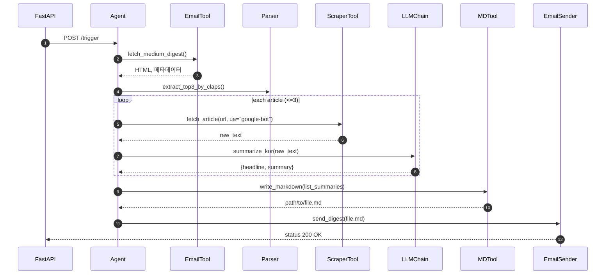

저는 Medium을 유료구독하며 매일 제 관심사의 Medium 아티클 목록을 메일로 받고있습니다!

제목들을 보면 정말 흥미롭고 읽어보고 싶지만 링크를 타고 들어가보면 긴 글과 빼곡한 영어에 급 피로해서 슉슉 넘기다 꺼버리는 경우가 많습니다 😂

각 잡고 읽을 때도 있지만 그럴 때는 시간이 꽤 소요돼서 왠지 각 잡고 읽기에 부담스러워 피하게 되더라구요.

하지만 매일 매일 새로운 기능이 생겨나는 요즘! AI 트렌드를 가장 빠르고 자세히 알 수 있는 Medium 아티클들을 그냥 놓치기엔 아쉬워서,
이번 주말에 **Medium 아티클들을 가볍고 빠르게 읽을 수 있도록 AI를 통해 요약&정리해주는 서비스**를 개발해보려합니다!

Agent를 통해 개발하면 빠르게 개발해볼 수 있지 않을까요?!!!

## 1. Workflow

제가 원하는 서비스의 기능 워크플로우입니다.

1. Medium으로부터 Medium Daily Digest 메일이 전송되면 서비스를 시작한다. (<- 1단계에서는 REST API를 통해 trigger하는 것으로 대체합니다.)
2. 메일의 내용 중 박수를 많이 받은 순으로 상위 3개의 아티클의 link를 추출한다.
3. google-bot header를 이용해 각 아티클 링크에 접근하여, 기사 내용을 추출한다.
4. 추출된 각 기사 내용을 LLM에 전달하여 핵심 헤드라인과 한국어로 번역된 정리&요약 내용을 요청하여 응답받는다.
5. 응답받은 헤드라인과 정리내용을 다시 내 메일로 통합하여 전송한다.

오늘은 우선 서버 연동을 안할거라 서비스가 상시로 수행되기 위한 대기상태로 띄워둘 수 없습니다.
로컬에서 실행할 때 동작시키기위해 대안으로 REST API를 통해 서비스가 trigger되도록합니다!

## 2. AI야, 아키텍쳐 좀 만들어줘라!

AI를 통해 아키텍쳐를 작성해달라고 부탁을 해봅니다.

제가 사용한 프롬프트입니다.

```
너는 mcp와 llm 프레임워크 등을 이용해서 ai 어플리케이션을  설계하는 능숙한 아키텍쳐 전문가야.
지금부터 내가 만들고싶은 서비스의 flow와 기능을 통해 구현을 위한 아키텍쳐를 설계해줘.
단, 나는 주말에 하루동안 진행할 간단한 프로젝트이고, langchain의 create_react_agent 기능을 활용해서 agent를 통해 구현할거야. fastapi프레임워크를 이용할거고, uv를 통한 패키지관리를 할거야. 오늘은 클라우드서버에 올리진 않겠지만, 나중엔 서버에 올릴 예정이야.

core feature: 메일로 전송된 medium에 올라온 아티클을 LLM을 통해 정리&요약하여 md 파일로 생성 후 정리된 내용을 다시 내 메일로 전송

flow
1. 특정 이메일에 medium으로부터 발송된 Medium Daily Digest 메일을 확인한다.
2. 메일의 내용 중 박수를 많이 받은 순으로 상위 3개의 아티클의 link를 추출한다.
3. 해당 3개의 아티클에 접근하여 각 기사 내용을 추출한다. (이때 header에 google-bot을 입력하여 접근 권한을 갖는다.)
4. 추출된 각 기사 내용을 LLM에 전달하여 핵심헤드라인과 한국어로 번역된 정리&요약 내용을 요청하여 응답받는다.
5. 헤드라인과 정리내용을 다시 내 메일로 통합하여 전송한다.
```

GPT의 `o3`모델과 Claude의 `3.7 Sonnet` 둘 다 물어보았는데요, 둘 다 참고하긴 했으나 주로 참고했던 부분은 `o3`모델의 응답이었습니다.

이유는

- 에어전트를 통해 개발하기 때문에 대부분 기술은 Tool을 이용해서 커버가 가능한데, 클로드는 구현하는 방향의 제안이 많았습니다.
- `o3` 모델이 아무래도 최신기술 조사 능력이 더 좋아 uv를 활용한 프로젝트 구조에 대한 제안이 더 좋았습니다.
- 하지만 상세 코드에 대한 구현의 구체성은 `3.7 Sonnet` 모델이 좋았습니다. 여기서 코드 구현에 대한 아이디어를 따올 수 있어 보입니다.

`o3`모델에서 제안해준 아키텍쳐 및 플로우 다이어그램입니다.



구조가 만족스럽습니다. 

자, 그럼 Agent의 플로우와 어떤 tool들을 사용할 지 조사해보고 Agent의 아키텍쳐를 구성해봅시다!


TODO 
1. Agent의 플로우와 어떤 tool들을 사용할 지 조사해보고 Agent의 아키텍쳐를 구성
2. 가능성 조사 - google bot으로 접근가능한지
3. 개발