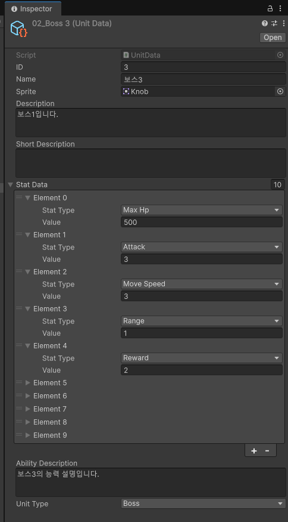

_  


## 머리말

---

### 참여 / 담당

서브 프로그래머로서 UI 개발을 담당했습니다.  

### 사용한 툴

- Unity 2022.3.8f1
- Github
- Google Presentation, Figma: 기획/ UI Flow 문서
- Google Drive: 리소스 공유

Discord를 통해 팀원/클라이언트와 소통하고 있습니다.  

## 시작

---

23년 12월 16일에 프로젝트에 참여했습니다.  

## 과정

---

## 구현

---

## 기록

---

- 2025-03-16. 00:00 ~ 00:44
  - UI branch 생성
  - Package 버전 업 / 정리
    - VSCode Package 추가
    - VisualScripting 제거 (이에 따른 일부 Script namespace 선언 제거)
    - 이 외 Package 버전 업
  - Pretendard Font Import
    - Font 확정 전까지 임시로 사용할 Font
  - 임시 배경화면 이미지 추가
  - HomeTown Scene, UI_HomeTown 추가
  - HomeTown 설정창 기반
- 2025-03-17. 19:00 ~ 21:50
  - NPC
    - UINPCPopup: NPC 말풍선
    - NPC Component
      - Talker
      - Interactive
        - StageEntrance
        - UIEntrance
  - 의상상점 (CostumeShop) 구현
    - 의상 Costume ScriptableObject 추가
  - 그 외
    - UnitManager.heroUnit을 Public Property로 변경
    - 게임 시작 시 설정창 비활성화
    - UI_Base의 Init이 Start가 아니라 Awake에서 호출되도록 수정
  - 22:30 회의 진행
- 2025-03-19.
  - 연공전 부활한 김에 연공전을 목표로 변경, 일정은 그대로
- 2025-03-20.
  - 전체적인 구조/흐름 구현
    - 일단 Hometown - Stage 간의 이동
- 2025-03-26.
  - 편성창
- 2025-03-29. 편성창, 업그레이드 상점
  - UIUpgradeDetail -> UIStatDetail
  - 편성창
    - Unit 사거리 기준 자동 우측 정렬, Null 포함
    - 편성 해제 UI Raycast 문제 해결
    - StatDetail
    - UI Develop
  - 업그레이드 상점
    - UI 기반 작성
    - 선택한 Goods Popup Animation, 초기 비활성화
    - Stat 증가량 게이지
  - Hero
    - Model LayerOrder 조정
    - 이동속도 조정 (5 -> 3)
  - UINPCPopup Pop, PopCoroutine 분리
  - Singleton, Resource Folder에서 Prefab 한 번 찾기
  - DataManager에 SO 저장
- 2025-04-05. 편성창 정보 Stage로 넘기기, 설정창
  - DataManager에 편성창 정보 저장
- 2025-04-10 ~ 04-11.
  - 자판기, 월드맵
- 2025-04-17
  - 전체적인 외관 기반 마무리 (클리어 UI +@)
  - 음악 에셋 적용
- 2025-04-18
  - 회의
    - priority: 전체 내용 들어간 빌드 공유
      - 정렬
      - *다수의 이파리가 겹칠 때 레이어 조건:
      - 캐릭터간 레이어가 겹칠 때가 있습니다. 제가 이파리들의 종류에 따라 레이어 순서가 정해놨지만 (사거리 짧음=더 앞), 같은 종류끼리는 생각하지 않았군요. 의 레이어 순서는 "더 앞(더 우측) = 앞 레이어" 입니다. 위치가 완전히 겹쳐질 경우, 겹쳐지기 전 앞 레이어에 있던 캐릭터가 계속 앞에 나오게끔 합니다.
      - HUD 재적용
      - 배경 적용
      - UI 남은 파트 (인트로, 스테이지 종료시 일어나는 일들, 설정 관련)
      - 새 브금 적용 (verse/chorus). 코러스는 피버때 출력됨
      - fever 입장음/퇴장음 -> 0으로.
      - 이파리 이동 랜덤 딜레이 -> 0으로.
- 2025-04-20
  - 빌드
- 2025-04-21
  - HomeTown BGM 적용
  - StageScene 통합
  - 유닛 별, 유닛 그룹 별 간격
- 2025-04-21
  - 유닛 이동 시 위치로

- Next

장애물, 필살기  
113 114 102 103  
113 스파인  
장애물 (공격 타겟)  

추가 인력  

## 툴 제작

---

엄청나게 대단한 것은 아니고, 간단히 기획자가 수치 조정하고, 스테이지 만들 수 있는 '스테이지 디자인 툴'을 만들겁니다. 명세가 자세하진 않았어요. 어떤어떤 기능이 필요한지 정도만 나열된 정도.  

필요한 기능을 간단히 요약하면 이렇습니다.  

1. 유닛 수치 조정
2. 스테이지 구현
3. 스테이지 디버깅

유닛 수치 조정은 사실 이미 인스펙터에서 대부분 가능하긴 한데, 기획자분께서 유니티에 익숙하지는 않으셔서, 이리저리 떨어져 있는 에셋들을 직접 찾아 조정하기에는 어려움이 있습니다. 그래서 관련 수치들을 최대한 모아서 한 곳에서 조정 가능하게 만들어야 해요.  

스테이지 구현은 조금 고민스럽긴해요. 어디까지 구현해야 할 지 잘 모르겠습니다. 씬에 캐릭터들 넣을 수 있는 버튼들 같은 걸 UI를 띄워야 할까봐요.  

### 스테이지 디버깅

우선 스테이지 디버깅 툴부터 만들어봅니다. 스테이지 디버깅 툴은 사실 개발하면서 만들었어야 했는데, 기능 테스트가 크게 복잡하지 않아서 우선순위 낮추고 미뤄뒀었더랬죠.  

스테이지를 바로바로 쉽게 테스트 할 수 있기위한 기능들이 필요해요. 어떤 상태로 어떤 스테이지를 플레이할 것인지를 설정할 수 있어야 합니다. 예를 들어 캐릭터의 업그레이드 수치는 어떤지, 어떤 버프를 가지고 있는지 등이 있겠네요.  

크게 기능이 막 복잡하진 않아요.  

### 유닛 수치 조정

  

이미 이런식으로 각 유닛 별로 데이터를 인스펙터에서 설정할 수 있긴해요. 스크립터블 오브젝트를 이용해서 각 유닛 별 데이터 파일을 만들어뒀어요.  

---

last_modified_at: 2025-11-05. 20:42
StageScene 배경 색 미묘하게 흰색이 아니였던 (DAEFFF) 문제 수정

빌드 용량 최적화 (목표: 120MB -> 50MB, 디코 업로드 제한, 시간 많이는 안쓸 듯)

빌드 옵션 Compression Option Nont -> LZ4 360->214MB

13067x2444 이미지를 13068x2444로 만들어서 Crunch 압축
텍스처 강제로 POT 만들기 (4배수), 사운드 파일 압축

214MB -> 177MB

Development Mode 끄기
177MB --> 116MB

추가적인 압축,
Managed Stripping Level None --> High  
116MB --> 97MB

이쯤에서 zip 빌드 압축하면
50.4MB 이렇게 아깝게 되는

그런데 7z <-- 이거 더 압축률이 좋다고 한다  
41.7MB  성공 !!  

진작에 7z 썼다면 좀 더 일찍 끝났을수도

업적 팝업 위치 좌측으로 (씬 어디에서나 동일)

스파인 적용 (재임포트, NPC 데이터 정의, 애니메이션 전환)
TODO: 왁굳, 소피아 특별 애니메이션

리듬 이슈 확인, 폴리싱

---

- ✅ BUG 17 스테이지 브금 적용
  - 스테이지 1-7: 키딩 일반
  - 스테이지 8: 키딩 보스
  - 스테이지 9-14: 어나더 일반
  - 스테이지 15: 어나더 보스
  - 스테이지 16-19: 미스티 일반
  - 스테이지 20: 미스티 보스
- ✅ 176: npc 출현위치 수정: 도파민, 티파니 출현위치 변경. 도파민은 스테이지 3, 티파니는 스테이지 2로 이동. (원래는 도파민: 3, 티파니:4).
  - 배경 현재 나온 것으로 임시 배치 (가능하면 역할에 맞는 쪽에 가깝게)
- ✅ 리듬UI 원형 대신 별 마크 (리듬간격 리소스) 테스트 요청. 기존 리듬간격은 그대로 두고, 이동시킬 별 마크는 약간 더 크게. 빌드보다는 움짤/의견으로 충분.
  - 로고 색으로 별 크기 조금 키워서 양쪽에서 (리듬)
- ✅ 현재 오차범위 +0.2초? +-?
  - 기존 0.2, 0.1이라서 0.2초씩 추가하면 0.5초 넘어감 (실패가 안됨)
  - 0.175 0.175로 조정
  - 실패 시 0.35f초 동안 입력 못하도록 (기존 0.5)
- BUG 09: 카툰 자동 출력 해제
- BUG 12: 입장 A+D ==> A
- BUG 13: 카툰 해상도 복구
- TEST 1 수정
- 코멘트 (버그랑 작업 목록 시트 하나로 합쳐도 되지 않을지 ?)

테스트삼아 모든 스테이지에 중간보스 투입
버그 수정

168: 설정창 팝업 관련

