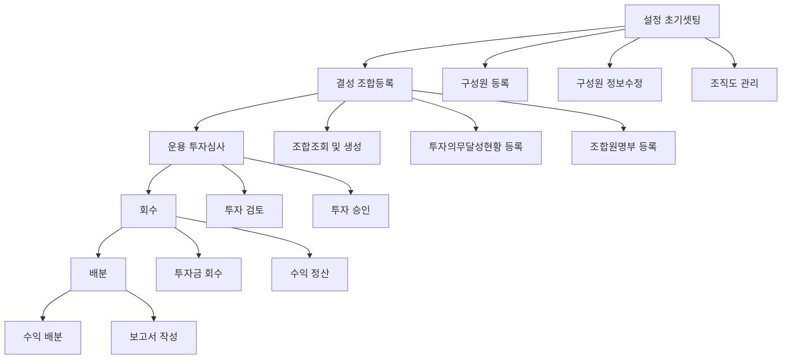

VCworks.kr은 똑똑(dkdk.kr)에서 만든 대한민국 Venture Capital ERP Solution입니다. 
VCworks.kr의 빠른 활용을 위해 Core Guide를 준비하였습니다.

VCworks의 활용 단계는 다음과 같이 총 5단계로 이루어집니다

1. 설정(초기셋팅)
2. 결성(조합등록)
3. 운용(투자심의)
4. 회수
5. 배분

자신의 업무에 따라 필요하신 것으로 바로 이동해서 탐색해 보시거나 순서대로 따라해 보시면 됩니다.

## 코어 가이드 목차

- 설정(초기셋팅)
	- 구성원 등록([hr0001]()) 
	- 구성원 정보수정 ([hr0002]())
	- 조직도 관리 ([hr0007]())  
	- 사용자 관리 ([se0005]())  
	- 역할/권한 관리 ([se0003]())  
- 결성(조합등록)
	- 조합조회 및 생성 ([fd0001]())(fd0009)  
	- 투자의무달성현황 등록 (fd0010)
	- 조합원명부 등록 (fd0011)(fd0051)
	- 재원별 회계원장 등록 (fm0010)
	- 금융정보 등록(계좌등록)(fd0009)
	- 필수 필요서류 등록 (fd0013)
	- 보수정보 등록 (fd0012)
	- 출자/배분 등록 (fd0006)
	- 운영지시서 등록 (io0002)
	- 전자결재 (ed0001)
- 운용(투자심사)
- 회수
- 배분

## 비즈니스 프로세스

- 이곳에 TC BPM을 다시 구조화한 뒤 세로 형태로 변환하여 삽입 예정
- Mermaid 방식으로 도해를 우선 검토함

---

- 버그 및 문의 사항은 다음 이메일로 보내주세요: **[we@dkdk.kr](mailto:we@dkdk.kr)**

- 똑똑(dkdk.kr)은 대한민국 벤처투자전문회사인 DSC인베스트먼트가 VC업계의 업무 방식을 혁신하고자 만든 IT자회사입니다. 

