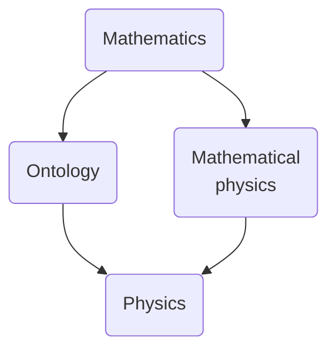

The universe we live in is a strange one. Tangible reality is best understood using physics; yet, its language, mathematics, is one of the most abstract constructs that the human mind has ever conceived. What is the true nature of objective reality — is it represented by the tangible, physical elements of this world, or the nearly metaphysical structures that we invented to grasp the deepest workings of the Cosmos?

The deep connection between physics and mathematics is a grand arena where exploration has just begun. In this age of discovery, it is crucial to investigate the marvels of physics and mathematics that festoon the road to reality. Only then can we truly understand our own existence. In the words of the famous poet T. S. Eliot,

> We shall not cease from exploration  
And the end of all our exploring  
Will be to arrive where we started  
And know the place for the first time.

The purpose of this blog is to embark on such a journey, into the without and the within. It aims to delve into not only physics and mathematics, but also how they play with each other and existence itself. In this light, there are four domains of interest:

I will be posting on topics from the above fields that I find interesting, such as: analysis, abstract algebra, discrete mathematics, geometry, classical mechanics, field  theory (including general relativity), quantum mechanics, ontology, consciousness, free will and so on. I will assume the reader is aware of some of the foundational mathematics underlying these ideas (save the ones to do with ontology, which involves nearly no math). However, there are plenty of posts which start from very basic concepts and examples, whose essence I hope to capture without involving heavy mathematical machinery.

But it is the reader who must judge me. Criticism, suggestions and questions are welcome on this site, as they only add more to this journey into the Cosmic landscape. Let's begin!
