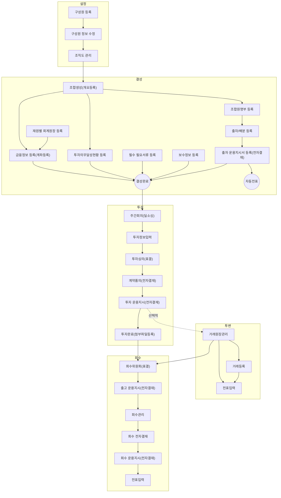

VCworks.kr은 똑똑[^dkdk] 주식회사에서 만든 대한민국 Venture Capital ERP Solution입니다.   

## VC업무의 일반 흐름
- 다음의 항목을 클릭하여 관련있는 항목으로 바로 이동할 수 있습니다.

버그 및 문의 사항은 다음 이메일로 보내주세요: **[we@dkdk.kr](mailto:we@dkdk.kr)**

---

[^dkdk]:똑똑(dkdk.kr)은 대한민국 벤처투자전문회사인 DSC인베스트먼트가 VC업계의 업무 방식을 혁신하고자 만든 IT자회사입니다. 
