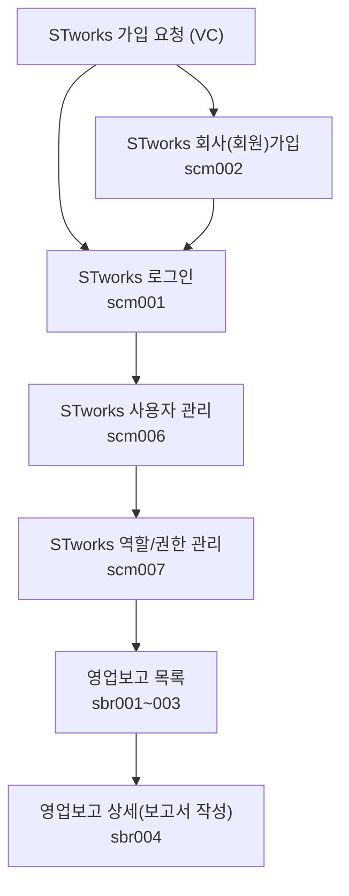

STworks.kr은 똑똑[^dkdk] 주식회사에서 만든 스타트업 영업보고(투자자보고) 시스템입니다.

## 투자자 보고 업무의 일반 흐름

버그 및 문의 사항은 다음 이메일로 보내주세요: **[we@ddock.kr](mailto:we@ddock.kr)**

---

[^dkdk]:똑똑(ddock.kr)은 대한민국 벤처투자전문회사인 DSC인베스트먼트가 VC업계의 업무 방식을 혁신하고자 만든 IT자회사입니다. 
