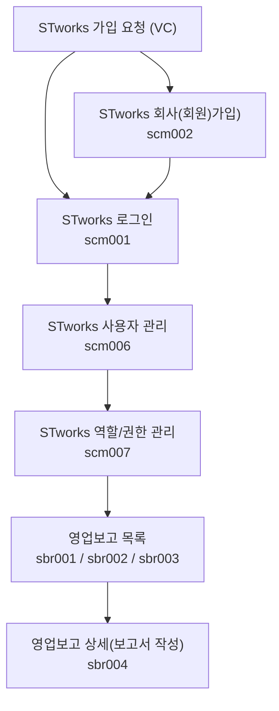

STworks.kr은 똑똑[^dkdk] 주식회사에서 만든 스타트업 영업보고(투자자보고) 시스템입니다.

## 신규 계정 등록하기

- STworks 신규 계정 등록 안내 메일의 [계정등록] 버튼을 클릭하여 계정 등록을 진행합니다.
1. 법인등록번호를 입력합니다. 
2. 영문 소문자로 회사코드 입력합니다. 회사명과 대표자명이 정확한지 확인하고 입력합니다. 
3. 아이디, 비밀번호를 설정합니다.
- 설정한 회사코드, 아이디, 비밀번호는 로그인에 사용됩니다.
- 최초로 생성한 아이디는 관리자 계정입니다. 관리자 계정으로 최초 로그인한 뒤, STworks를 사용할 아이디를 추가적으로 생성합니다. 

## 사용자 등록하기

- `설정 > 사용자관리` 메뉴에서 STworks를 사용할 아이디를 추가할 수 있습니다.

#### 사용자 ID 생성

STworks에서 사용할 계정(ID)를 생성하는 방법은 다음과 같습니다.

1. 사용자 관리 화면에서 [신규등록] 버튼을 클릭합니다.
  - 사용자 등록 드로어가 열립니다.
2. 아이디, 비밀번호, 이름, 이메일, 역할을 입력 또는 선택해주세요.
	- '역할'의 경우 `설정 > 역할/권한 관리`에서 설정할 수 있습니다.
  - ID 하나에 여러 개의 역할을 부여할 수 있으며, 역할에 설정된 권한은 합집합으로 적용됩니다.
    [저장]을 클릭해주세요.
- 신규 계정 등록시 설정한 회사코드와 아이디, 비밀번호를 이용해 로그인이 가능합니다.

#### 사용자 ID 정보 수정

최초 생성 시 설정한 아이디, 비밀번호 정보 외의 항목들을 수정할 수 있습니다.
사용자 ID(계정) 정보를 수정하는 방법은 다음과 같습니다.

1. 수정이 필요한 ID를 클릭해 주세요.
	- 사용자 상세 드로어가 열립니다. 
2. [수정]을 클릭해 주세요.
	- 사용자 정보를 수정할 수 있는 모드로 변경됩니다.
3. 수정하고자 하는 정보를 입력 또는 선택해 주세요.
	- 비밀번호는 해당 ID로 로그인 후, `좌측 하단 프로필 영역 클릭 > 비밀번호 재설정`에서 변경하실 수 있습니다.
	- 비밀번호를 잃어버린 경우 `로그인 페이지-비밀번호 찾기`에서 비밀번호를 변경해주세요.
	- 비밀번호 찾기, 비밀번호 재설정은 ID에 등록된 이메일을 통해 진행되므로, 인증 메일을 수신 할 수 있는 이메일을 설정해주셔야 합니다.
4. `저장` 버튼을 클릭해 주세요.
	- 수정한 정보가 ID에 반영됩니다.

## `사용자 관리` 자주 묻는 질문

> `설정`에서 `사용자 관리` 메뉴가 안보여요.
{: .prompt-tip }
- 로그인 한 ID에 `관리자` 역할이 부여된 경우에만 `사용자 관리`메뉴에서 VCworks 계정 정보를 생성하고, 수정하실 수 있습니다.
 
> 이름과 이메일을 수정하고 싶은데, 수정이 안됩니다.
{: .prompt-tip }
- 구성원을 선택한 경우, 구성원의 이름과 이메일 정보를 사용하기 때문에 수정할 수 없습니다.
- `인사-구성원`에서 해당 구성원의 이름과 이메일 정보를 수정하시면, 연결된 ID의 이름과 이메일 정보도 자동으로 수정됩니다.

> 역할이 뭔가요? 
{: .prompt-tip }
- 권한을 설정하는 단위입니다.
- `설정-역할/권한 관리`에서 역할을 생성하거나, 역할에 설정된 권한을 수정할 수 있습니다.

> 사용하지 않는 ID를 삭제하고 싶어요.
{: .prompt-tip }
- 사용하지 않는 ID의 `사용여부`를 `부`로 설정시면, 해당 ID로 로그인이 불가능합니다.
- ID를 화면 상에서 영구적으로 삭제하는 기능은 현재 제공하고 있지 않습니다.
- 사용 시 많은 불편함이 느껴지신다면 `STworks > 좌측 하단 프로필 클릭 > [문의하기]를 통해 의견을 남겨주세요!

## 역할/권한 관리

- `설정 > 역할/권한 관리` 메뉴에서 역할/권한을 설정합니다.
- 관리자 역할을 가진 사용자는 `사용자 관리` 메뉴와 `역할/권한 관리`에서 계정을 추가 생성하고, 권한을 설정할 수 있습니다.

#### 역할 생성 및 권한 설정

역할을 생성하고, 역할별로 권한을 할당하거나 역할을 부여할 사용자 ID를 설정하는 방법은 다음과 같습니다.

###### 역할 생성
1. 역할 설정 섹션에서 [등록] 버튼을 클릭합니다.
  - 역할 등록 드로어가 열립니다. 
2. 역할명과 설명, 사용 여부를 선택해주세요.
3. 우측 상단 [저장] 버튼을 클릭해주세요.

#### 권한 설정
1. 권한 설정 섹션에서 [수정]을 클릭합니다.
2. 권한 설정 섹션 - 기본 정보 탭 - 사용자목록 테이블의 하단에서 [+] 버튼을 클릭해 해당 역할에 배정할 사용자를 추가해주세요.
  - [+] 버튼으로 추가된 행의 `이름` 항목을 더블클릭 하면, 사용자 리스트를 선택할 수 있습니다.
3. 권한 설정 섹션 - 메뉴 권한 탭에서 권한을 가질 메뉴를 선택합니다.
4. 권한 설정 섹션 - 투자자 보고 권한 탭에서 보고 조회 권한을 설정합니다.
  - 공통 외 추가 항목 조회 권한은 기본적으로 제공되는 보고서 항목 외의 모든 탭에 대한 조회 권한을 설정합니다.
  - 모든 탭 및 공통 외 추가 항목 조회 권한이 있는 경우에만 보고 전송 권한을 가질 수 있습니다.

## `역할/권한 관리` 자주 묻는 질문

> 사용하지 않는 역할을 삭제하고 싶어요.
{: .prompt-tip }
-  사용하지 않는 역할의 `사용 여부`를 `부`로 설정하시면, 해당 역할에 할당된 권한이 적용되지 않습니다.
- 역할을 화면 상에서 영구적으로 삭제하는 기능은 현재 제공하고 있지 않습니다.

> 사용하지 않는 역할의 `사용 여부`를 `부`로 수정하려는데, 수정이 되지 않습니다.
{: .prompt-tip }
- 역할의 `사용 여부`가 수정 불가능한 사유는 다음과 같습니다.
	- 해당 역할이 관리자 역할(최초 가입 시 생성된 역할)인 경우
		- 관리자 역할의 `사용 여부`는 수정 불가능하므로, 역할 부여 사용자 목록을 수정해 주세요.
	- `사용 여부`를 `OFF`할 경우, 특정 ID에 설정된 역할이 1개 미만이 되는 경우
		- 사용자 ID에는 `사용 여부`가 `여`인 역할이 최소 1개 이상 부여되어야 합니다.
		- 다른 역할을 부여해준 뒤 해당 역할의 `사용 여부`를 `부`로 설정해 주세요.

> 사용자 목록에서 사용자를 제거할 수 없습니다.
{: .prompt-tip }
- 사용자 ID에는 `사용 여부`가 `여`인 역할이 최소 1개 이상 부여되어야 합니다.
- 선택한 사용자를 제거 시, 해당 ID에 부여된 역할이 1개 미만이 되는 경우 부여된 역할을 제거할 수 없습니다.
- 다른 역할을 부여해준 뒤 해당 역할의 사용자 목록에서 사용자 ID를 제거 주세요.

> 역할을 할당했는데, 권한이 적용되지 않아요.
{: .prompt-tip }
- 역할의 `사용 여부`를 확인해주세요.
- `사용 여부`가 off인 경우 해당 역할에 설정된 권한은 적용되지 않습니다.

## 투자자 보고

## 투자자 보고 업무의 일반 흐름

버그 및 문의 사항은 다음 이메일로 보내주세요: **[we@ddock.kr](mailto:we@ddock.kr)**

---

[^dkdk]:똑똑(ddock.kr)은 대한민국 벤처투자전문회사인 DSC인베스트먼트가 VC업계의 업무 방식을 혁신하고자 만든 IT자회사입니다. 
