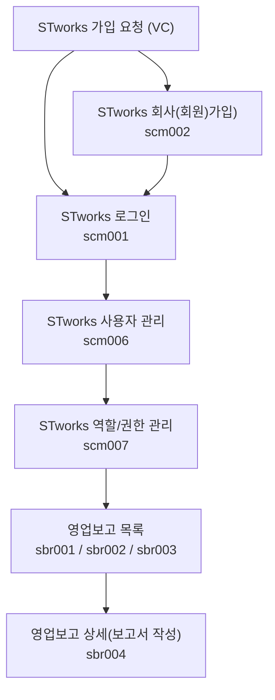

STworks.kr은 똑똑[^dkdk] 주식회사에서 만든 스타트업 영업보고(투자자보고) 시스템입니다.

## 신규 계정 등록하기

- STworks 신규 계정 등록 안내 메일의 [계정등록] 버튼을 클릭하여 계정 등록을 진행합니다.
1. 법인등록번호를 입력합니다. 
2. 영문 소문자로 회사코드 입력합니다. 회사명과 대표자명이 정확한지 확인하고 입력합니다. 
3. 아이디, 비밀번호를 설정합니다.
- 설정한 회사코드, 아이디, 비밀번호는 로그인에 사용됩니다.
- 최초로 생성한 아이디는 관리자 계정입니다. 관리자 계정으로 최초 로그인한 뒤, STworks를 사용할 아이디를 추가적으로 생성합니다. 

## 사용자 등록하기

- `설정 > 사용자관리` 메뉴에서 STworks를 사용할 아이디를 추가할 수 있습니다.
1. `사용자 관리` 화면에서 [신규등록] 버튼을 클릭합니다.
2. 아이디, 비밀번호, 이름, 이메일, 역할을 입력한 뒤 저장합니다.
	1. '역할'의 경우 설정 > 역할/권한 관리에서 설정할 수 있습니다. 
- 신규 계정 등록시 설정한 회사코드와 아이디, 비밀번호를 이용해 로그인이 가능합니다.

## 역할/권한 관리

- `설정 > 역할/권한 관리` 메뉴에서 역할/권한을 설정합니다.
- 최초 등록한 아이디는 관리자 역할을 갖고 있으며, 모든 메뉴에 대한 권한이 있습니다.
- 신규 역할 및 권한 만들기
	1. 역할 설정 섹션에서 [등록] 버튼을 클릭합니다.
	2. 역할명과 설명, 사용 여부를 선택하고 저장합니다.
	3. `권한 설정` 섹션에서 해당 역할에 배정할 사용자를 등록하고, 권한을 설정합니다.
		1. `권한 설정` 섹션에서 [수정]을 클릭합니다.
		2. `권한 설정 섹션 - 기본 정보 탭 - 사용자목록 테이블`의 하단에서 [+] 버튼을 클릭해 해당 역할에 배정할 사용자를 등록합니다.
		3. `권한 설정 섹션 - 메뉴 권한 탭`에서 권한을 가질 메뉴를 선택합니다.
		4. `권한 설정 섹션 - 투자자 보고 권한 탭`에서 보고 조회 권한을 설정합니다.
			1. 조회 권한이 없는 경우, 보고서에서 해당 내용이 노출되지 않습니다.

## 자주 묻는 질문

> `설정`에서 `사용자 관리` 메뉴가 안보여요.
{: .prompt-tip }
- 로그인 한 ID에 `관리자` 역할이 부여된 경우에만 `사용자 관리`메뉴에서 STworks 계정 정보를 생성하고, 수정하실 수 있습니다.
- STworks에 최초로 생성된 계정에는 `관리자` 역할이 부여되어 있습니다.
- `관리자` 역할이 부여된 계정을 찾기 어려우시면 [we@dkdk.kr](mailto:we@dkdk.kr)로 문의를 남겨주세요.

> 역할이 뭔가요? 
{: .prompt-tip }
-  STworks의 권한을 설정하는 단위입니다.
- `설정 > 역할/권한 관리`에서 역할을 생성하거나, 역할에 설정된 권한을 수정할 수 있습니다.

> 사용하지 않는 ID를 삭제하고 싶어요.
{: .prompt-tip }
- 사용하지 않는 ID의 `사용여부`를 `부`로 설정시면, 해당 ID로 로그인이 불가능합니다.
- ID를 화면 상에서 영구적으로 삭제하는 기능은 현재 제공하고 있지 않습니다.
- 사용 시 많은 불편함이 느껴지신다면 [we@dkdk.kr](mailto:we@dkdk.kr)로 의견을 남겨주세요!

## 투자자 보고 업무의 일반 흐름

버그 및 문의 사항은 다음 이메일로 보내주세요: **[we@ddock.kr](mailto:we@ddock.kr)**

---

[^dkdk]:똑똑(ddock.kr)은 대한민국 벤처투자전문회사인 DSC인베스트먼트가 VC업계의 업무 방식을 혁신하고자 만든 IT자회사입니다. 
