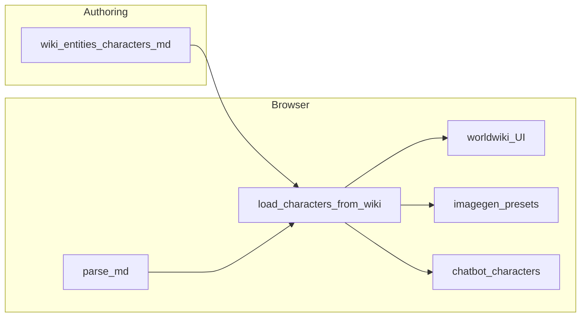

# KarmoLab — 개발 로드맵 (에이전트·기여용)

이 문서는 **앱 구현·세계관 파이프라인** 관점의 로드맵입니다. 브랜드·마스코트·MVP 기획은 [`../js/widgets/docs/roadmap.md`](../js/widgets/docs/roadmap.md)를 봅니다.

---

## 목표 한 줄

**세계관은 위키 MD 한 벌로 유지**하고, 이미지 생성·챗봇·앱 내 위키가 같은 데이터를 소비한다. “실험실” 도구들은 **명시적으로 개발 중**으로 묶어 기대치를 맞춘다.

---

## 현재 아키텍처 (요약)

- 정적 호스팅(GitHub Pages) 전제: **빌드 없이** `fetch`로 MD 로드.
- 한계: `file://`에서는 CORS로 실패할 수 있음 → 문서화됨.

---

## 단계별 로드맵

### Phase A — 세계관 위키 “쓸만하게” (단기)

| 항목 | 설명 |
|------|------|
| 목록 자동화 | 새 캐릭터 MD 추가 시 코드 수정 최소화(`SLUGS` 제거 또는 인덱스) |
| 내부 링크 | `[[slug]]` 또는 동일 앱 내 라우팅 |
| 검색 | 최소: 클라이언트 필터; 확장: 간단 인덱스 JSON |
| 아티팩트 | `wiki/artifacts/` 스키마 + 목록 1~2개 샘플 |

**완료 기준**: 작성자가 MD만 추가해도 목록·본문·이미지/챗봇 연동이 깨지지 않음(티메토 제외는 명시적으로 결정).

### Phase B — 도구 연동 (중기)

| 항목 | 설명 |
|------|------|
| 딥링크 | 위키에서 “이 프리셋으로 이미지 생성” 등 |
| 티메토 | 캐릭터와 동일 단일 출처 패턴 적용 여부 |
| YAML 정리 | 접두사 폭발 시 nested frontmatter 또는 스키마 버전 필드 |

### Phase C — 실험실 위젯 성숙 (병행)

| 위젯 | 방향 |
|------|------|
| 플래너 | React 번들·데이터 백엔드 정책 문서화 |
| 티어리스트 | 카탈로그/공유 UX 안정화 |
| 글 그래프 | `post-graph.json` 갱신 주기·생성 스크립트를 레포에 두거나 문서화 |

**완료 기준**: “실험실 · 개발중” 라벨을 뗄 수 있는 위젯은 `category`를 `tool` 등으로 승격하고, desc에서 “개발 중” 제거.

### Phase D — 품질 (여유 시)

- 오프라인/데스크톱(Tauri)에서 world fetch 실패 시 폴백 전략
- `parse-md` 테스트·스펙 문서
- a11y·모바일 사이드바

---

## 의존성 / 순서

1. **인덱스·슬ug 자동화**는 위키 링크·검색보다 먼저 해도 됨(데이터 구조 기반).
2. **딥링크**는 `Toolbox.switchPage` + 쿼리 파라미터 합의 후.
3. 실험실 위젯 성숙은 세계관과 **독립**으로 진행 가능.

---

## 참고 파일

| 문서 / 코드 | 역할 |
|-------------|------|
| [`world/README.md`](../world/README.md) | KarmoWorld frontmatter 규칙 |
| [`docs/TODO.md`](TODO.md) | 실행 가능한 체크리스트 |
| [`js/widgets-lazy-meta.js`](../js/widgets-lazy-meta.js) | 위젯·로드 순서 |
| [`js/toolbox.js`](../js/toolbox.js) | `CATEGORIES`, 사이드바 그룹 |

---

*마지막 정리: 저장소 루트 정책에 맞춰 `_posts/`는 이 로드맵 범위에 포함하지 않는다.*
