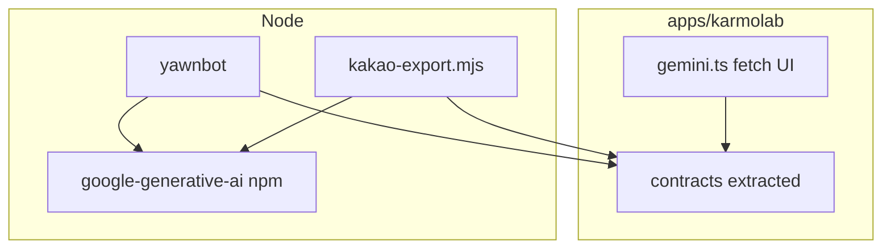

# AI 호출 공통화 계획

> **원본 파일:** `apps/karmolab/js/widgets/docs/ai-commonization-plan.md` (Toolbox 문서 위젯에서 이 탭으로 표시)

KarmoLab Toolbox(`apps/karmolab`)와 Discord 봇(yawnbot)·카카오보내기 스크립트에서 Gemini 관련 로직을 한곳에 맞추기 위한 설계 메모입니다.

## 기준점: `apps/karmolab`의 AI 허브

공통화의 **소스 오브 트루스**는 **`apps/karmolab/src/gemini.ts`** (빌드 후 `js/gemini.js`) 로 둡니다.

- Toolbox 전역·이미지 위젯 등에서 쓰는 **Gemini / Vertex(Express API 키) / Imagen** REST 호출과 모델 목록이 여기에 모여 있습니다.
- Discord 봇(`@google/generative-ai` + `GEMINI_*` env)이나 `apps/discord-bots/apps/yawnbot/scripts/kakao-export.mjs`는 **같은 모델 ID·프로바이더 구분 규칙**을 이 허브와 맞추는 것이 목표입니다.

## 현재 상태 (요약)

| 구역 | 위치 | 방식 |
|------|------|------|
| KarmoLab | `apps/karmolab/src/gemini.ts` | 브라우저 `fetch`, localStorage 키, 채팅·스트림·이미지·Imagen |
| YawnBot `/ai` | `apps/discord-bots/apps/yawnbot/src/main.ts`, `slash/ai.ts` | `@google/generative-ai`, env |
| 카카오 파이프라인 | `yawnbot/scripts/kakao-export.mjs` | 동일 SDK, `summarizeChunk` |

`apps/discord-bots/packages/discord-bot-common`에는 AI 코드가 없습니다.

## 한계: 한 파일로 완전 통합은 비현실적

- **브라우저**: CORS·번들·localStorage·UI와 결합된 대형 모듈이라 Node가 그대로 import 하기 어렵습니다.
- **Node**: `.env`와 공식 SDK가 자연스럽습니다.

따라서 **동일 `.ts` 하나로 브라우저+Node 전체**를 합치기보다, `gemini.ts`에서 **순수 계약(모델 ID, URL/프로바이더 규칙)** 만 분리해 공유하는 방식이 현실적입니다.

## 권장 단계

### 1. `gemini.ts`에서 공유 레이어 추출

- 예: `apps/karmolab/src/ai/gemini-contracts.ts` (가칭)
- 내용: `MODELS` id 문자열, 기본 모델, AI Studio vs Vertex URL 조립 패턴 등 **DOM/localStorage/fetch 없는 코드만**
- `gemini.ts`는 위 모듈을 import하고, 기존처럼 `fetch`·UI·키 관리만 담당
- KarmoLab은 `build.mjs`(esbuild)로 컴파일 — 새 경로가 엔트리/번들에 포함되는지 확인

### 2. Node 소비자 연결

- `apps/discord-bots`는 별도 npm workspace이므로, 공유 코드 배치 옵션:
  - **레포 루트** `packages/<이름>` 에 contracts만 두고 KarmoLab·yawnbot이 동시 의존, 또는
  - `file:` / 루트 workspaces 확장으로 `../../karmolab/src/ai/...` 참조 (구성 난이도 있음)
- yawnbot·카카오: **모델 ID·규약**은 공유 모듈에서; **실제 호출**은 Node에서는 계속 `@google/generative-ai` 래퍼로 두는 편이 단순합니다.

### 3. (선택) Node에서 Vertex

- KarmoLab과 동일 REST를 맞출지, `@google-cloud/vertexai`를 쓸지 별도 결정 (자격증명: API 키 vs ADC).

## 다이어그램

## 작업 체크리스트 (구현 시)

1. 추출 모듈 경로 확정 (`apps/karmolab/src/ai/` vs 레포 `packages/`)
2. `gemini.ts`에서 contracts 분리 후 KarmoLab 빌드·위젯 동작 회귀 확인
3. yawnbot / `kakao-export.mjs`에 contracts 의존 연결 및 기본 모델 정렬
4. (선택) Node용 얇은 `generateText` 래퍼만 별 파일로 두고 프롬프트/모델은 contracts에서

## 관련 문서

- 위젯 쪽 가이드: [google_api_setup_for_planner.md](google_api_setup_for_planner.md)
- 로드맵(문서 위젯): [roadmap.md](roadmap.md)
- 저장소 내 기획 메모: `apps/karmolab/docs/` (Jekyll/에디터용, Toolbox fetch 대상 아님)
