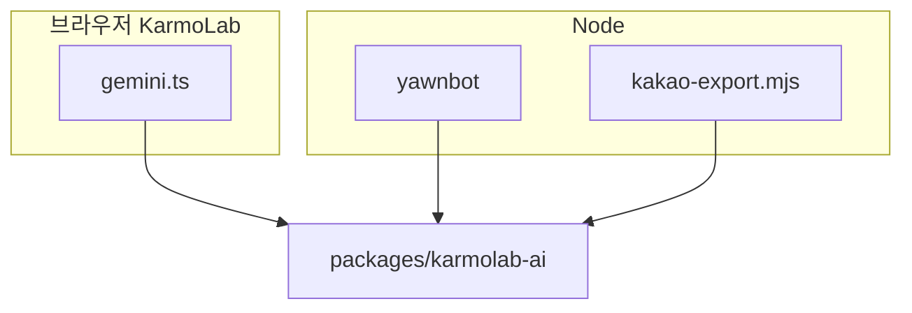

# KarmoLabAI (`karmolab-ai`) 사용 가이드

> **원본 경로:** 레포 루트 `packages/karmolab-ai/` — npm 패키지 이름 `karmolab-ai`  
> **역할:** Google **AI Studio**(Generative Language API)와 **Vertex AI**를 함께 쓸 때, 모델 ID·REST URL·문서 링크·기본값을 **한곳(SSOT)**에서 맞춥니다. 루트 엔트리(`.`)는 `fetch`·API 키·DOM을 넣지 않습니다. Node에서는 서브패스 **`karmolab-ai/node`** 로 AI Studio(SDK) 또는 Vertex(**REST `fetch`**, 브라우저 `gemini.ts`와 동일 엔드포인트) 텍스트 호출을 맞출 수 있습니다.

---

## 왜 패키지로 나눴나

KarmoLab 브라우저 앱과 yawnbot·`kakao-export.mjs` 등 Node 쪽은 **같은 모델 ID·프로바이더 규칙**을 쓰지만, 호출 코드를 **한 파일**로 합치기는 어렵습니다.

- **브라우저:** CORS, `fetch`, localStorage, UI와 결합된 **`apps/karmolab/src/gemini.ts`**가 실제 REST 호출을 담당합니다.
- **Node:** `.env`와 `@google/generative-ai` 같은 SDK가 자연스럽습니다.

그래서 **DOM·네트워크·키 저장 없이** 모델 카탈로그·기본 ID·AI Studio/Vertex URL 조립만 **`packages/karmolab-ai`**에 두고, KarmoLab과 봇이 같은 패키지를 의존합니다. (`apps/discord-bots/packages/discord-bot-common`에는 AI 코드가 없습니다.)

### 소비자 (요약)

| 구역 | 역할 |
|------|------|
| KarmoLab | `gemini.ts`가 `karmolab-ai`를 import해 URL·모델을 맞추고, `fetch`·UI·키는 여기서 |
| yawnbot `/ai` 등 | `tryCreateGenerativeTextFromEnv()` → `generateFromPrompt` (surface는 `.env`의 `KARMOLAB_AI_SURFACE` 등) |
| 카카오 PC보내기 | `kakao-export.mjs`도 동일 클라이언트로 요약 (AI Studio 또는 Vertex) |



### 구현·유지보수 체크리스트

- [ ] `MODEL_CATALOG` / 기본 모델을 바꾼 뒤 패키지·KarmoLab·봇을 각각 빌드했는지
- [ ] (선택) Node에서 Vertex를 쓸 때 KarmoLab과 동일 REST를 맞출지, `@google-cloud/vertexai`·ADC를 쓸지 결정을 문서에 남겼는지

---

## 무엇이 들어 있나

| 구분 | 설명 |
|------|------|
| **모델 카탈로그** | 텍스트 Gemini(`gemini`), 이미지용 Nano Banana(`geminiImage`), Imagen(`imagen`) 목록과 표시 이름 |
| **기본 모델 ID** | `DEFAULT_TEXT_MODEL_ID` — 텍스트용 기본 API 모델 ID (`gemini-2.5-flash` 등, 카탈로그와 동기) |
| **AI Studio URL** | `buildAiStudioGenerateContentUrl`, `buildAiStudioStreamGenerateContentUrl`, `buildAiStudioPredictUrl` |
| **Vertex URL** | `buildVertexPublisherModelUrl` — `generateContent` / `streamGenerateContent` / `predict` |
| **기본 리전** | `DEFAULT_VERTEX_LOCATION` (`us-central1`) |
| **문서 링크** | `DOC_URL_AI_STUDIO_API_KEY`, `DOC_URL_VERTEX_API_KEYS` |
| **Env 이름(참고)** | `ENV_GOOGLE_AI` — `GEMINI_API_KEY`, `GEMINI_MODEL` 문자열만 (값을 읽지는 않음) |
| **타입** | `GoogleGenerativeSurface`, `ModelProvider`, `ModelEntry` 등 |
| **Node 서브패스** | `karmolab-ai/node` — `tryCreateGenerativeTextFromEnv`, `generateAiStudioText`, `generateVertexText`, `createAiStudioTextModel`, `parseGenerativeSurfaceFromEnv` (`peerDependencies`: `@google/generative-ai`) |
| **package exports** | `package.json`의 `exports`에 `"."`와 `"./node"` (타입·런타임 경로 분리) |

소스는 TypeScript(`src/index.ts`, `src/node.ts`)이고, `npm run build`로 `dist/`에 CommonJS·선언 파일이 생성됩니다.

---

## KarmoLab(브라우저)에서

- **`apps/karmolab/src/gemini.ts`** 가 `karmolab-ai`를 import합니다.
- 빌드(`apps/karmolab`에서 `npm run build`) 시 **esbuild**가 의존성을 묶어 `js/gemini.js`로 보냅니다.
- 페이지 스크립트에서는 전역 **`Gemini`** 객체로 기능을 씁니다. 예:
  - **AI Studio:** `callText`, `callChat`, `callChatStream`, `callGeminiImage`, `callImagen`
  - **Vertex:** `callVertexText`, `callVertexChat`, `callVertexChatStream`, `callVertexGeminiImage`, `callVertexImagen`
- Vertex 텍스트/채팅은 사용자 설정의 **Vertex API 키**, **`ig_vertex_project_id`**, **`ig_vertex_location`**(이미지 위젯과 동일)을 사용합니다.
- **챗봇** 위젯: 사이드바 **API**에서 `Vertex AI`를 고르면 스트리밍이 Vertex 경로로 갑니다. (웹 검색은 AI Studio 전용.)

키 입력·프로필 UI는 **내 정보 → 설정**의 Gemini/Vertex 항목을 사용하세요.

---

## Node(욘봇·스크립트)에서

- **`apps/discord-bots/apps/yawnbot`** 에 `karmolab-ai`가 `file:../../../../packages/karmolab-ai` 로 연결되어 있습니다.
- 루트에서 봇 빌드할 때 `packages/karmolab-ai`가 먼저 `tsc` 됩니다 (`apps/discord-bots`의 `npm run build` / `build:yawnbot`).
- **엔트리 분리:** 루트 `karmolab-ai`는 계약(URL·카탈로그)만, **`karmolab-ai/node`** 에서 AI Studio(SDK) 또는 Vertex(REST) 텍스트 호출을 제공합니다. (`peerDependencies`: `@google/generative-ai` — AI Studio 경로에만 사용)
- **호출 표면 전환 (`.env`):**
  - **기본 AI Studio:** `GEMINI_API_KEY` 필수, `GEMINI_MODEL` 선택
  - **Vertex:** `KARMOLAB_AI_SURFACE=vertex` (또는 `GEMINI_SURFACE=vertex`) + `VERTEX_API_KEY`, `VERTEX_PROJECT_ID` 필수, `VERTEX_LOCATION`·`GEMINI_MODEL` 선택  
  - env 키 이름 참고: 루트 패키지 `ENV_GOOGLE_AI`
- **`karmolab-ai/node` API (요약):**
  - `tryCreateGenerativeTextFromEnv()` → `{ surface, generateFromPrompt }` 또는 `null` — 욘봇 `/ai`·카카오 요약 공통
  - `generateVertexText({ apiKey, projectId, location?, modelId?, userText, systemInstruction? })` — Vertex 단발
  - `generateAiStudioText({ apiKey, modelId?, prompt, signal? })` — AI Studio 단발
  - `createAiStudioTextModel` / `resolveAiStudioTextModelId` / `parseGenerativeSurfaceFromEnv` — 필요 시 저수준 조합
- **TypeScript(욘봇):** `moduleResolution: node`(classic) 대비 `apps/yawnbot/tsconfig.json`의 `paths`로 `karmolab-ai/node` → `packages/karmolab-ai/dist/node` 연결
- **dotenv 레이어:** 욘봇·`kakao-export`는 `config/yawnbot-defaults.txt`(커밋 기본값) → `.karmolab.common.env` → `.discord-bots.env` → `.yawnbot.env` → (카카오만) `.yawnbot.kakao.env` → `.env` 순. `apps/yawnbot/.env.template` 참고

모델 ID·카탈로그만 쓰려면 루트 `karmolab-ai`에서 `DEFAULT_TEXT_MODEL_ID`, `MODEL_CATALOG`, `getDefaultModelId` 를 import 하면 됩니다.

### 레포에서 타입체크(기여 시)

- KarmoLab 위젯 소스(`apps/karmolab/src/widgets/*.ts`)는 전역 `Gemini`·`Toolbox` 등을 `apps/karmolab/types/global.d.ts`에 선언해 두고, CI에서 `npm run typecheck`로 검사합니다.

---

## 로컬에서 패키지 빌드

```bash
cd packages/karmolab-ai
npm install
npm run build
```

KarmoLab 전체 JS:

```bash
cd apps/karmolab
npm install
npm run build
```

---

## 모델 목록을 바꿀 때

1. **`packages/karmolab-ai/src/index.ts`** 의 `MODEL_CATALOG` / `isDefault` 만 수정  
2. `packages/karmolab-ai`에서 `npm run build`  
3. KarmoLab·욘봇 쪽을 각각 다시 빌드  

브라우저와 봇이 같은 ID 문자열을 쓰게 유지할 수 있습니다.

---

## 관련 문서

- 사용자 **가이드** 탭: API 키 입력 위치 등 기본 사용법  
- [google_api_setup_for_planner.md](google_api_setup_for_planner.md): 플래너용 Google API 설정 메모  
- **로드맵** 탭: [roadmap.md](roadmap.md)  

---

## 참고 링크

- [Google AI Studio API 키](https://aistudio.google.com/app/apikey)  
- [Vertex AI — API 키](https://cloud.google.com/vertex-ai/generative-ai/docs/start/api-keys)  
- [Vertex AI REST 참고](https://cloud.google.com/vertex-ai/docs/reference/rest)
