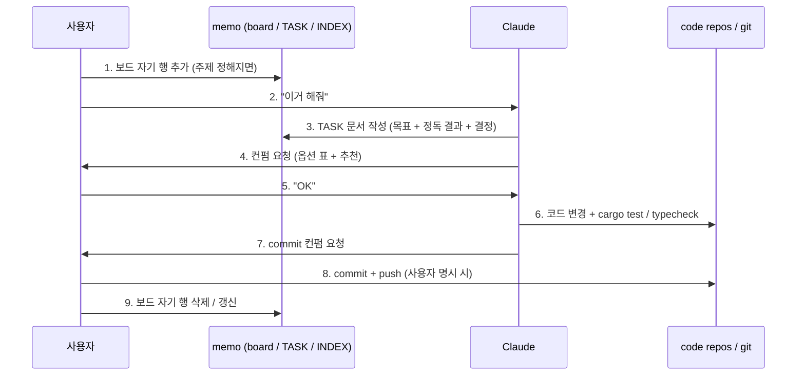
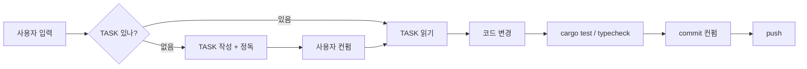

## 한 줄

karmoddrine 산하 모든 작업 (WM / KarmoLab / YawnBot / 인생·취미·학습 등) 이 도는 *메타* 흐름. 모든 다른 시스템의 부모.

## 흐름 (시퀀스)

## 분기

## 노드 정본 위치

| 노드 | 정본 |
| --- | --- |
| 보드 (병렬 세션 협업) | `memo/.claude/active-sessions.md` |
| TASK 스펙 | `memo/TASK-SCHEMA.md` |
| umbrella 작업 지침 | `memo/CLAUDE-karmoddrine.md` |
| 문서 지도 | `memo/INDEX.md` |
| 사용자 auto-memory (LLM 전용) | `~/.claude/projects/<this>/memory/MEMORY.md` |
| 코드 레포 3 | `WitchMendokusai/`, `Mascari4615.github.io/`, `memo/` |

## 자주 발생하는 분기

- **TASK 미존재** → Claude 가 TASK 작성 (정독 → 옵션 표 → 추천 → 사용자 컨펌)
- **충돌** → 보드 점검, 다른 세션이 같은 파일 잡고 있으면 손대지 않음
- **옵션 결정** → "추천 + 이유 + 근본성" + ★ 마커 (근본 수정 디폴트)
- **commit / push** → 자동 X. 사용자 명시 컨펌 후만

## 관련 룰 / 메모리

- `feedback_check_existing_first.md` — 새 기능 시작 전 같은 도메인 정독 우선
- `feedback_user_intent_quote.md` — TASK 「목표」 사용자 발화 인용 강제
- `feedback_format_options.md` — 형식·구조 결정도 옵션 표
- `feedback_recommend_when_offering_options.md` — 추천 + 근본성 평가
- `feedback_commit_ask_first.md` / `feedback_push_only_when_asked.md`

## 후속

본 시스템은 *모든 다른 시스템의 부모*. 서브시스템 (WM Quest 흐름 / KL 위젯 빌드 / YawnBot 캐릭터 시스템 / MDD 등) 은 *이 메타 루프의 어느 노드에 끼는지* 로 표현.
