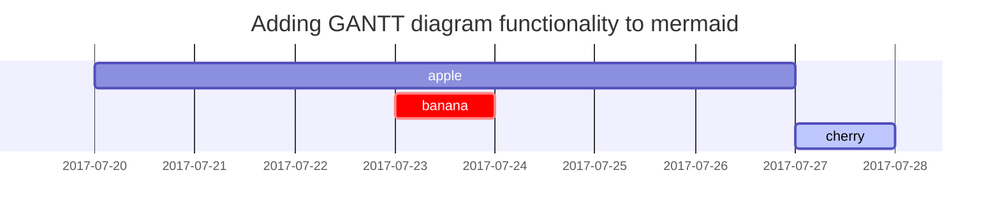

This post is to show Markdown syntax rendering on [**Chirpy**](https://github.com/cotes2020/jekyll-theme-chirpy/fork), you can also use it as an example of writing. Now, let's start looking at text and typography.


## Titles
---
# H1 - heading

<h2 data-toc-skip>H2 - heading</h2>

<h3 data-toc-skip>H3 - heading</h3>

<h4>H4 - heading</h4>
---
<br>

## Paragraph

I wandered lonely as a cloud

That floats on high o'er vales and hills,

When all at once I saw a crowd,

A host, of golden daffodils;

Beside the lake, beneath the trees,

Fluttering and dancing in the breeze.

## Lists

### Ordered list

1. Firstly
2. Secondly
3. Thirdly

### Unordered list

- Chapter
	- Setcion
      - Paragraph

### Task list

- [ ] TODO
- [x] Completed
- [ ] Defeat COVID-19
  - [x] Vaccine production
  - [ ] Economic recovery
  - [ ] People smile again

### Description list

Sun
: the star around which the earth orbits

Moon
: the natural satellite of the earth, visible by reflected light from the sun


## Block Quote

> This line to shows the Block Quote.

## Tables

| Company                      | Contact          | Country |
|:-----------------------------|:-----------------|--------:|
| Alfreds Futterkiste          | Maria Anders     | Germany |
| Island Trading               | Helen Bennett    | UK      |
| Magazzini Alimentari Riuniti | Giovanni Rovelli | Italy   |

## Links

<http://127.0.0.1:4000>


## Footnote

Click the hook will locate the footnote[^footnote], and here is another footnote[^fn-nth-2].


## Images

- Default (with caption)


_Full screen width and center alignment_

<br>

- Specify width

{: width="400"}
_400px image width_

- Shadow

{: .shadow width="90%" }
_shadow effect (visible in light mode)_

<br>

- Left aligned

{: width="350" .normal}

<br>

- Float to left

  {: width="240" .left}
  "A repetitive and meaningless text is used to fill the space. A repetitive and meaningless text is used to fill the space. A repetitive and meaningless text is used to fill the space. A repetitive and meaningless text is used to fill the space. A repetitive and meaningless text is used to fill the space. A repetitive and meaningless text is used to fill the space. A repetitive and meaningless text is used to fill the space. A repetitive and meaningless text is used to fill the space. A repetitive and meaningless text is used to fill the space. A repetitive and meaningless text is used to fill the space. A repetitive and meaningless text is used to fill the space. A repetitive and meaningless text is used to fill the space."

<br>

- Float to right

  {: width="240" .right}
  "A repetitive and meaningless text is used to fill the space. A repetitive and meaningless text is used to fill the space. A repetitive and meaningless text is used to fill the space. A repetitive and meaningless text is used to fill the space. A repetitive and meaningless text is used to fill the space. A repetitive and meaningless text is used to fill the space. A repetitive and meaningless text is used to fill the space. A repetitive and meaningless text is used to fill the space. A repetitive and meaningless text is used to fill the space. A repetitive and meaningless text is used to fill the space. A repetitive and meaningless text is used to fill the space. A repetitive and meaningless text is used to fill the space."

<br>

## Mermaid SVG




## Mathematics

The mathematics powered by [**MathJax**](https://www.mathjax.org/):

$$ \sum_{n=1}^\infty 1/n^2 = \frac{\pi^2}{6} $$

When $a \ne 0$, there are two solutions to $ax^2 + bx + c = 0$ and they are

$$ x = {-b \pm \sqrt{b^2-4ac} \over 2a} $$


## Inline code

This is an example of `Inline Code`.


## Code block

### Common

```
This is a common code snippet, without syntax highlight and line number.
```

### Specific Languages

#### Console

```console
$ env |grep SHELL
SHELL=/usr/local/bin/bash
PYENV_SHELL=bash
```

#### Ruby

```ruby
def sum_eq_n?(arr, n)
  return true if arr.empty? && n == 0
  arr.product(arr).reject { |a,b| a == b }.any? { |a,b| a + b == n }
end
```

#### Shell

```shell
if [ $? -ne 0 ]; then
    echo "The command was not successful.";
    #do the needful / exit
fi;
```

#### Liquid


```liquid

  This product's title contains the word Pack.

```


#### Java

```java
private void writeObject(java.io.ObjectOutputStream s)
  throws java.io.IOException {
  // Write out any hidden serialization magic
  s.defaultWriteObject();
  for (E e: map.keySet()) s.writeObject(e);
}
```

## Reverse Footnote

Allen, J. F. (1998, December 15). AI Growing Up: The changes and Opportunities. AI Magazine, pp. 13-23.
Brownlee, J. (2020, December 10). Machine Learning is Popular Right Now. Retrieved from Machine Learning Mastery: https://machinelearningmastery.com/machine-learning-is-popular/#:~:text=Machine%20learning%20is%20popular%20because,capability%20of%20machine%20learning%20methods.&text=There%20is%20an%20abundance%20of%20data%20to%20learn%20from.
Brynce Goodman, S. F. (2016, August 31). European Union Regulations on Algorithmic Decision-Making and a “Right to Explanation”. AI Magazine, pp. 50-57. doi:10.1609/aimag.v38i3.2741
Bunz, M. (2019). The calculation of meaning: on the misunderstanding of new artificial intelligence as culture. Culture, Theory and Critique, 60, pp. 264-278. doi:10.1080/14735784.2019.1667255
Christian Berghoff, M. N. (2020, July 22). Vunerabilities of Connectionist AI Applications: Evaluation and Defense. Front. Big Data. doi:10.3389/fdata.2020.00023
Dean, J. (2019). The Deep Learning Revolution and Its Implications for Computer Architecture. CoRR, abs/1911.05289. Retrieved from http://arxiv.org/abs/1911.05289
Evenlyn Fix, J. H. (1951, February). Nonparametric Discrimination Consistency Properties. International Statistical Review / Revue Internationale de Statistique, 57, pp. 238-247. doi:https://doi.org/10.2307/1403797
Garcez, A. d., & C. Lamb, L. (2020). Neurosymbolic AI: The 3rd Wave. arXiv(arXiv:2012.05876).
Garg, A. (2020, March 28). MIT 6.S191 (2020): Generalizable Autonomy for Robot Manipulation. Retrieved from Youtube: https://www.youtube.com/watch?v=8Kn4Gi8iSYQ&list=PLtBw6njQRU-rwp5__7C0oIVt26ZgjG9NI&index=20&ab_channel=AlexanderAminiAlexanderAmini
Hao Li, Z. X. (2017). Visualizing the Loss Landscape of Neural Nets. CoRR, abs/1712.09913. Retrieved from http://arxiv.org/abs/1712.09913
Hornik, K. (1991). Approximation Capabilities of Multilayer Feedforward Networks. Neural Networks, 4(0893-6080), pp. 251-257. doi:https://doi.org/10.1016/0893-6080(91)90009-T
Ian J. Goodfellow, J. S. (2015, March 20). Explaining and Harnessing Adversarial Examples. CoRR, abs/1412.6572.
Institute for Healthcare Policy & Innovation. (2018, March 21). What happens when an algorithm cuts your health care.
Kaggle Inc. (2021). Kaggle: Your Machine Learning and Data Science Community. Retrieved from Kaggle: https://www.kaggle.com/
Kaiming He, X. Z. (2016). Deep Residual Learning for Image Recognition. 2016 IEEE Conference on Computer Vision and Pattern Recognition (CVPR), pp. 770-778. Retrieved from http://arxiv.org/abs/1512.03385
Seshapanpu, J. (2020, April 16). Vanishing and Exploding Gradients in Neural Networks. Retrieved from Medium: https://medium.com/@sjakki/vanishing-and-exploding-gradients-in-neural-networks-5b3ee108a568
Stanford Image Lab. (2020). ImageNet Large Scale Visual Recognition Challenge (ILSVRC). Retrieved from ImageNet: https://www.image-net.org/challenges/LSVRC/#:~:text=The%20ImageNet%20Large%20Scale%20Visual,image%20classification%20at%20large%20scale.&text=Another%20motivation%20is%20to%20measure,indexing%20for%20retrieval%20and%20annotation.
Tao, S. (2019, August 13). Deep Neural Network Ensembles. LOD.
Vladimir Vapnik, B. B. (1992, July). A Training Algorithm for Optimal Margin Classifiers. Proceedings of the fifth annual workshop on Computational learning theory, pp. 144–152. doi:10.1145/130385.130401
Yann LeCun, C. C. (n.d.). The MNIST Database. Retrieved from Lecun: http://yann.lecun.com/exdb/mnist/index.html
Yingqui Liu, S. M.-C. (2018, January). Trojaning Attack on Neural Networks. doi:10.14722/ndss.2018.23300
Yiwem Gui, C. Z. (2018). Sparse DNNs with Improved Adversarial Robustness. NeurIPS.
