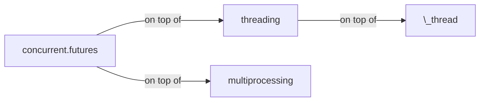

Put the math expression within <span>$</span>...\$:

\\(\LaTeX{}\\)

$\Pi$

$ a * b = c ^ b $

$ 2^{\frac{n-1}{3}} $

$ \int\_a^b f(x)\,dx. $

\\( \int\_a^b f(x)\,dx. \\)

$$
\begin{cases}
\text{if true}\ foo \\
\text{if false}\ bar
\end{cases}
$$

$ \rho {\rm{FOD}} = \sum\limits{\sigma ,i} {(\delta _1 - \delta _2 n_i^\sigma )|\phi _i^\sigma ({\bf{r}})|^2} $

$$ \rho {\rm{FOD}} = \sum\limits{\sigma ,i} {(\delta _1 - \delta _2 n_i^\sigma )|\phi _i^\sigma ({\bf{r}})|^2} $$


{{ "here is a liquid filter." | capitalize }}


\`escape inline code\`  
`inline code`  
Here is a **capture block**.


{{ test | markdownify }}

 
100 / 3 = {{ x }}

:+1:
:bolivia:

\1. 21312  
\2. 21312  
\4. 4214  


import networkx as nx
from collections import Counter

diagrams = defaultdict(list)
particle_counts = defaultdict(Counter)

for (a, b), neighbors in common_neighbors.items():
    # Build up the graph of connections between the
    # common neighbors of a and b.
    g = nx.Graph()
    for i in neighbors:
        for j in set(nl.point_indices[
            nl.query_point_indices == i]).intersection(neighbors):
            g.add_edge(i, j)

    # Define the identifiers for a CNA diagram:
    # The first integer is 1 if the particles are bonded, otherwise 2
    # The second integer is the number of shared neighbors
    # The third integer is the number of bonds among shared neighbors
    # The fourth integer is an index, just to ensure uniqueness of diagrams
    diagram_type = 2-int(b in nl.point_indices[nl.query_point_indices == a])
    key = (diagram_type, len(neighbors), g.number_of_edges())
    # If we've seen any neighborhood graphs with this signature,
    # we explicitly check if the two graphs are identical to
    # determine whether to save this one. Otherwise, we add
    # the new graph immediately.
    if key in diagrams:
        isomorphs = [nx.is_isomorphic(g, h) for h in diagrams[key]]
        if any(isomorphs):
            idx = isomorphs.index(True)
        else:
            diagrams[key].append(g)
            idx = diagrams[key].index(g)
    else:
        diagrams[key].append(g)
        idx = diagrams[key].index(g)
    cna_signature = key + (idx,)
    particle_counts[a].update([cna_signature])


```cpp
void insert(const char* key) {
    if (*key == '\0') {
        finish = true;
    } else {
        int idx = *key - 'A';
        if (!next[idx])
            next[idx] = new Trie();
        next[idx]->insert(key + 1);
    }
}
```

```ruby
p ":+1:"
```

``` diff
+        'user_exists' => 'SELECT EXISTS(SELECT 1 FROM table WHERE username = (:username || \'@sample'))',
+        'get_users' => 'SELECT split_part(username, \'@\', 1) FROM table WHERE (username ILIKE :search) OR (name ILIKE :search)',
+        'get_password_hash_for_user' => 'SELECT split_part(password, \'{CRYPT}\', 2) FROM table WHERE username = (:username || \'@sample\')',
+        'set_password_hash_for_user' => 'UPDATE table SET password =  \'{CRYPT}\' || :new_password_hash WHERE username = (:username || \'@sample\')',
```

Reload the Nginx:

``` console
$ sudo nginx -s reload
```

|:                        |:                  :|: $$O_3 + C_2H_2 \rightarrow $$         :|||:  $$O_3 + C_2H_4 \rightarrow $$ :|||:       :| 
|:  ^^ Method            :| ^^ $$\lambda^a$$  |    vdW |    TS |    cycloadd.           |  vdW  |  TS  |  cycloadd.           | ^^ MAE    |
|-------------------------|-------------------|--------|-------|------------------------|-------|------|----------------------|-----------|
| $$\lambda$$-tPBE        |   0.20            | -0.40  | 7.69  | -68.00                 | -1.86 | 4.87 | -57.57               | 1.29      |
|-------------------------|-------------------|--------|-------|------------------------|-------|------|----------------------|-----------|
| MC1H-PBE $$^b$$         |   0.25            | -1.08  | 3.66  | -70.97                 | -1.25 | 0.13 | -61.26               | 3.35      |
|-------------------------|-------------------|--------|-------|------------------------|-------|------|----------------------|-----------|
| Reference values $$^c$$ |   ---------       | -1.90  | 7.74  | -63.80                 | -1.94 | 3.37 | -57.15               | --------- |
|=========================|===================|========|=======|========================|=======|======|======================|===========|
| $$^a$$ The optimal mixing parameter.$$\~$$ $$^b$$ From Ref. .$$\~$$  $$^c$$ Best estimates from Ref. . ||||||||


|   1   |  2     |   3   |   4   |  5   |  6   |  7  |
| spancell1     ||   spancell2  || cell | spancell3 ||
|^^ spancell1   ||   spancell2  || cell | spancell3 ||
{:class="custom-table"}

<script>
|:-----:|:-----:|:-----:|:-----:|
| (0,0) | (0,1) | (0,2) | (0,3) |
|     (1,0)    || ^^    | (1,3) |
</script>


|:-----:|:-----:|:-----:|:-----:| ---- |
| (0,0) | (0,1) | (0,2) | (0,3) |      |
|     (1,0)    || ^^    | (1,3) |      |


|:-----:|:-----:|:-----:|:-----:| ---- |
| (0,0) | (0,1) | (0,2) | (0,3) |      |
|     (1,0)           ||| (1,3)       ||


|:-----:|:-----:|:-----:|:-----:| ---- |
| (0,0) | (0,1) | (0,2) | (0,3) |      |
|     (1,0)           ||| ^^    |      |

|:-----:|:-----:|:-----:|:-----:| ---- |
| (0,0) | (0,1) | (0,2) | (0,3) |      \
|     (1,0)           ||| ^^    |      |


## Table

| Stage | Direct Products | ATP Yields |
| ----: | --------------: | ---------: |
|Glycolysis | 2 ATP                   ||
|^^         | 2 NADH      | 3--5 ATP   |
|Pyruvaye oxidation | 2 NADH | 5 ATP   |
|Citric acid cycle  | 2 ATP           ||
|^^                 | 6 NADH | 15 ATP  |
|^^                 | 2 FADH | 3 ATP   |
|                        30--32 ATP  |||


{:color-style: style="background: black;" }
{:color-style: style="color: white;" }
{:font-style: style="font-weight: 900; text-decoration: underline;" }

|:             Here's a Inline Attribute Lists example                 :||||
| ------- | ------------------------- | -------------------- | ----------- |
|:       :|:  <div style="color: red;"> &lt; Normal HTML Block > </div> :|||
| ^^      |   Red    {: .cls style="background: orange" }                |||
| ^^ IALs |   Green  {: #id style="background: green; color: white" }    |||
| ^^      |   Blue   {: style="background: blue; color: white" }         |||
| ^^      |   Black  {: color-style font-style}                          |||


[cell image]: https://jekyllrb.com/img/octojekyll.png "An exemplary image"

| Heading            | Column 1      | Column 2                           |
|--------------------|---------------|------------------------------------|
| Row 1              | Apple[^1]     | [Youtube (Home)]                   |
| Row 2              | Banana        | [Github][1]                        |
| Row 3 (merged)     | Blueberry     | [Google] *****  [Github]           |
| ^^         | [Plum](https://example.com) | Raspberry ![example][cell image]   |
| Row 4      | <https://www.google.com>    |  [test](https://www.google.com){:target="_blank"}                            |
|^^          |^^ <https://www.youtube.com> |                              |
| Row 5      | <https://www.google.com>                                  ||

[Youtube (Home)]: https://www.youtube.com
[Google]: https://www.google.com
[Github]: https://www.github.com
[1]: https://www.github.com
[^1]: Footnote

<https://www.google.com>

Not in table: `<Mail Gateway>`

In table:

Decision Point | Design Decision
--- | ---
Authoritative DNS MX Record | `<Mail Gateway>`

9 \* 9

| 1 \* 1 = 1 |
| 1 \* 2 = 2 | 2 \* 2 = 4 |
| 1 \* 3 = 3 | 2 \* 3 = 6 | 3 \* 3 = 9  |
| 1 \* 3 = 3 | 2 \* 3 = 6 | 3 \* 4 = 12 | 4 \* 4 = 16 |

## Emoji
:+1:

## Mathjax

$\LaTeX{}$

## PlantUML

@startuml
Bob -> Alice : hello
@enduml

## Mermaid



## Video


[\[video link\]](//www.youtube.com/watch?v=Ptk_1Dc2iPY)

## Audio

[HTML5 Audio Formats Test](https://hpr.dogphilosophy.net/test/)

Opus Audio (".opus"):


"MP3" file (".mp3") :


WebM Audio (".weba"):


WebMv2 Audio (".webm"):


Ogg Vorbis (".ogg") :


"wave" file(".wav") :


FLAC file (".flac") :


CAF file (".caf") :


Spotify Podcast:


## Special media links

Local video file (".webm"):


Video with custom thumbnail:

[](https://www.youtube.com/watch?v=kCHGDRHZ4eU)

Tips:
* Use pipes (`|`) to delineate columns, and dashes to delineate the header row from the rest of the table.
* Spacing doesn't matter to the markdown processor, any extra white space is removed, but it can really help with readability.
The two markdown examples below both create this table.

Use pipes `(`|`)` to delineate columns, and dashes to delineate the header row from the rest of the table.

